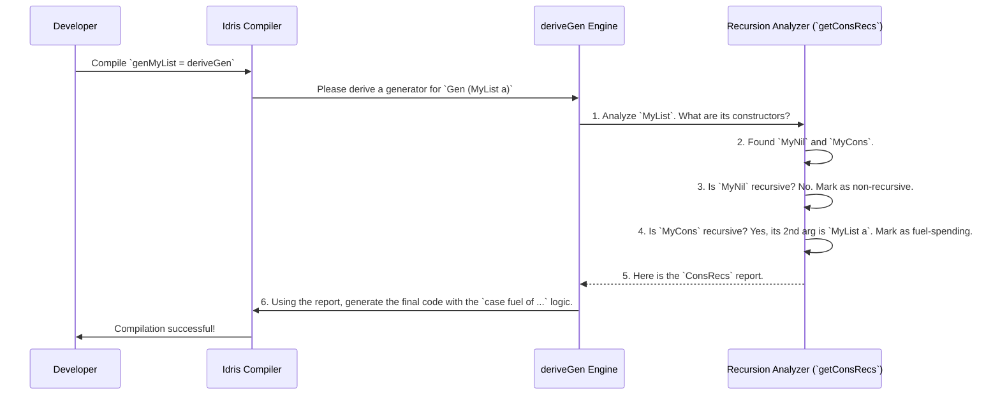

# Chapter 7: Constructor Recursion Analysis

In the [previous chapter](06_generator_signature_representation_.md), we saw how `DepTyCheck` acts like a diligent secretary, turning your generator signature into a formal work order called a `GenSignature`. This work order tells the `deriveGen` engine exactly what to build.

Now, the engine has its instructions. But before it starts generating code, it must perform a crucial safety check. It needs to inspect the blueprint of the data type itself. What happens if the blueprint says, "to build this part, you first need to build another one just like it"? This is recursion, and if not handled carefully, it's a recipe for disaster. This chapter explores how `DepTyCheck` analyzes and tames recursion.

## The Danger of Infinite Loops

Let's return to our familiar friend, the `MyList` data type.

```idris
data MyList a = MyNil | MyCons a (MyList a)
```

To create a `MyList`, a generator has two choices:
1.  Choose `MyNil`: Easy, we're done.
2.  Choose `MyCons`: We need to generate a value `a`... and *another* `MyList a`.

Imagine a naive generator that just picks between `MyNil` and `MyCons` with a 50/50 chance. What if it gets unlucky? It could pick `MyCons`, which requires another `MyList a`. For that inner list, it could again pick `MyCons`, which requires *another* `MyList a`, and so on.

```
MyCons head1 (MyCons head2 (MyCons head3 (... forever ...)))
```

This would create an infinite loop, and your program would hang, never producing a single test value. This is the fundamental problem that constructor recursion analysis solves.

## The Safety Inspector and "Fuel"

`DepTyCheck` avoids this trap with a two-part strategy we first hinted at in [Chapter 1: Automatic Generator Derivation
](01_automatic_generator_derivation_.md):

1.  **The Fuel Mechanism:** Every generator takes a `Fuel` argument. Think of it as a battery for the generator. Every time it takes a complex, recursive step, it consumes some fuel. When the fuel runs out (`Dry`), it's only allowed to take simple, non-recursive steps.

2.  **Constructor Recursion Analysis:** How does the generator know which steps are "recursive" and which are "non-recursive"? This is where the safety inspector comes in. At compile time, `deriveGen` runs an analysis that examines every constructor of your data type and tags it.

Let's see how the inspector analyzes `MyList a`:

-   **`MyNil`:** The inspector looks at `MyNil`. Does it have any arguments of type `MyList a`? No. It concludes: **`MyNil` is a non-recursive constructor (a base case).** It's safe to use even when out of fuel.

-   **`MyCons a (MyList a)`:** The inspector looks at `MyCons`. Does it have any arguments of type `MyList a`? Yes, the second argument is `MyList a`. It concludes: **`MyCons` is a recursive constructor.** It must only be used when there is fuel available to spend.

This analysis is stored in a special data structure called `ConsRecs` (Constructor Recursions). It's a report card that the code generator will use to make smart decisions.

## The `ConsRecs` Report Card

The `ConsRecs` record is the output of this analysis phase. It's essentially a map where `deriveGen` stores its findings. For `MyList`, the report card would look something like this:

-   **Type:** `MyList`
-   **Constructor Analysis:**
    -   `MyNil`: Non-recursive. Weight: 1.
    -   `MyCons`: Recursive, consumes fuel. Weight: 1.

The code generator can now use this report. When it writes the body for `genMyList`, it will generate code that explicitly checks the fuel.

```idris
-- Simplified pseudocode for what deriveGen produces
genMyList fuel =
  case fuel of
    Dry =>
      -- No fuel! Must use a non-recursive constructor.
      -- ConsRecs says only MyNil is available.
      Pure MyNil
    More newFuel =>
      -- Fuel available! Can choose recursive or non-recursive.
      -- ConsRecs says both are available.
      oneOf [ Pure MyNil
            , gen_a newFuel >>= \val =>
              genMyList newFuel >>= \rest =>
              Pure (MyCons val rest)
            ]
```

This `case` statement on `Fuel` is the key! It's the mechanism that guarantees termination. By forcing the generator to pick a base case when fuel runs out, `deriveGen` ensures that it will always eventually bottom out and produce a finite data structure.

## Under the Hood: The `getConsRecs` Function

This analysis happens inside `deriveGen`'s metaprogramming engine, specifically in a function called `getConsRecs` located in `src/Deriving/DepTyCheck/Gen/ConsRecs.idr`.

Let's trace the process when you compile `genMyList = deriveGen`.



The `getConsRecs` function iterates over all known types and their constructors. For each constructor, it performs a check similar to this conceptual snippet:

```idris
-- Highly simplified concept from: src/Deriving/DepTyCheck/Gen/ConsRecs.idr
getConsRecs : Elaboration m => m ConsRecs
getConsRecs = do
  -- For each type known to the compiler...
  for knownTypes $ \targetType => do
    -- For each constructor of that type...
    for targetType.cons $ \con => do
      -- Is this constructor recursive with respect to its own type?
      if isRecursive {containingType=Just targetType} con
        then -- Mark it as a fuel-spending, recursive constructor
             ...
        else -- Mark it as a simple, non-recursive constructor
             ...
```
This function is where the "Safety Inspector" does its work. `isRecursive` is a helper that inspects the types of a constructor's arguments to see if any of them mention the `containingType` itself.

An interesting detail is that this analysis is smart enough to detect more than just simple recursion. It can also identify "structurally decreasing" recursion, like in a `Nat`.

```idris
data Nat = Z | S Nat
```

The inspector sees that `S` is recursive, but it's a special kind. The inner `Nat` is always "smaller" than the `Nat` you are building. `DepTyCheck` can use this information to create more efficient generators that don't always need to spend fuel, but this is an advanced optimization. The core safety net is simply distinguishing between recursive and non-recursive steps.

## Conclusion

You've now seen the critical safety net that makes `deriveGen` reliable. Constructor Recursion Analysis is the compile-time inspector that prevents infinite loops and ensures your generators always terminate.

-   It systematically analyzes your data types to identify which constructors are **recursive** (like `MyCons`) and which are **non-recursive** (like `MyNil`).
-   It stores these findings in a `ConsRecs` "report card."
-   The code generator uses this report card to create a `case` expression based on `Fuel`, forcing the use of non-recursive base cases when fuel runs out.

This clever combination of compile-time analysis and a runtime fuel mechanism allows `DepTyCheck` to automatically generate data for even deeply recursive types with confidence and control.

Now that we've seen how `deriveGen` parses signatures and analyzes types, you might be wondering what utility functions are available to power this kind of metaprogramming. In the next chapter, we'll look at the general-purpose tools that `DepTyCheck` provides for writing your own compile-time macros.

Next: [Chapter 8: Derivation Metaprogramming Utilities](08_derivation_metaprogramming_utilities_.md)

---

Generated by [AI Codebase Knowledge Builder](https://github.com/The-Pocket/Tutorial-Codebase-Knowledge)