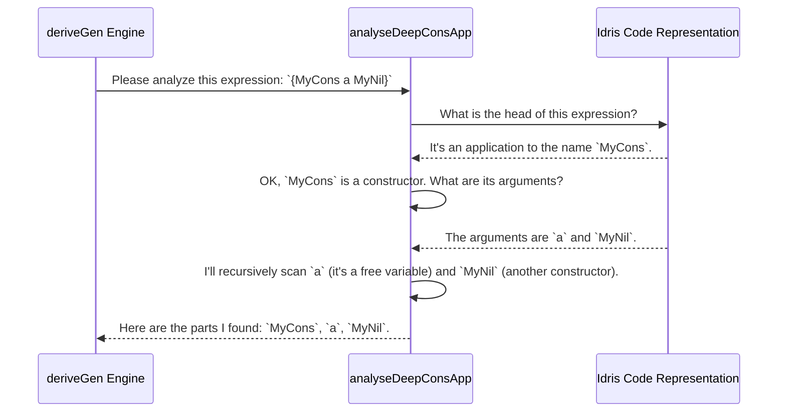

# Chapter 8: Derivation Metaprogramming Utilities

In the [previous chapter](07_constructor_recursion_analysis_.md), we became safety inspectors, learning how `deriveGen` analyzes data types to find recursive constructors and prevent infinite loops. We've seen *what* the derivation engine does: it parses signatures, analyzes types, and builds safe generators. But we haven't seen *how* it performs these delicate operations. How does it actually look inside a type expression and understand its structure?

This chapter opens the lid on the `DepTyCheck` engine's specialized toolbox. These are not tools you'll use every day, but understanding them reveals the low-level "magic" that makes automatic derivation possible. They are the power drills and laser scanners that handle the nitty-gritty details of code manipulation at compile-time.

## The Engine's Secret Toolbox

Imagine the `deriveGen` engine is a master mechanic working on a complex car engine (your data type). The mechanic has a high-level plan, like "install the alternator." But to do that, they need specific tools: a wrench to loosen a bolt, a screwdriver to remove a panel, a voltmeter to check a connection.

The Derivation Metaprogramming Utilities are that toolbox. They are a collection of low-level helper functions that the core derivation logic uses to perform fundamental tasks like code analysis and transformation. Let's look at two of the most important tools in the box.

### Tool 1: The X-Ray Scanner — `analyseDeepConsApp`

One of the first things `deriveGen` must do is understand the structure of a type. Consider a type like `Vect 3 (MyList String)`. From the compiler's perspective, this is just one big, complicated expression. The engine needs to break it down. It needs to see:

-   The outermost type is `Vect`.
-   It has an argument `MyList String`.
-   `MyList` is another data type.
-   `String` is a primitive type.

This is the job of `analyseDeepConsApp`. Think of it as an X-ray scanner. You point it at a type expression, and it gives you back a list of all the data constructors and free variables inside, in the order they appear.

Let's imagine we point it at the expression `MyCons "hello" MyNil`.

```idris
-- This is a conceptual example, not real Idris code you would write.
let expression = `{MyCons "hello" MyNil}`

-- Point the 'X-ray scanner' at the expression.
analyseDeepConsApp(expression)
```

The function would analyze the expression and return something conceptually like this:

```
-- Output: A list of the important "parts" of the expression.
["MyCons", "String", "MyNil"]
```
*(Note: "hello" is a value of type `String`, so the analysis identifies `String` as a component.)*

This tool is incredibly powerful. It allows the main derivation logic to ask questions like, "Does this type depend on any variables?" or "What are the fundamental building blocks of this type?" without getting bogged down in the complex details of parsing the code tree.

**Under the Hood**

When the `deriveGen` engine needs to understand a type provided in a [Generator Signature Representation](06_generator_signature_representation_.md), it calls `analyseDeepConsApp`. This happens deep within the compile-time metaprogramming phase.



The implementation in `src/Deriving/DepTyCheck/Util/DeepConsApp.idr` is a recursive function that walks through a `TTImp` (the internal representation of an Idris expression). A very simplified piece of its logic looks like this:

```idris
-- Simplified from: src/Deriving/DepTyCheck/Util/DeepConsApp.idr
analyseDeepConsApp : ... -> (analysedExpr : TTImp) -> m ...
analyseDeepConsApp ... e = do
  -- Break the expression into the thing being applied and its arguments
  let (function, args) = unAppAny e

  -- Is the function a constructor?
  let Just con = lookupCon function.name
    | Nothing => throwError "this is not a constructor"

  -- Recursively analyze all the arguments
  deepArgs <- for args $ \arg => analyseDeepConsApp ... arg
  -- ... combine results and return
```

This recursive "deconstruction" is what allows `analyseDeepConsApp` to peer into arbitrarily complex type expressions and give a simple, clean report to the rest of the engine.

### Tool 2: The Argument Rearranger — `reorder`

In the chapter on [Derivation Customization](05_derivation_customization_.md), we learned how to use `GenOrderTuning` to tell `deriveGen` to generate a constructor's fields in a specific order. This is a high-level instruction, but how does the engine actually execute it?

It uses a simple but essential tool: `reorder`. This function takes a list of items and a list of new positions (a permutation) and returns a new list with the items rearranged.

Imagine the engine needs to generate arguments for a constructor `MkFoo` which has three fields: `x`, `y`, and `z`. The default order is `[x, y, z]`. But you've provided a hint telling it to generate them in the order `z`, then `x`, then `y`.

To execute this, the engine first defines the new order as a list of indices: `[2, 0, 1]`. Then it calls `reorder`.

```idris
-- Conceptual example
let arguments = ["generator_for_x", "generator_for_y", "generator_for_z"]
let permutation = [2, 0, 1] -- z is at index 2, x is at 0, y is at 1

reorder(permutation, arguments)
```

The output is exactly what the engine needs to proceed.

```
-- Output: The generators rearranged into the desired order.
["generator_for_z", "generator_for_x", "generator_for_y"]
```

This utility handles the mechanical task of shuffling the plan, allowing the main logic to focus on the high-level strategy.

**Under the Hood**

The implementation of `reorder` in `src/Deriving/DepTyCheck/Util/ArgsPerm.idr` is beautifully concise. It uses a little bit of vector-based programming to achieve its goal.

```idris
-- From: src/Deriving/DepTyCheck/Util/ArgsPerm.idr
export
reorder : (perm : Vect n (Fin n)) -> Vect n a -> Vect n a
reorder perm orig = perm <&> flip index orig
```

Let's break this down:
- It takes a permutation `perm` (a `Vect` of indices) and the original `Vect` `orig`.
- The `<&>` operator is just `map`. It applies a function to every element in `perm`.
- The function is `flip index orig`. This means for each index `i` in the `perm` vector, it computes `index i orig`, which plucks the i-th element out of the original vector.
The result is a new vector containing the elements of the original, but in the new order specified by the permutation.

## Conclusion

You've now had a peek into the specialized toolbox used by the `DepTyCheck` metaprogramming engine. While you may never call these functions directly, they are the unsung heroes that make automatic derivation work.

-   **`analyseDeepConsApp`** acts like an X-ray scanner, deconstructing complex type expressions into a simple list of their constituent parts.
-   **`reorder`** is a utility for rearranging lists of arguments, used to implement features like `GenOrderTuning`.
-   These low-level tools handle the messy details of code analysis and manipulation, enabling the high-level derivation logic to be clean and focused.

Understanding that this layer of powerful, general-purpose tools exists helps demystify the entire derivation process. The "magic" of `deriveGen` is built upon these solid, understandable foundations.

We've now completed our tour of a core developer-facing features of `DepTyCheck`. In the final chapter, we'll switch gears and look at the practical side of things: how to build the project, run the tests, and configure it for your own needs.

Next: [Chapter 9: Project Build and Configuration](09_project_build_and_configuration_.md)

---

Generated by [AI Codebase Knowledge Builder](https://github.com/The-Pocket/Tutorial-Codebase-Knowledge)