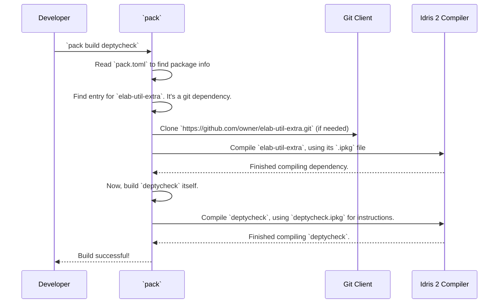

# Chapter 9: Project Build and Configuration

In the [previous chapter](08_derivation_metaprogramming_utilities_.md), we explored the specialized toolbox of metaprogramming utilities that power the `deriveGen` engine. We've completed our tour through the core logic of `DepTyCheck`. For our final chapter, we're zooming out from the intricate internal machinery to look at the project's "scaffolding"—the collection of files that define how the library is built, tested, and managed.

Think of the previous chapters as studying the design of a revolutionary car engine. This chapter is about visiting the factory floor. We'll look at the main assembly line instructions, the list of parts suppliers, and the custom tools the mechanics use to keep everything running smoothly.

## The Project's Blueprint: `deptycheck.ipkg`

Every Idris 2 project has a "birth certificate" and instruction manual rolled into one: the `.ipkg` file. This is a simple text file that tells the Idris compiler the most basic information about a library.

-   What is its name?
-   Who are the authors?
-   Where is the source code?
-   What other libraries does it depend on?

Let's look at a simplified version of `deptycheck.ipkg`.

```idris
package deptycheck

authors = "Denis Buzdalov"
sourcedir = "src"

modules = Deriving.DepTyCheck.Gen
        , Test.DepTyCheck.Gen
        -- ... many more modules ...

depends = ansi
        , elab-util-extra
        , random-pure
```

-   `package deptycheck`: Declares the name of our project.
-   `sourcedir = "src"`: Tells the compiler to look for all source code files inside a folder named `src`.
-   `modules = ...`: This is a complete list of all the source code files (modules) that make up the `DepTyCheck` library.
-   `depends = ...`: This lists the names of other Idris libraries that `DepTyCheck` needs to function. It's like saying, "To build this project, you first need to have `ansi` and `random-pure` installed."

This file is the primary blueprint that the Idris compiler uses. However, it doesn't say *where* to get those dependencies. For that, we need a supply chain manager.

## The Supply Chain Manager: `pack.toml`

Modern software projects are rarely built from scratch; they rely on a network of other open-source libraries. Managing these dependencies can be tricky. `DepTyCheck` uses `pack`, the community package manager for Idris 2, to handle this. `pack`'s configuration file is `pack.toml`.

This file is like a detailed address book of suppliers. For every dependency listed in `deptycheck.ipkg`, `pack.toml` tells `pack` exactly where to get it.

It also defines "local" packages, like the main library itself and its examples, so `pack` knows how to build and test them.

```toml
-- In pack.toml

-- This entry says "deptycheck" is a local package,
-- found in the current directory (.), with its blueprint
-- in deptycheck.ipkg.
[custom.all.deptycheck]
type = "local"
path = "."
ipkg = "deptycheck.ipkg"
test = "tests/tests.ipkg"

-- This tells pack where to find a specific dependency.
[custom.nightly-251007.fin-lizzie]
type   = "git"
url    = "https://github.com/buzden/idris2-fin-lizzie"
commit = "latest:master"
ipkg   = "fin-lizzie.ipkg"
```

With this file, building the entire project and all its dependencies is as simple as running one command: `pack build`. `pack` will read the file, download any missing git repositories, find the right `.ipkg` files, and build everything in the correct order.

## Specialized Tools for Development

Beyond the main configuration files, the `DepTyCheck` repository includes a few special helper scripts. You don't need to understand *how* they work, but it's useful to know *what* they're for. They are the custom tools in the factory's workshop.

### `.rename`: The Smart Refactoring Tool

When working on a large project, you sometimes need to rename a file. If you do this manually, you then have to go through every other file and update all the `import` statements. This is slow and error-prone.

The `.rename` script automates this. You simply run it like this:

```sh
./.rename src/Old/FileName.idr src/New/Path/To/File.idr
```

It not only moves the file but also intelligently searches the entire project for any references to the old module name and updates them to the new one. It's a huge time-saver for developers.

### `.patch-chez-gc-handler`: The Performance Tuner

This is a fascinating and highly specialized tool. Idris 2 compiles to a language called Chez Scheme. The performance of a compiled Idris program, especially one doing a lot of compile-time metaprogramming like `DepTyCheck`, can be affected by how Chez Scheme manages memory (its "Garbage Collector" or GC).

The `.patch-chez-gc-handler` script is like a hot-rod mechanic's tool. It finds the compiled output of an Idris program and replaces the standard garbage collector logic with a custom-tuned version that is more aggressive about cleaning up memory. This can lead to significant speedups when running complex derivations. This is not something users need to do, but it's a vital part of the development and CI/CD pipeline for ensuring `DepTyCheck` itself is fast.

## Under the Hood: The Build Process

When a developer wants to build and test `DepTyCheck`, these files work together in a coordinated sequence. Let's see what happens when you run `pack build deptycheck`.



This orchestrated process ensures that all dependencies are present and built before the main library is compiled, preventing a whole class of build errors. The `pack.toml` file provides the high-level coordination, while each `.ipkg` file provides the specific build instructions for its own package.

## Conclusion

Congratulations! You've made it through the entire `DepTyCheck` tutorial. We started with the "magic" of `deriveGen` and have now ended with the practical nuts and bolts that hold the project together. You've learned that a robust project is more than just its core logic; it's also a product of its build and configuration system.

-   **`deptycheck.ipkg`** is the project's low-level blueprint, telling the Idris compiler what the project is and what modules it contains.
-   **`pack.toml`** is the high-level supply chain manifest, telling the `pack` package manager where to find all dependencies.
-   **Helper scripts** like `.rename` and `.patch-chez-gc-handler` are specialized tools that make development more efficient and performant.

You now have a deep understanding of not only how to *use* `DepTyCheck` to create powerful, dependently-typed property tests, but also how its most important features are designed and implemented. We hope this journey has been enlightening and empowers you to write more reliable and robust software with Idris. Happy testing

---

Generated by [AI Codebase Knowledge Builder](https://github.com/The-Pocket/Tutorial-Codebase-Knowledge)