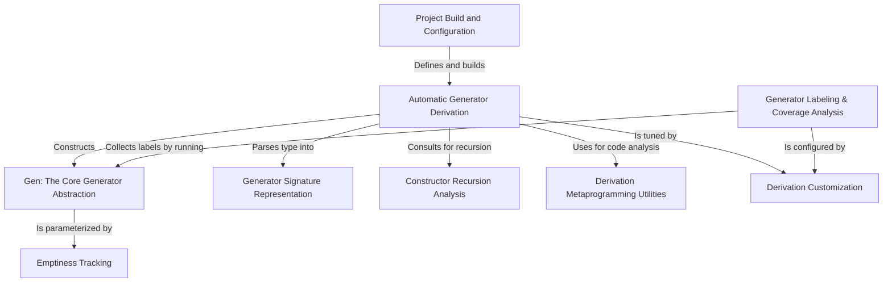

# Tutorial: DepTyCheck

`DepTyCheck` is a library for *property-based testing* in the Idris programming language, which is special because it supports **dependent types**. The core of the library is the `Gen` abstraction, a "recipe" for creating random test data. Its main superpower is `deriveGen`, a feature that can **automatically create** these complex recipes for your data structures, making it much easier to write thorough tests. It also includes tools to track whether a generator can even produce a value and to analyze how well your tests cover all parts of your data model.

**Source Repository:** [None](None)

## Chapters

1. [Automatic Generator Derivation
](01_automatic_generator_derivation_.md)
2. [Gen: The Core Generator Abstraction
](02_gen__the_core_generator_abstraction_.md)
3. [Emptiness Tracking
](03_emptiness_tracking_.md)
4. [Generator Labeling & Coverage Analysis
](04_generator_labeling___coverage_analysis_.md)
5. [Derivation Customization
](05_derivation_customization_.md)
6. [Generator Signature Representation
](06_generator_signature_representation_.md)
7. [Constructor Recursion Analysis
](07_constructor_recursion_analysis_.md)
8. [Derivation Metaprogramming Utilities
](08_derivation_metaprogramming_utilities_.md)
9. [Project Build and Configuration
](09_project_build_and_configuration_.md)

---

Generated by [AI Codebase Knowledge Builder](https://github.com/The-Pocket/Tutorial-Codebase-Knowledge)