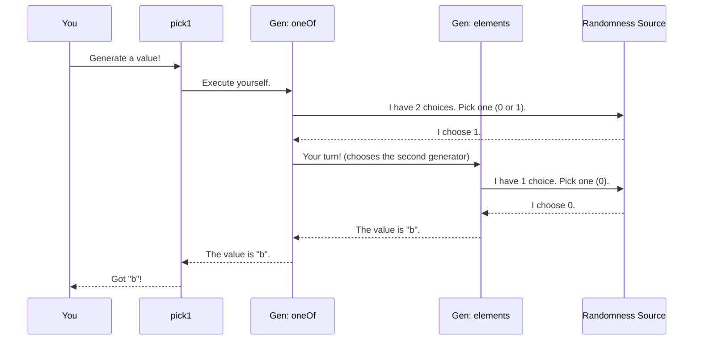

# Chapter 1: Test Data Generator (`Gen`)

Welcome to your journey with `DepTyCheck`! In this series, we'll explore how to perform property-based testing for programs written in Idris, a language with powerful dependent types.

Our first stop is the most fundamental building block of any property-based testing library: the **Test Data Generator**. Before we can test any property, we need a way to generate random data to test it with. Let's dive in!

## What is a `Gen`?

Imagine you're a chef who needs to create a wide variety of dishes. You have a recipe book. Some recipes are very simple, like "a single apple." Others are more complex, like "a random fruit salad," which might tell you to "pick one recipe from the 'fruit' section of the book."

In `DepTyCheck`, a **`Gen a`** is exactly that: a **recipe for making random values of type `a`**.

You can have simple recipes, and you can combine them to create more elaborate ones. This "recipe" is the core abstraction you'll work with when creating test data.

## Your First Recipe: `elements`

Let's start with the simplest case. Imagine we have a function we want to test that works with greetings.

```idris
-- A function we want to test
greet : String -> String
greet name = "Hello, " ++ name ++ "!"
```

To test this, we need to generate some random `String`s. The easiest way to do this is to create a generator that picks one value from a pre-defined list. We use the `elements` function for this.

```idris
import Test.DepTyCheck.Gen

-- A recipe for making one of three specific strings
genSomeGreetings : Gen NonEmpty String
genSomeGreetings = elements ["Hi", "Hello", "Howdy"]
```

Let's break this down:

*   `genSomeGreetings` is our new recipe.
*   The type is `Gen NonEmpty String`. This tells us two things:
    *   `Gen ... String`: It's a recipe for making a `String`.
    *   `NonEmpty`: This is a guarantee. It means this recipe will **always** succeed in producing a value. It's never "empty." We'll see why this is important later.
*   `elements [...]`: This is the function we use to build the recipe. It simply says, "randomly pick one of the items from this list."

To actually "cook" the recipe and get a value, you can use the `pick1` function.

```idris
-- In an interactive Idris session (REPL)
-- You would get one of the three strings randomly.
> :exec pick1 genSomeGreetings
"Hello"
> :exec pick1 genSomeGreetings
"Hi"
```

## Combining Recipes: `oneOf`

Your recipe book wouldn't be very useful if you couldn't combine recipes. Let's say we have another generator for names.

```idris
-- A recipe for making one of two names
genSomeNames : Gen NonEmpty String
genSomeNames = elements ["Alice", "Bob"]
```

Now, what if we want a generator that can produce *either* a greeting *or* a name? We can use `oneOf`. It takes a list of generators and creates a new one that randomly picks one of the *inner* generators to run.

```idris
-- A recipe that can make a greeting OR a name
genGreetingOrName : Gen NonEmpty String
genGreetingOrName = oneOf [genSomeGreetings, genSomeNames]
```

Think of this as telling the chef, "Randomly open to either the 'greetings' recipe page or the 'names' recipe page, and then follow that recipe."

When you run `pick1 genGreetingOrName`, there's a 50% chance it will run `genSomeGreetings` and a 50% chance it will run `genSomeNames`.

## Recipes for Complex Data: Applicative Syntax

Most of the time, our data isn't just a simple `String`. Let's define a `User` type.

```idris
data User = MkUser String Nat

-- A generator for simple user profiles
genUser : Gen NonEmpty User
genUser = [| MkUser genSomeNames (choose (18, 65)) |]
```

This looks a bit different! Let's examine the new pieces:
*   `choose (18, 65)`: This is a built-in recipe that generates a random number within a given range. In this case, it's a `Nat` between 18 and 65, inclusive.
*   `[| MkUser ... |]`: This special syntax is for building complex data. It's like a master recipe that says:
    1.  Follow the `genSomeNames` recipe to get a name.
    2.  Follow the `choose (18, 65)` recipe to get an age.
    3.  Use the results from steps 1 and 2 to build a `User` with `MkUser`.

So, `genUser` is a recipe that produces users like `MkUser "Alice" 25` or `MkUser "Bob" 60`.

## The Impossible Recipe: `Empty` Generators

Here's where `DepTyCheck` really shines, especially for dependent types. What happens if a recipe is impossible? For example, a recipe for a "cake without ingredients."

In Idris, some types literally have no values. We call them "uninhabited." A classic example is `Fin 0`. The type `Fin n` represents a number from `0` to `n-1`. So `Fin 0` represents a number from `0` to `-1`, which is an empty set. No such number exists!

If we want to write a generator for `Fin n` that works for *any* `n`, it must be able to handle the `n=0` case.

```idris
-- A simplified recipe for Fin n
genFin : (n : Nat) -> Gen MaybeEmpty (Fin n)
genFin Z     = empty
genFin (S k) = -- ... a recipe that generates a Fin (S k) ...
```

Notice two crucial things:

1.  **`empty`**: This is the "impossible recipe." It's a generator that can never produce a value.
2.  **`Gen MaybeEmpty ...`**: The guarantee has changed! `MaybeEmpty` tells us that this recipe *might* be empty. It might not produce a value.

This is the purpose of the first parameter to `Gen`:
*   `Gen NonEmpty a`: A recipe for `a` that is **guaranteed** to produce a value.
*   `Gen MaybeEmpty a`: A recipe for `a` that **might be empty** (fail to produce a value).

This ability to represent "impossible" generations is essential for testing programs with dependent types, where the existence of a value can depend on another value (like `n` in `Fin n`).

## Under the Hood: How `Gen` Executes

So what is a `Gen` object really? It's a data structure that represents the *instructions* for generation, but it doesn't do anything until you ask it to.

When you call `pick1 myGen`, `DepTyCheck`'s runner inspects the structure of `myGen` and follows the instructions.

Let's visualize running `pick1 (oneOf [elements ["a"], elements ["b"]])`.



The `Gen` itself is just a plan. The runner brings it to life using a source of randomness.

If you look inside the code (in `src/Test/DepTyCheck/Gen.idr`), you'll find the definition of `Gen`, which looks something like this:

```idris
-- A simplified view of the Gen data type
data Gen : Emptiness -> Type -> Type where
  -- The impossible recipe
  Empty : Gen MaybeEmpty a

  -- A recipe that is just one specific value
  Pure  : a -> Gen em a

  -- A recipe defined by combining other recipes
  OneOf : GenAlternatives True alem a -> Gen em a

  -- ... and a few others for more complex cases
```
Each of these constructors corresponds to a different kind of recipe instruction that the runner knows how to interpret.

## Conclusion

You've just learned the fundamentals of the `DepTyCheck` test data generator, `Gen`:

*   A **`Gen a`** is a **recipe** for creating random values of type `a`.
*   You can create simple recipes with functions like **`elements`** and **`choose`**.
*   You can combine recipes using **`oneOf`** (to choose between recipes) and applicative syntax `[| ... |]` (to build complex data).
*   A generator can be **`Empty`**, representing an impossible recipe. This is tracked by the `Emptiness` type parameter (`NonEmpty` vs. `MaybeEmpty`) and is critical for dependent types.

Creating all these recipes by hand for your own complex data types would be tedious. What if `DepTyCheck` could look at your data type's definition and write the generator *for you*? That's exactly what we'll cover in the next chapter.

Next up: **[Chapter 2: Generator Derivation Engine](02_generator_derivation_engine_.md)**

---

Generated by [AI Codebase Knowledge Builder](https://github.com/The-Pocket/Tutorial-Codebase-Knowledge)