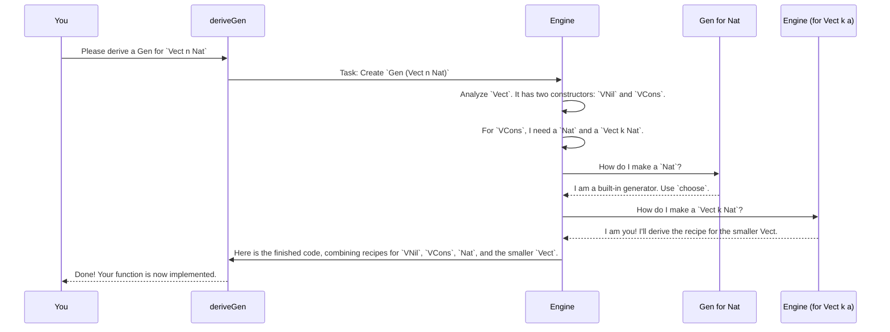

# Chapter 2: Generator Derivation Engine

In [Chapter 1: Test Data Generator (`Gen`)](01_test_data_generator___gen___.md), we learned how to manually write "recipes" (`Gen`) to create random test data. While this works, writing these recipes for every single one of your data types can be slow and repetitive, especially for complex ones.

What if you had an expert chef who could look at a picture of a dish and instantly write the recipe for you? That's exactly what `DepTyCheck`'s Generator Derivation Engine does!

## The Problem: Manual Labor

Let's imagine we have a simple, dependently-typed list called `Vect`.

```idris
data Vect : Nat -> Type -> Type where
  VNil : Vect Z a
  VCons : a -> Vect k a -> Vect (S k) a
```

To write a generator for `Vect n a` by hand, you'd need to handle recursion, the dependency on `n`, and the base case. It might look something like this:

```idris
-- Simplified manual generator for Vect
genVect : Gen NonEmpty a -> (n : Nat) -> Gen NonEmpty (Vect n a)
genVect genA Z = pure VNil
genVect genA (S k) = [| VCons genA (genVect genA k) |]
```

This isn't too bad for `Vect`, but imagine a data type with ten fields and multiple constructors. Writing the generator manually would be a nightmare!

## The Magic: `deriveGen`

This is where the magic happens. With `DepTyCheck`, you don't have to write that code. You just state what you want and let the engine do the work.

```idris
import Deriving.DepTyCheck.Gen

-- A generator for a Vect of Nat's between 0 and 100
genVectNat : (n : Nat) -> Gen MaybeEmpty (Vect n Nat)
genVectNat {a=Nat} = deriveGenFor (Fuel -> {n:_} -> Gen (Vect n Nat))
```

That's it! One line.

*   `deriveGenFor` is the macro that calls the engine.
*   We give it the *type signature* of the generator we want. In this case, `Fuel -> {n:_} -> Gen (Vect n Nat)`. This tells the engine: "I need a generator that takes some fuel (for randomness) and a length `n`, and produces a `Vect` of that length."
*   The engine analyzes `Vect` and the `Nat` type inside it and automatically writes the implementation for you.

> **Note:** We use `Gen MaybeEmpty` here because the engine is powerful enough to know that if you ask for a `Vect` of a type that has no values, it would be impossible to generate, so the recipe might be empty.

## Meet the Expert Chef: The Derivation Engine

The `deriveGen` macro isn't really magic. It's powered by a sophisticated **Generator Derivation Engine**. Think of it as a master chef with a team of specialists.

When you ask it to derive a generator, it follows a meticulous process:

1.  **Analyze the Dish:** It first looks at the final result you want (e.g., `Vect n Nat`). This is like the chef looking at a photo of the finished dish. This step is handled by the [Generator Signature Analysis](04_generator_signature_analysis_.md) system.
2.  **Break It Down:** It then breaks the dish down into its core components. To make a `Vect (S k) Nat`, it knows it needs a `Nat` and another `Vect k Nat`.
3.  **Delegate to Sub-Chefs:** For each component, it finds or creates a recipe.
    *   "I need a `Nat`. Is there a built-in recipe for `Nat`? Yes, `choose`. I'll use that."
    *   "I need a `Vect k Nat`. I'll just ask my main engine to create a recipe for *that*." (This is recursion!)
4.  **Assemble the Master Recipe:** It combines all the sub-recipes into a final, complete master recipe (`Gen`).

This process is coordinated across all the types you need, even if they are mutually recursive (e.g., a `Tree` that can contain a `Forest`, which is a list of `Tree`s).

## A Walkthrough: Deriving `genVectNat`

Let's visualize what happens when `deriveGen` is called.



The key takeaway is that the engine is a **recursive system**. It solves a big problem by breaking it into smaller, identical problems until it reaches a simple base case (like generating a `Nat`) that it already knows how to solve.

## A Glimpse Under the Hood

You don't need to understand the internal code to use the engine, but seeing a simplified view can help demystify the "magic". The engine is composed of several modules working together.

#### 1. The Entry Point (`Deriving.DepTyCheck.Gen`)

When you call `deriveGen`, it triggers the `deriveGenExpr` function. This is the front door to the engine. Its main job is to analyze your requested signature.

```idris
-- Simplified from src/Deriving/DepTyCheck/Gen.idr

export
deriveGenExpr : (signature : TTImp) -> Elab TTImp
deriveGenExpr signature = do
  -- 1. Analyze the signature you provided.
  checkResult <- checkTypeIsGen DerivationTask signature

  -- 2. Run the main derivation logic.
  (callExpr, locals) <- runCanonic ... (callMainDerivedGen ...)

  -- 3. Wrap the result in the final function.
  pure $ local locals callExpr
```
This function acts as a project manager, first understanding the task (`checkTypeIsGen`) and then handing it off to the core derivation logic (`runCanonic`).

#### 2. The Coordinator (`ForAllNeededTypes`)

The `runCanonic` and `callGen` functions act as the coordinator or "head chef". They manage a to-do list of all the generator recipes that need to be written.

```idris
-- Simplified from src/Deriving/DepTyCheck/Gen/ForAllNeededTypes/Impl.idr

-- A function to get a generator for a given signature
callGen : (sig : GenSignature) -> ... -> m TTImp
callGen sig fuel values = do
  -- Is there an external (user-provided) generator for this?
  -- If so, use it.
  ...

  -- Have we already derived this generator?
  let Nothing = SortedMap.lookup sig !(get)
    | Just name => pure (callCanonic sig name ...) -- If so, just call it.

  -- If not, let's derive it!
  let name = nameForGen sig
  -- Add this task to our to-do list.
  modify {stateType=List _} $ (::) (sig, name)
  -- Actually do the work (if we're at the top level).
  deriveAll
  ...
```
This is the core of the recursive process. It checks if the work has already been done. If not, it adds the task to a queue and ensures that every required `Gen` is created exactly once.

#### 3. The Specialist (`ForOneTypeConRhs`)

For each constructor of your data type (like `VNil` and `VCons`), a specialist function `consGenExpr` is called. It figures out the recipe for just that one constructor.

```idris
-- Simplified from src/Deriving/DepTyCheck/Gen/ForOneTypeConRhs/Impl.idr

[LeastEffort] DeriveBodyRhsForCon where
  consGenExpr sig con givs fuel = do
    -- 1. Figure out the best order to generate the constructor's fields.
    --    This is crucial for dependent types!
    theOrder <- ... searchOrder ...

    -- 2. Generate the code that calls sub-generators in that order.
    genForOrder theOrder
```
This is where some of the deepest challenges are solved, like figuring out the correct order to generate fields. We will explore this in detail in a later chapter on [Derivation Order & Field Dependency Analysis](05_derivation_order___field_dependency_analysis_.md).

## Conclusion

You've now seen the "magic" behind `DepTyCheck`: the **Generator Derivation Engine**.

*   It **automates** the tedious task of writing `Gen` recipes for your data types.
*   You activate it with the **`deriveGen`** or **`deriveGenFor`** macros.
*   It works like an **expert chef**, recursively breaking down your type, delegating sub-tasks, and assembling a master recipe.
*   It's a **multi-layered system** that analyzes signatures, coordinates recursive derivations, and handles the complexities of each constructor.

Now that we know how to generate vast amounts of test data automatically, a new question arises: how do we know if our generated data is actually testing all the important parts of our code? Are we missing any edge cases?

Next up: **[Chapter 3: Coverage Tracking](03_coverage_tracking_.md)**

---

Generated by [AI Codebase Knowledge Builder](https://github.com/The-Pocket/Tutorial-Codebase-Knowledge)