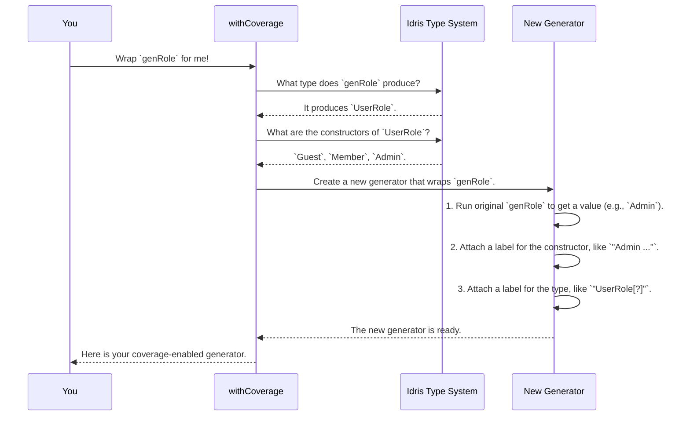

# Chapter 3: Coverage Tracking

In the [previous chapter on the Generator Derivation Engine](02_generator_derivation_engine_.md), you saw how `DepTyCheck` can automatically create generators for even the most complex data types. This is incredibly powerful! We can now generate thousands of test cases in an instant.

But this raises a new question: are we generating the *right* kind of data? Are our tests exploring all the interesting corners of our data model, or are they just repeating the same simple cases over and over? This is where Coverage Tracking comes in.

## The Problem: Are We Testing Everything?

Imagine we have a data type representing different kinds of users on a website.

```idris
data UserRole = Guest | Member | Admin
```

An `Admin` user likely has special privileges and behaviors that are critical to test. When we use our automatically derived generator, `deriveGen`, how can we be sure it's actually creating `Admin` users? If the `Admin` case is rare, our test suite might run thousands of times without ever testing the most sensitive part of our application!

We need a way to monitor which parts of our data model are being "touched" by our generators.

## Meet the Quality Control Team

Coverage Tracking is `DepTyCheck`'s built-in quality control system. Think of it like a team that monitors an assembly line.

1.  **Tagging the Parts (`Label`):** The team places invisible tags on different parts of the assembly line instructions. In our code, these "parts" are our types (like `UserRole`) and constructors (like `Guest`, `Member`, and `Admin`). A tag is just a simple `Label`.

2.  **Scanning the Product:** When a random value is produced (e.g., an `Admin` user role is generated), it's scanned for all the tags it contains.

3.  **The Final Report (`ModelCoverage`):** The results from all generated values are collected into a `ModelCoverage` report. This report shows you exactly how many times each type and constructor was used.

This helps you see at a glance if your tests are thoroughly exploring the state space of your data.

## Using Coverage Tracking: A Simple Example

Let's see it in action. The main tool you'll use is the `withCoverage` macro. It takes a generator and wraps it with all the necessary tracking logic.

```idris
import Test.DepTyCheck.Gen.Coverage

-- 1. Create a generator for UserRole
-- We'll use the derivation engine from the last chapter.
genRole : Gen MaybeEmpty UserRole
genRole = deriveGen

-- 2. Wrap it with coverage tracking
genRoleWithCoverage : Gen MaybeEmpty UserRole
genRoleWithCoverage = withCoverage genRole
```

That's it! `genRoleWithCoverage` behaves just like `genRole`, but it has a secret superpower: every value it generates is tagged.

### Generating Data and Getting the Report

Now, how do we see the results? We need a special function to run the generator that can also collect the coverage data. One such function is `unGenTryND`.

```idris
import Data.List.Lazy

-- A function to generate N values and capture their coverage
-- unGenTryND : (n : Nat) -> seed -> Gen a -> LazyList (ModelCoverage, a)
generateN n gen = take n $ unGenTryND n (believe_me_its_a_seed) gen
```

Let's generate 100 `UserRole` values.

```idris
-- Generate 100 roles and their associated coverage data
results : LazyList (ModelCoverage, UserRole)
results = generateN 100 genRoleWithCoverage
```

Each item in the `results` list is a pair: the `ModelCoverage` for *that single generation* and the `UserRole` value itself. Now, let's combine all the coverage data and print a nice report.

```idris
-- 1. Get just the coverage data and combine it all into one big report
totalCoverage : ModelCoverage
totalCoverage = foldl (<+>) neutral (map fst results)

-- 2. Create an empty report structure for our UserRole type
coverageInfo = initCoverageInfo {g=UserRole}

-- 3. Fill the empty report with our collected data
finalReport = registerCoverage totalCoverage coverageInfo

-- 4. Print it!
:exec putStrLn (show finalReport)
```

You would see output that looks something like this (exact numbers will vary):

```
UserRole covered partially (100 times)
  - Main.Guest: covered (35 times)
  - Main.Member: covered (33 times)
  - Main.Admin: covered (32 times)
```

Success! We can clearly see that all three constructors (`Guest`, `Member`, and `Admin`) were generated. If `Admin` showed "not covered" or "covered (1 time)", we would immediately know that our testing for `Admin`-related features is weak and needs to be improved.

## How It Works Under the Hood

The `withCoverage` macro seems like magic, but it's just a clever code generator. Let's trace what happens when you call `withCoverage genRole`.



The macro inspects your type, automatically builds a labelling function specific to that type, and wraps your original generator with it.

### A Peek at the Code

Let's look at the key components.

**1. The `Label`**

A `Label` is just a wrapper around a `String`. It's the "invisible tag" from our analogy.

```idris
-- From: src/Test/DepTyCheck/Gen/Labels.idr

data Label : Type where
  StringLabel : String -> Label
```

**2. The `withCoverage` Macro**

This macro is the entry point. It analyzes the type of the generator you give it and builds the wrapper.

```idris
-- Simplified from: src/Test/DepTyCheck/Gen/Coverage.idr

export %macro
withCoverage : (gen : Gen em a) -> Elab $ Gen em a
withCoverage gen = do
  -- Inspect the type `a` that the generator produces
  tyExpr <- quote a
  let (IVar _ tyName, _) = ... -- Get the name of the type, e.g., `UserRole`

  -- Ask the type system for info about `UserRole` (its constructors, etc.)
  tyInfo <- getInfo' tyName

  -- ... code to build a function that attaches labels ...

  -- Return a new generator that uses the labelling function
  pure $ label (fromString "\{show tyName}[?]") (gen >>= labeller)
```
The macro generates a `labeller` function that acts like a `case` statement: if the value is `Guest`, attach the `"Guest"` label; if it's `Admin`, attach the `"Admin"` label, and so on.

**3. The `ModelCoverage` Report**

The `ModelCoverage` record is a simple map that stores the count for each label.

```idris
-- From: src/Test/DepTyCheck/Gen/Coverage.idr

public export
record ModelCoverage where
  constructor MkModelCoverage
  unModelCoverage : SortedMap Label Nat -- A map from Label to its count
```
Because `ModelCoverage` has a `Monoid` implementation, we can easily combine many small reports into one final summary using `foldl (<+>) neutral`.

**4. The Derivation Engine's Own Labels**

Interestingly, the [Generator Derivation Engine](02_generator_derivation_engine_.md) itself uses a similar labelling system internally! When it builds a generator using `oneOf` or `frequency`, it adds its own labels to track which path was taken.

```idris
-- Simplified from: src/Deriving/DepTyCheck/Gen/Labels.idr

-- A function used by the engine to wrap a list of generators
callOneOf : (desc : CTLabel) -> List TTImp -> TTImp
callOneOf desc variants = labelGen desc $ `(Test.DepTyCheck.Gen.oneOf ...)
```
This means that even without `withCoverage`, the engine is already providing some level of insight, which `DepTyCheck` uses to guide its generation strategies.

## Conclusion

You've learned how `DepTyCheck`'s **Coverage Tracking** system gives you confidence in your automated testing.

*   It solves the problem of not knowing whether your generators are exploring all parts of your data model.
*   You use the **`withCoverage`** macro to easily add tracking to any generator.
*   The system works by adding **`Label`**s to generated values and summarizing them in a **`ModelCoverage`** report.
*   This lets you see at a glance which types and constructors have been "covered" by your tests, helping you find and fix blind spots.

The derivation engine and coverage system both depend heavily on a crucial first step: understanding the *type signature* of the generator you ask for. How does `DepTyCheck` parse a complex signature like `(n : Nat) -> Gen (Vect n String)` and figure out what to do? We'll dive into that in the next chapter.

Next up: **[Chapter 4: Generator Signature Analysis](04_generator_signature_analysis_.md)**

---

Generated by [AI Codebase Knowledge Builder](https://github.com/The-Pocket/Tutorial-Codebase-Knowledge)