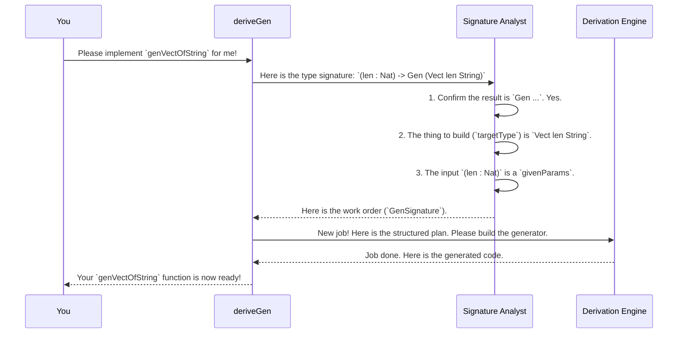

# Chapter 4: Generator Signature Analysis

In the [previous chapter on Coverage Tracking](03_coverage_tracking_.md), we learned how to make sure our automatically generated test data is exercising all the different parts of our data types. All of this powerful automation, from generating data with `deriveGen` to tracking coverage with `withCoverage`, relies on a critical first step: `DepTyCheck` must understand exactly what you're asking it to do.

This chapter uncovers that very first step. How does `DepTyCheck` read your mind when you write `deriveGen`? It doesn't! It just has a very smart "front desk manager" that analyzes your request.

## The Problem: Understanding Your Order

Imagine you walk into a high-tech, custom cake shop. You don't just say "make me a cake." You give a detailed order: "I need a two-layer vanilla cake, for 10 people, with 'Happy Birthday' written on top. I will provide the special chocolate sprinkles."

Similarly, when you ask `DepTyCheck` to derive a generator, you give it a detailed "order" in the form of a type signature.

```idris
import Deriving.DepTyCheck.Gen

-- Our "order" for a custom generator
genVectOfString : (len : Nat) -> Gen (Vect len String)
genVectOfString = deriveGenFor (Fuel -> (len : Nat) -> Gen (Vect len String))
```
This signature is packed with information:
*   The final product should be a `Vect len String`.
*   The length `len` is something the user will provide.
*   The `String`s inside the `Vect` need to be generated from scratch.

Before the "chefs" in the [Generator Derivation Engine](02_generator_derivation_engine_.md) can start working, someone needs to read this order, understand it, and translate it into a structured work order. This is the job of the **Generator Signature Analysis** component.

## The Front Desk Manager: Parsing the Signature

Generator Signature Analysis acts like the front desk manager at our cake shop. It takes your raw order (the type signature) and breaks it down into a clear, unambiguous work order that the rest of the system can use. This structured work order is called a `GenSignature`.

A `GenSignature` answers three key questions:

1.  **What is the final product? (`targetType`)**
    This is the main data type we are trying to build. For our example, it's `Vect`.

2.  **What ingredients are you providing? (`givenParams`)**
    These are the parameters in your generator's signature that you, the user, will provide when you call it. In our example, `len : Nat` is a given parameter.

3.  **What ingredients do we need to make from scratch? (`generatedParams`)**
    Sometimes, a generator needs to create a value and return it alongside the final product. This is common in dependent types. For example, if we wanted a generator for "a `Vect` of random length", the signature might look like this: `Gen (n ** Vect n String)`. Here, `n` is a `generatedParams` because the generator creates it.

Let's see how our `genVectOfString` order gets translated.

**Input Order (Type Signature):**
`(len : Nat) -> Gen (Vect len String)`

**Structured Work Order (`GenSignature`):**
*   **`targetType`**: `Vect` (along with its own parameters, like its length and element type).
*   **`givenParams`**: The length parameter, which is connected to the `len` you provide.
*   **`generatedParams`**: None in this case.

This `GenSignature` is then passed to the derivation engine, which now has a crystal clear plan to execute.

## A Step-by-Step Walkthrough

Let's trace the journey of your request from a line of code to a structured plan.



The Signature Analyst is the crucial bridge between your request and the engine's execution. It ensures no misunderstandings happen and prevents the engine from trying to build the wrong thing.

## Under the Hood: The `checkTypeIsGen` Function

The magic of signature analysis happens within a function called `checkTypeIsGen`, located in `src/Deriving/DepTyCheck/Gen.idr`. This function is large and complex, but its job can be broken down into a series of checks.

Let's peek at a few simplified parts of its checklist.

#### 1. Is the final result a `Gen`?

First, it checks that your signature actually asks for a generator.

```idris
-- Simplified from checkTypeIsGen
checkTypeIsGen checkSide origsig@sig = do
  -- ...
  let (sigArgs, sigResult) = unPi sig

  -- Check the resulting type is `Gen`
  let IApp _ (IApp _ (IVar genFC topmostResultName) ...) ... = sigResult
    | _ => fail "The result type must be `Gen ...`"
  -- ...
```
This code looks at the return type of your function (`sigResult`) and makes sure it's shaped like `Gen MaybeEmpty YourType`. If not, it stops immediately.

#### 2. What are the given parameters?

Next, it walks through the arguments of your function signature (`sigArgs`) to identify the `givenParams`.

```idris
-- Simplified from checkTypeIsGen
(givenParams, ...) <- for sigArgs $ \case
  -- An explicit, named argument like `(len : Nat)`
  MkArg MW ExplicitArg (Just $ UN name) type =>
    pure $ Left (Signature.ExplicitArg, name, type)

  -- An implicit, named argument like `{n : Nat}`
  MkArg MW ImplicitArg (Just $ UN name) type =>
    pure $ Left (Signature.ImplicitArg, name, type)
    
  _ => failAt (getFC ty) "Arguments must be explicit or implicit, and named."
```
It collects all the named arguments that come before the final `Gen` return type. These are the "ingredients you provide."

#### 3. Are there any generated parameters?

It then looks *inside* the `Gen` to see if you're asking for a dependent pair `(x ** MyType x)`. These become the `generatedParams`.

```idris
-- Simplified from checkTypeIsGen

-- `targetType` is the type inside `Gen`, e.g., `(n ** Vect n String)`
let Just (paramsToBeGenerated, finalType) = unDPairUnAlt targetType
  | Nothing => ... -- No generated params, that's fine

paramsToBeGenerated <- for paramsToBeGenerated $ \case
  -- Finds the `n` in `(n ** ...)`
  MkArg MW ExplicitArg (Just $ UN name) t => pure (name, t)
  _ => fail "Generated parameter must be explicit and named."
```
This allows the analyst to distinguish between `Gen (Vect 10 String)` (no generated params) and `Gen (n ** Vect n String)` (where `n` is a generated param).

#### 4. The Final Work Order: `GenSignature`

After all the checks pass, the analyst produces the final `GenSignature` record, defined in `src/Deriving/DepTyCheck/Gen/Signature.idr`.

```idris
-- A simplified view of the GenSignature record
public export
record GenSignature where
  constructor MkGenSignature
  targetType  : TypeInfo -- Info about the type to build (e.g., `Vect`)
  givenParams : SortedSet (Fin targetType.args.length) -- Which of the target's arguments are provided by the user
```
This record is a clean, machine-readable summary of your request.
*   `targetType` contains everything the engine needs to know about the `Vect` data type itself.
*   `givenParams` is a set of indices telling the engine which arguments of `Vect` (like its length) correspond to parameters given by the user.

## Conclusion

You've now seen the first, critical step of the derivation process: **Generator Signature Analysis**.

*   It acts as a **front desk manager**, translating your request (a type signature) into a structured work order (`GenSignature`).
*   It identifies the three key components of your order: the **target type**, the **given parameters**, and the **generated parameters**.
*   This process is handled by the internal `checkTypeIsGen` function, which performs a series of validation checks.
*   The resulting `GenSignature` provides a clear, unambiguous plan for the rest of the [Generator Derivation Engine](02_generator_derivation_engine_.md).

Now that the engine has a clear plan, it faces its next challenge. To build a value like `Vect 3 String`, it needs to construct it piece by piece. But in what order should it generate the fields? For a simple type, it might not matter, but for dependent types, the order is everything.

Next up: **[Chapter 5: Derivation Order & Field Dependency Analysis](05_derivation_order___field_dependency_analysis_.md)**

---

Generated by [AI Codebase Knowledge Builder](https://github.com/The-Pocket/Tutorial-Codebase-Knowledge)