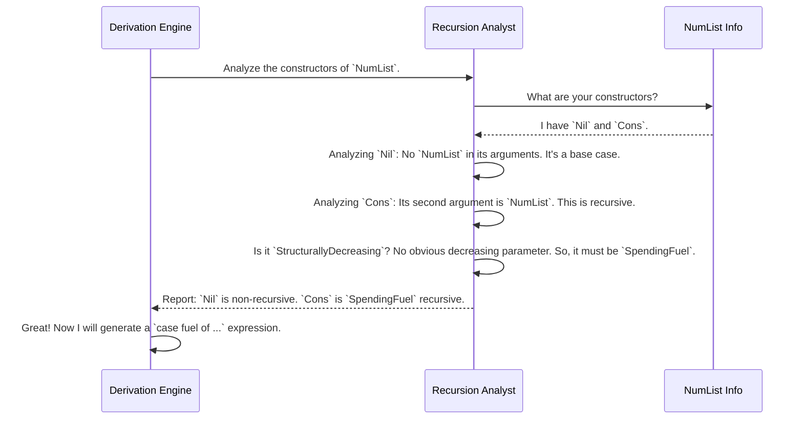

# Chapter 6: Constructor Recursion and Weighting

In the [previous chapter on Derivation Order & Field Dependency Analysis](05_derivation_order___field_dependency_analysis_.md), you saw how `DepTyCheck` cleverly figures out the right order to generate fields, especially for dependent types. Now, we'll tackle another profound challenge: generating data for recursive types like lists or trees.

How do we ask a machine to randomly generate a list without it getting stuck in a loop, trying to make an infinitely long list? How can we control whether we get small lists or large ones? Let's dive into `DepTyCheck`'s safety system for recursion.

## The Problem: The Never-Ending Recipe

Imagine you're using our [Generator Derivation Engine](02_generator_derivation_engine_.md) to create a generator for a simple, home-made list of numbers.

```idris
data NumList = Nil | Cons Nat NumList
```

The engine analyzes this type. It sees two constructors:
*   `Nil`: Simple, no problem.
*   `Cons`: To make a `Cons`, you need a `Nat` and... another `NumList`.

This is a recursive recipe! It's like a recipe for a cake that says, "Step 1: Bake a slightly smaller cake." If you follow it blindly, you'll be baking forever! Without a mechanism to stop, an automated generator could easily enter an infinite loop, trying to generate a `Cons` of a `Cons` of a `Cons`..., never finishing.

We need a safety inspector who can tell the generator when it's time to stop recursing and just pick `Nil`.

## The "Fuel" Mechanism: A Budget for Recursion

`DepTyCheck`'s solution is a simple but powerful concept: **Fuel**.

Imagine you give the generator a limited budget of "recursion coupons." Every time it wants to follow a recursive recipe (like `Cons`), it must spend one coupon.

*   If it has coupons left, it's free to choose the recursive option.
*   If it runs out of coupons, it's **forbidden** from choosing recursive options and *must* pick a base case (like `Nil`).

This "fuel" is represented by the `Fuel` data type, which is either `More fuel` (you have coupons left) or `Dry` (you're out). This guarantees that the generation process will always finish.

## Two Kinds of Recursion: Dumb vs. Smart

The "fuel" system is great, but it's a bit heavy-handed. It treats all recursion as potentially dangerous. `DepTyCheck` is smarter than that. It analyzes the recursion and classifies it into two types.

#### 1. `SpendingFuel`: The "Potentially Infinite" Recursion

This is the standard type of recursion we saw with `NumList`. There's no obvious sign that `Cons Nat NumList` is getting "smaller" in a predictable way, so the system plays it safe. To generate a `Cons`, it must spend fuel.

Think of this as exploring a dark cave. You take one step at a time, and your lamp's battery (the fuel) slowly drains.

#### 2. `StructurallyDecreasing`: The "Provably Safe" Recursion

Now consider the `Vect` type we've seen before.

```idris
data Vect : Nat -> Type -> Type where
  VNil : Vect Z a
  VCons : a -> Vect k a -> Vect (S k) a
```
The constructor `VCons` is also recursive. But notice something special: to build a `Vect (S k) a`, it needs a `Vect k a`. The number `k` is getting strictly smaller! The system knows this process *must* eventually reach `Vect Z a` and terminate.

The safety inspector sees this and says, "This recursion is provably safe! It's structurally decreasing. No need to spend fuel here." This allows the generator to create `Vect`s of any specified length without worrying about a fuel budget.

## Weighting: Controlling the Generated Shapes

Now that the system can distinguish between terminating constructors (`Nil`) and recursive ones (`Cons`), it can do something really clever: it **assigns weights** to them to influence the probability of what gets generated.

Here's how it works internally:
*   When the generator has **plenty of fuel** (`More`), it might give a higher weight to the recursive `Cons` constructor to encourage the creation of longer, more complex lists.
*   When the generator is **out of fuel** (`Dry`), it gives the recursive `Cons` constructor a weight of **zero**. It forces the generator to pick `Nil`.

The end result is that `DepTyCheck` automatically generates code that looks something like this:

```idris
-- A simplified view of what the derived generator does
genNumList : Fuel -> Gen NumList
genNumList Dry = pure Nil -- No fuel left? Only Nil is possible.
genNumList (More remainingFuel) =
  frequency -- Choose based on weights
    [ (5, pure Nil) -- Lower chance of stopping early
    , (10, [| Cons genNat (genNumList remainingFuel) |]) -- Higher chance of recursing
    ]
```
This dynamic weighting based on fuel is the key to getting a good *distribution* of data—both small, simple values and large, complex ones—while guaranteeing termination.

## Under the Hood: The `ConsRecs` Analysis

This analysis is performed by a module that produces a `ConsRecs` (Constructor Recursiveness) report. Let's see how it analyzes `NumList`.



This analysis happens before any generator code is written, providing a blueprint for how to handle recursion safely.

### A Peek at the Code

The results of this analysis are stored in a `ConWeightInfo` record for each constructor. The core of this is the `RecWeightInfo` data type.

```idris
-- From: src/Deriving/DepTyCheck/Gen/ConsRecs.idr

-- Information about a recursive constructor's weight
public export
data RecWeightInfo : Type where
  -- Default: This recursion must spend fuel.
  SpendingFuel : ((fuelName : Name) -> TTImp) -> RecWeightInfo

  -- Optimization: This recursion is provably safe.
  StructurallyDecreasing : (decrTy : TypeInfo) -> (wExpr : TTImp) -> RecWeightInfo
```
*   `SpendingFuel`: This holds a little template for generating the weight-calculating code. The weight often depends on the amount of fuel left.
*   `StructurallyDecreasing`: This marks the constructor as safe and provides the weight expression to use, which doesn't involve spending fuel.

When the derivation engine goes to write the final function body, it uses this information to build the `case` expression on the `fuel` argument.

```idris
-- Simplified from: src/Deriving/DepTyCheck/Gen/ForOneType/Impl.idr

-- This function generates the `case fuel of ...` logic
fuelDecisionExpr : (fuelArg : Name) -> List (Con, WeightInfo) -> TTImp
fuelDecisionExpr fuelArg consRecs =
  -- Pattern match on the fuel argument
  iCase (var fuelArg) ... [

    -- Case 1: The fuel is Dry
    var `{Data.Fuel.Dry}` .=
      -- Call only the non-spending constructors
      callConstFreqs ... nonSpendCons,

    -- Case 2: The fuel is More
    var `{Data.Fuel.More}` .$ bindVar subFuelArg .=
      -- Call ALL constructors, passing the remaining fuel `subFuelArg`
      -- to the fuel-spending ones.
      callFrequency ... (consRecs <&> ...)
  ]
```
This is the heart of the safety mechanism. The `ConsRecs` analysis provides the `consRecs` data, and the `fuelDecisionExpr` function translates that data into actual, safe, and efficient Idris code.

## Conclusion

You've now uncovered the safety system that makes `DepTyCheck`'s powerful derivation engine possible.

*   You learned about the **`Fuel`** mechanism, a simple "coupon" budget that guarantees recursive generation always terminates.
*   You saw how `DepTyCheck` analyzes recursion, distinguishing between default **`SpendingFuel`** recursion and optimized **`StructurallyDecreasing`** recursion.
*   This analysis allows the engine to dynamically **assign weights** to constructors, controlling the shape of generated data based on the available fuel.
*   This entire system works automatically, ensuring you get a rich variety of test data without ever worrying about infinite loops.

So far, we've explored the core conceptual machinery of `DepTyCheck`. But how is the project itself put together? How are its dependencies managed, and how do you build it from source? In the next chapter, we'll shift gears from concepts to the practical side of project maintenance.

Next up: **[Chapter 7: Project Build and Dependency Management](07_project_build_and_dependency_management_.md)**

---

Generated by [AI Codebase Knowledge Builder](https://github.com/The-Pocket/Tutorial-Codebase-Knowledge)