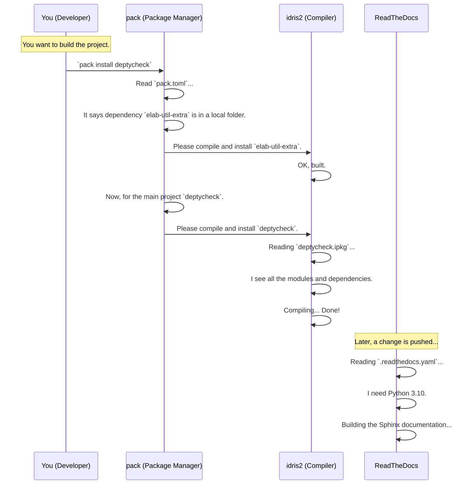

# Chapter 7: Project Build and Dependency Management

In the [previous chapter on Constructor Recursion and Weighting](06_constructor_recursion_and_weighting_.md), we explored the final piece of the conceptual machinery inside `DepTyCheck`—the safety system that makes sense of recursive data types. We've now covered all the "big ideas" behind how `DepTyCheck` works.

It's time to zoom out from the internal logic and look at the project as a whole. How is `DepTyCheck` itself built? How does it manage all its necessary "ingredients" from other libraries? This chapter is your guide to the project's architecture and setup.

## The Problem: A Missing Blueprint

Imagine trying to build a complex Lego model with thousands of pieces, but with no instruction manual. You might have all the bricks, but you don't know which ones you need, where they go, or how they connect. It would be chaos!

A software project is no different. `DepTyCheck` is built using the Idris language, but it also relies on several external libraries. Furthermore, its documentation is built using a different set of tools entirely. Without a central plan, a new developer would have no idea how to:
*   Find and install the correct versions of all the required libraries.
*   Tell the Idris compiler which files to compile.
*   Build the beautiful documentation website you see.

This is the problem that **Project Build and Dependency Management** solves. It's the master plan that ensures anyone can build the project reliably and consistently.

## The Architect's Master Plan

Think of the `DepTyCheck` project's configuration as an architect's master plan for a large building. This plan consists of a few key documents, each with a specific purpose.

1.  **`deptycheck.ipkg` - The Main Blueprint:** This file tells the Idris compiler what the `DepTyCheck` library is. It lists the library's name, its version, all the source code files (`modules`) that make it up, and the names of the other libraries (`depends`) it needs to function.

2.  **`pack.toml` - The List of Suppliers:** The blueprint (`.ipkg`) says we need "ten-by-ten steel beams," but it doesn't say who sells them. The `pack.toml` file is our list of suppliers. It tells the `pack` package manager *where to get* each required library—whether it's from a specific folder on our computer or from a specific online Git repository.

3.  **`.readthedocs.yaml` - Separate Instructions for the Showroom:** This file isn't for building the main structure. It's a special set of instructions for an external service called ReadTheDocs, which automatically builds our project's documentation website (the "showroom").

Together, these files ensure that every "builder" (whether it's you, a teammate, or an automated server) uses the same plans, the same materials, and the same process, resulting in an identical, perfectly built project every time.

## Putting It All Together: A Developer's First Build

Let's imagine you're a new developer joining the `DepTyCheck` project. Your first goal is to build it on your machine. Here’s what happens when you use the master plan.



This flow shows how the different configuration files are used by different tools to achieve a complete and reproducible setup. The `pack` tool uses `pack.toml` to gather materials, the `idris2` compiler uses `.ipkg` files to assemble them, and ReadTheDocs uses `.readthedocs.yaml` for its separate task.

## Under the Hood: A Closer Look at the Files

Let's take a peek inside these "blueprint" files.

### `deptycheck.ipkg`: The Core Project Definition

This is the standard package file for any Idris 2 project. It's a simple text file that defines the most important metadata.

```idris
-- From: deptycheck.ipkg
package deptycheck

authors = "Denis Buzdalov"
sourcedir = "src"
version = 0.0.251013

modules = Deriving.DepTyCheck.Gen
        , Test.DepTyCheck.Gen
        -- ... and many more modules

depends = ansi
        , elab-util-extra
        , random-pure
        -- ... and a few more dependencies
```

*   `package deptycheck`: The name of our library.
*   `sourcedir = "src"`: Tells the compiler to look for source code in the `src/` directory.
*   `modules = ...`: An explicit list of all the source files to include in the library. This is like the list of all rooms in the blueprint.
*   `depends = ...`: The list of *names* of other libraries that `DepTyCheck` needs. Notice it just says `elab-util-extra`, not *where* to get it.

### `pack.toml`: The Dependency "Address Book"

`pack` is the de-facto package manager for Idris 2. Its configuration file, `pack.toml`, tells it where to find the packages listed in `.ipkg` files.

Let's look at two examples from `pack.toml`.

First, how `pack` finds the main `deptycheck` library itself (as a local project):

```toml
-- From: pack.toml
[custom.all.deptycheck]
type = "local"
path = "."
ipkg = "deptycheck.ipkg"
```

*   `[custom.all.deptycheck]`: This defines a custom package named `deptycheck`.
*   `type = "local"`: It's a package located on the local filesystem.
*   `path = "."`: The path to the project is the current directory.
*   `ipkg = "deptycheck.ipkg"`: The package file to use is `deptycheck.ipkg`.

Now, let's see how `pack` might find an external dependency from a Git repository:

```toml
-- From: pack.toml
[custom.nightly-251007.fin-lizzie]
type   = "git"
url    = "https://github.com/buzden/idris2-fin-lizzie"
commit = "latest:master"
ipkg   = "fin-lizzie.ipkg"
```

*   `type = "git"`: This package needs to be downloaded from a Git repository.
*   `url = ...`: The HTTPS address of the repository.
*   `commit = "latest:master"`: Specifies exactly which version to use (in this case, the latest commit on the `master` branch). This is key to ensuring everyone uses the exact same version of the dependency.

This file acts as the bridge between a dependency's name (`fin-lizzie`) and its physical location.

### `.readthedocs.yaml`: The Documentation Build Plan

This file is written in YAML, a simple data-formatting language. It has nothing to do with Idris; it's purely for the ReadTheDocs service.

```yaml
---
# From: .readthedocs.yaml
version: 2

build:
  os: ubuntu-22.04
  tools:
    python: "3.10"

python:
  install:
    - requirements: docs/requirements.txt

sphinx:
  configuration: docs/source/conf.py
```

*   `version: 2`: Specifies we're using version 2 of the ReadTheDocs configuration format.
*   `build:`: Tells the server to use a specific operating system (`ubuntu-22.04`) and Python version.
*   `python: install: ...`: Gives the command to install the Python tools needed for building the documentation (like Sphinx, the doc generator).
*   `sphinx: configuration: ...`: Points to the main configuration file for Sphinx itself.

This file isolates all the documentation-specific setup, keeping our main project configuration clean.

## Conclusion

You've now seen the "master plan" that holds the `DepTyCheck` project together.

*   You learned about the three key configuration files: `deptycheck.ipkg`, `pack.toml`, and `.readthedocs.yaml`.
*   **`deptycheck.ipkg`** is the **blueprint** that describes the project to the Idris compiler.
*   **`pack.toml`** is the **list of suppliers** that tells the `pack` package manager where to get all the project's dependencies.
*   **`.readthedocs.yaml`** is a **specialized plan** for building the project's documentation on an external service.

These files work together to create a stable, reproducible, and easy-to-manage development environment. A solid foundation is great, but day-to-day development often involves repetitive tasks. How can we make those tasks easier? The next chapter will introduce the simple scripts and tools that help with that.

Next up: **[Chapter 8: Developer Tooling & Scripts](08_developer_tooling___scripts_.md)**

---

Generated by [AI Codebase Knowledge Builder](https://github.com/The-Pocket/Tutorial-Codebase-Knowledge)