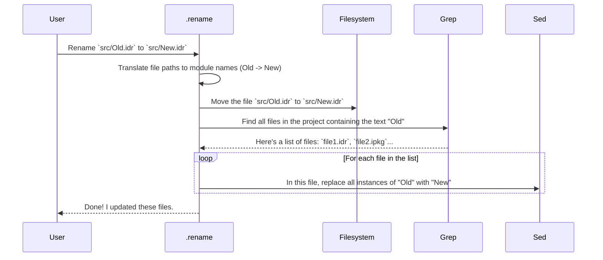

# Chapter 8: Developer Tooling & Scripts

In the [previous chapter on Project Build and Dependency Management](07_project_build_and_dependency_management_.md), we looked at the "master plans" that ensure the `DepTyCheck` project can be built reliably. Now, let's explore the tools that make the day-to-day work of developing the project easier, faster, and more consistent.

Welcome to the `DepTyCheck` developer's toolbox! Every good workshop has a set of specialized tools to make common tasks simple and safe. This chapter will introduce you to the handy scripts and configuration files that improve the developer experience and help maintain high code quality.

## The Problem: The Annoyance of Repetitive Tasks

Imagine you're working on the project and you decide that a module named `Old.Name` should really be called `Better.Name`. What do you do?

1.  Rename the file `src/Old/Name.idr` to `src/Better/Name.idr`.
2.  Now, the hard part: Find every single file in the entire project that imports or mentions `Old.Name` and change it to `Better.Name`.

This is tedious and very easy to get wrong. You might miss a file, or accidentally change `SomeOther.Old.Name` to `SomeOther.Better.Name`, breaking something else. Similarly, what about code formatting? If one developer uses tabs and another uses spaces, the code becomes messy and hard to read.

These small, constant frictions can slow down development and introduce bugs.

## The Solution: A Well-Organized Toolbox

`DepTyCheck` comes with a suite of helper scripts and configuration files that automate these tedious tasks and enforce a consistent style. It's like having a project-specific toolbox with specialized tools for common jobs. Let's look at three of the most important tools in this box.

1.  **The Safe Renaming Script (`.rename`)**: A tool that renames a module and automatically updates all references to it across the entire project.
2.  **The Performance Tuner (`.patch-chez-gc-handler`)**: A highly specialized script for fine-tuning the performance of the compiler's garbage collector.
3.  **The Style Enforcer (`.editorconfig`)**: A set of project-wide rules that tells your code editor how to format files, ensuring everyone writes in the same style.

### Tool 1: The Safe Renaming Script (`.rename`)

This is your solution to the module renaming problem. It's a simple shell script that automates the entire "find and replace" process safely.

#### How to Use It

Using it is as simple as telling it the old file path and the new file path.

```sh
# Let's rename Bad.Name to Good.Name
./.rename src/Bad/Name.idr src/Good/Name.idr
```

When you run this, the script will perform the rename and then print out all the files it automatically updated for you.

```
Renaming Bad.Name to Good.Name...
  - usage in deptycheck.ipkg...
  - usage in src/Some/Other/Module.idr...
  - usage in docs/source/tutorial.md...
```

No more manual searching! The job is done correctly in seconds.

#### How It Works Under the Hood

The script is a clever combination of standard command-line tools. Here’s a simplified walkthrough of what it does.



The script first renames the file itself. Then, it uses `grep` to find all potential usages of the old module name and pipes that list to `sed`, a tool for replacing text, which performs the update in-place.

A simplified look at the core of the script:

```sh
#!/bin/sh
# Simplified from .rename

FROM_FILE="$1"
TO_FILE="$2"

# ... code to convert file paths to module names ...
# FROM_MODULE="Old.Name", TO_MODULE="Better.Name"

# 1. Move the actual file
mv "$FROM_FILE" "$TO_FILE"

# 2. Find all files that use the old module name and replace it
grep -l -r "$FROM_MODULE" |
  while read -r r; do
    echo "  - usage in $r..."
    sed -i "s/$FROM_MODULE/$TO_MODULE/g" "$r"
  done
```

This simple automation saves a lot of time and prevents common mistakes.

### Tool 2: The Performance Tuner (`.patch-chez-gc-handler`)

This tool is more advanced, like a specialized tuning fork for a high-performance engine.

The Idris 2 compiler, which is built on Chez Scheme, has a "janitor" called a Garbage Collector (GC). The GC's job is to periodically clean up memory that is no longer being used. The default GC is good for general-purpose programs, but `DepTyCheck` does something very specific: it creates and discards a massive number of small, temporary objects during the [generator derivation process](02_generator_derivation_engine_.md).

The `.patch-chez-gc-handler` script replaces the compiler's default "janitor service" with a custom one that is specifically optimized for this kind of workload. It tells the GC to be more aggressive about cleaning up small, recent messes, which can significantly speed up `DepTyCheck`'s complex code generation.

You don't need to understand the script's dense Scheme code, just its purpose: **it's a performance optimization that makes `DepTyCheck` run faster.**

### Tool 3: The Style Enforcer (`.editorconfig`)

This isn't a script you run, but a configuration file you just leave in the project's root directory. It's a set of rules for your code editor.

```ini
# From: .editorconfig

# Rules for all files
[*]
end_of_line = lf
insert_final_newline = true
trim_trailing_whitespace = true

# Rules for Idris source files
[*.idr]
indent_style = space
indent_size = 2
```

Most modern code editors (like VS Code, Emacs, Vim, etc.) automatically recognize and apply the rules in an `.editorconfig` file. This file says things like:
*   "For all files, make sure the line endings are `lf` (the standard on Linux/macOS)."
*   "For any file ending in `.idr`, use spaces for indentation, not tabs."
*   "When you indent, use 2 spaces."

This file acts like a "house style guide" that your editor enforces for you. It completely eliminates arguments about code formatting and ensures that every file in the project has a consistent, clean look, no matter which developer wrote it.

## Conclusion

In this chapter, you've opened the developer's toolbox and seen how `DepTyCheck` uses small, focused tools to create a better development environment.

*   These tools solve common problems like **renaming files**, **optimizing performance**, and **enforcing code style**.
*   The **`.rename`** script automates the tedious and error-prone task of updating module references.
*   The **`.patch-chez-gc-handler`** is a specialized tool for tuning compiler performance.
*   The **`.editorconfig`** file ensures consistent code formatting across the entire team and project.

---

### A Final Word

Congratulations on completing this tutorial series! You have journeyed through the core of `DepTyCheck`, from the fundamental concept of a [Test Data Generator (`Gen`)](01_test_data_generator___gen___.md) to the incredible power of the [Generator Derivation Engine](02_generator_derivation_engine_.md). You've seen how `DepTyCheck` uses [Coverage Tracking](03_coverage_tracking_.md) to ensure your tests are thorough and how it solves deep, technical challenges like [dependency analysis](05_derivation_order___field_dependency_analysis_.md) and [safe recursion](06_constructor_recursion_and_weighting_.md). Finally, you've learned how the project is built and maintained.

You are now equipped with the knowledge to start using `DepTyCheck` to test your own dependently-typed Idris programs with confidence. Happy testing

---

Generated by [AI Codebase Knowledge Builder](https://github.com/The-Pocket/Tutorial-Codebase-Knowledge)