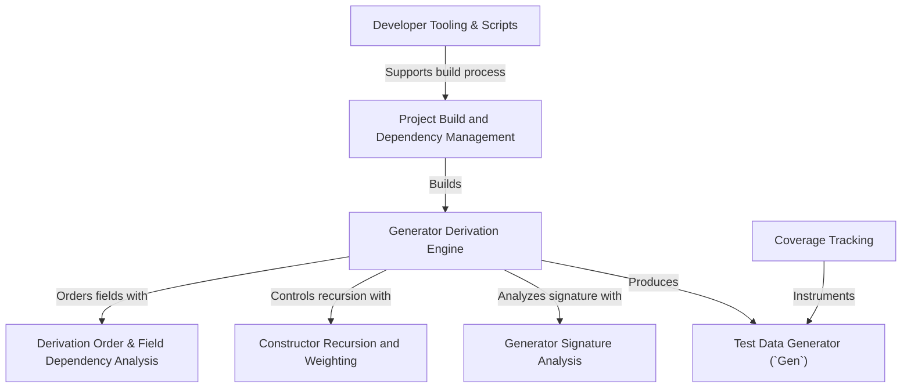

# Tutorial: DepTyCheck

`DepTyCheck` is a library for property-based testing in the Idris 2 programming language, specifically designed to handle complex *dependent types*. Its main feature is the ability to **automatically derive** test data generators. Users define the shape of their data, and the library's `deriveGen` macro writes the code to produce random, valid instances of that data. It provides a core `Gen` abstraction for representing these *data generation recipes* which can be composed manually or derived automatically.

**Source Repository:** [None](None)

## Chapters

1. [Test Data Generator (`Gen`)
](01_test_data_generator___gen___.md)
2. [Generator Derivation Engine
](02_generator_derivation_engine_.md)
3. [Coverage Tracking
](03_coverage_tracking_.md)
4. [Generator Signature Analysis
](04_generator_signature_analysis_.md)
5. [Derivation Order & Field Dependency Analysis
](05_derivation_order___field_dependency_analysis_.md)
6. [Constructor Recursion and Weighting
](06_constructor_recursion_and_weighting_.md)
7. [Project Build and Dependency Management
](07_project_build_and_dependency_management_.md)
8. [Developer Tooling & Scripts
](08_developer_tooling___scripts_.md)

---

Generated by [AI Codebase Knowledge Builder](https://github.com/The-Pocket/Tutorial-Codebase-Knowledge)