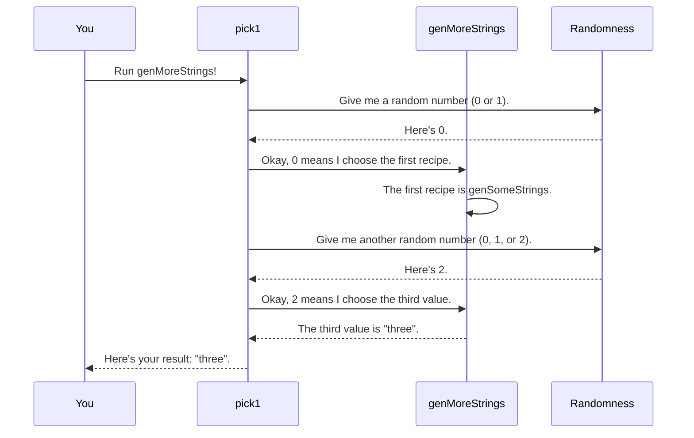

# Chapter 1: Test Data Generator (`Gen`)

Welcome to `DepTyCheck`! If you've ever wondered how to automatically test your code with a wide variety of inputs, you're in the right place. This library is all about *property-based testing*, a powerful technique where you state a property about your code (like `reverse (reverse myList) == myList`) and let the computer generate hundreds of random inputs to try and prove you wrong.

But before the computer can start testing, it needs to know how to create that random data. That's where the heart of our library comes in: the Test Data Generator, or `Gen`.

## What's a `Gen`? The Cookbook for Test Data

Imagine you're in a kitchen, and your goal is to prepare a dish. You'd use a recipe, right?

A `Gen` is exactly that: **a recipe for creating a random piece of test data.**

- A simple recipe might just say, "pick a random apple from this basket."
- A more complex recipe could be, "make an apple pie," which involves following other recipes for the crust, the filling, and the topping.

In `DepTyCheck`, we write these recipes to tell the computer how to generate values of any type we need, from simple `String`s to our own custom data types.

## Your First Recipes: `elements` and `pure`

Let's start with the simplest recipe. If you have a list of pre-defined values you want to choose from, you can use `elements`.

```idris
import Test.DepTyCheck.Gen

-- A recipe that produces one of three specific strings.
genSomeStrings : Gen NonEmpty String
genSomeStrings = elements ["one", "two", "three"]
```

This code defines `genSomeStrings`, a generator that, when run, will randomly pick `"one"`, `"two"`, or `"three"` with equal probability.

Another basic recipe is `pure`, which isn't random at all. It's a recipe that *always* produces the exact same value.

```idris
-- A recipe that *always* produces the string "hello".
genHello : Gen NonEmpty String
genHello = pure "hello"
```

While not very useful on its own for testing, `pure` is a fundamental building block for more complex recipes.

## The Emptiness Label: `NonEmpty` vs. `MaybeEmpty`

You might have noticed the `NonEmpty` in `Gen NonEmpty String`. This is a very important concept in `DepTyCheck`. Think of it as an "ingredient label" on your recipe.

`Emptiness` tells us whether a recipe is *guaranteed* to produce a result.

- `NonEmpty`: This recipe is guaranteed to produce a value. `elements ["one"]` is `NonEmpty` because it will always be able to pick "one".
- `MaybeEmpty`: This recipe *might* produce a value, or it might produce nothing. `elements []` is `MaybeEmpty` because there's nothing to choose from!

Why is this "maybe" case so important? Because in Idris, some types can be *uninhabited*—they have no values! A classic example is `Fin 0`, the type for numbers in the range `0 <= i < 0`. It's impossible to create a value of this type.

If we want to write a generator for `Fin n` for *any* `n`, our generator must be able to handle the `n=0` case by producing nothing.

```idris
import Data.Fin

-- A recipe for generating a Fin n.
-- Note the 'MaybeEmpty' label!
genFin : (n : Nat) -> Gen MaybeEmpty (Fin n)
genFin Z     = empty -- If n is 0, the recipe is empty.
genFin (S k) = elements (allFins k) -- Otherwise, pick from all possible values.
```
Here, `empty` is the special generator that produces nothing. Because `genFin` can sometimes be `empty`, its type must be `Gen MaybeEmpty ...`.

## Combining Recipes

This is where the real fun begins! You can combine simple recipes to create much more interesting and complex ones.

### `oneOf`: Picking a Recipe

What if you have several different recipes and you want to randomly choose one of them to follow? That's what `oneOf` is for.

```idris
-- A recipe that first decides whether to use
-- 'genSomeStrings' or a new 'elements' recipe.
genMoreStrings : Gen NonEmpty String
genMoreStrings = oneOf [genSomeStrings, elements ["four", "five"]]
```

When `genMoreStrings` is run, it has a 50/50 chance of either running `genSomeStrings` (which then picks from its three strings) or running `elements ["four", "five"]` (which then picks one of its two strings).

### `Applicative`: Building Complex Data

What if you want to generate a `Person` record, which needs a `name` and an `age`? You need to run a string generator and a number generator and combine the results. You can do this using `Applicative` syntax, which looks like this: `[| ... |]`.

```idris
data Person = MkPerson String Nat

-- A recipe for creating a Person.
genPerson : Gen NonEmpty Person
genPerson = [| MkPerson (elements ["Alice", "Bob"]) (elements [25, 40, 60]) |]
```

This tells `DepTyCheck`: "To make a `Person`, run `elements ["Alice", "Bob"]` to get the first argument for `MkPerson`, and run `elements [25, 40, 60]` to get the second." The result will be a random `Person` like `MkPerson "Alice" 60` or `MkPerson "Bob" 25`.

### `Monad`: Dynamic, Step-by-Step Recipes

Sometimes, the next step in a recipe depends on the result of a previous step. This is where dependent types shine, and `Monad` syntax (`do`-notation) lets us write these dynamic recipes.

Let's create a recipe that first generates a natural number `n` between 1 and 3, and *then* generates a value of type `Fin n`.

```idris
import Data.So

-- First, a generator for a Nat from 1 to 3.
-- We'll use this as an 'auto' implicit argument.
genSmallNat : Gen NonEmpty Nat
genSmallNat = elements [1, 2, 3]

-- A recipe for a pair (n, Fin n).
-- The @{...} syntax provides the implicit generator.
genAnyFin : Gen NonEmpty Nat => Gen NonEmpty (n ** Fin n)
genAnyFin @{genNat} = do
  n <- genNat      -- Step 1: Generate a random Nat 'n'.
  f <- genFin n    -- Step 2: Use 'n' to generate a Fin n.
  pure (n ** f)  -- Combine them into a pair.
```

This is incredibly powerful! The choice of which `genFin` recipe to use in Step 2 depends entirely on the random value `n` created in Step 1.

## Under the Hood: How a `Gen` Runs

So what actually happens when you use a `Gen`? Let's trace the execution of `pick1 genMoreStrings`.



1.  **You** call a function like `pick1` to get one value from the generator.
2.  `pick1` internally asks for a random number to decide which sub-generator inside `oneOf` to use.
3.  Based on the number, it selects one (e.g., `genSomeStrings`).
4.  It then asks for *another* random number to run the selected sub-generator.
5.  `genSomeStrings` (which is just `elements [...]`) uses this new number to pick a final value.
6.  The final value is returned to you.

The `Gen` type itself is defined as a data structure that represents these steps.

File: `src/Test/DepTyCheck/Gen.idr`
```idris
data Gen : Emptiness -> Type -> Type where
  -- A recipe that might produce nothing.
  Empty : Gen MaybeEmpty a

  -- A recipe for a single, fixed value.
  Pure  : a -> Gen em a

  -- A recipe that combines a list of other non-empty recipes.
  OneOf : GenAlternatives True alem a -> Gen em a

  -- A dynamic, two-step recipe (for Monads).
  Bind  : RawGen c -> (c -> Gen biem a) -> Gen em a

  -- ... and a few others
```
Every generator you write is ultimately constructed from these basic building blocks. Writing `elements ["one", "two"]` is just convenient syntax for creating a `OneOf` generator containing `Pure "one"` and `Pure "two"`.

## Conclusion

You've just learned the most fundamental concept in `DepTyCheck`!

- A **`Gen`** is a recipe for making random test data.
- The **`Emptiness`** type (`NonEmpty` or `MaybeEmpty`) is a crucial safety label that tells us if a recipe is guaranteed to succeed.
- You can create simple recipes with **`elements`** and combine them into complex ones using helpers like **`oneOf`**, **`Applicative`** (`[|...|]`), and **`Monad`** (`do`) syntax.

Writing these recipes by hand is powerful, but it can also be tedious for large, complex data types. Wouldn't it be great if the compiler could look at your data type's definition and write a generator for you automatically?

That's exactly what we'll explore in the next chapter.

Next: [Chapter 2: Generator Derivation Engine](02_generator_derivation_engine_.md)

---

Generated by [AI Codebase Knowledge Builder](https://github.com/The-Pocket/Tutorial-Codebase-Knowledge)