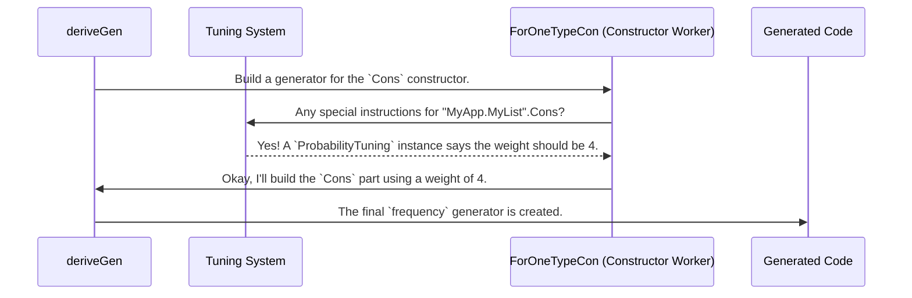

# Chapter 3: Derivation Tuning

In the [previous chapter](02_generator_derivation_engine_.md), we met the "auto-chef"—the powerful [Generator Derivation Engine](02_generator_derivation_engine_.md) that automatically writes `Gen` recipes for our data types. This is a fantastic time-saver, but sometimes, the default recipe isn't exactly what we want.

What if the auto-chef's default recipe for a list creates lists that are too short for our tests? Or what if it gets stuck trying to generate a complex value with dependent types?

This is where Derivation Tuning comes in. It's our way of giving **special instructions to the auto-chef** to guide its cooking process, ensuring the final result is just right for our testing needs.

## Why We Need to Give the Chef Instructions

Let's look at two common scenarios where the auto-chef's default recipe could be improved.

### Scenario 1: Making Longer Lists

Consider a simple `List` data type.

```idris
data List a = Nil | Cons a (List a)
```

When we ask the engine to `deriveGen` a generator for `List Nat`, it sees two constructors, `Nil` and `Cons`, and treats them equally. It effectively creates a generator like:

`oneOf [pure Nil, [| Cons (genNat) (genListNat) |]]`

This means that at every step of generating a list, there's a 50% chance of stopping (`Nil`) and a 50% chance of continuing (`Cons`). The result? Most of the lists you generate will be very short: `Nil`, `Cons 1 Nil`, `Cons 5 Nil`, etc.

But for testing, we might want to test our functions on much longer lists! We need a way to tell the chef, "Go easy on the `Nil`s and be more generous with the `Cons`."

### Scenario 2: A Tricky Dependent Type

Now for a more complex recipe. Imagine a type that says "a pair of numbers `n` and `m`, where `n` must be less than `m`."

```idris
data LtPair : Type where
  MkLtPair : (n : Nat) -> (m : Nat) -> (prf : n `LT` m) -> LtPair
```

The auto-chef, by default, will try to generate the arguments in order:
1.  Generate a random `n` (say, `10`).
2.  Generate a random `m` (say, `5`).
3.  Try to generate a proof `prf` for `10 < 5`.

This third step is impossible! The generator will fail and have to try again. It might get lucky eventually, but it will waste a lot of time generating invalid pairs. This is like trying to build a house by putting on the roof before building the walls—the order is wrong! We need to tell the chef, "Build the walls first! Generate `m`, then generate `n` to be smaller than `m`."

Derivation Tuning gives us the tools to solve both of these problems.

## Tuning the Recipe: Two Kinds of Instructions

`DepTyCheck` provides two main ways to give instructions to the auto-chef: `ProbabilityTuning` and `GenOrderTuning`.

### 1. `ProbabilityTuning`: Changing the Odds

Let's solve our "short list" problem. We want to make the `Cons` constructor more likely to be chosen than the `Nil` constructor. We can do this with `ProbabilityTuning`.

You define an `instance` of this interface for the *specific constructor* you want to influence.

```idris
import Deriving.DepTyCheck.Gen.Tuning

-- For the `Cons` constructor of my app's `List` type...
-- Note: Replace "MyApp.MyList" with your actual module and type name.
instance ProbabilityTuning "MyApp.MyList".Cons where
  isConstructor = itIsConstructor
  -- Make this constructor's weight 4 (default is 1).
  tuneWeight _ = 4
```

Let's break this down:
-   `instance ProbabilityTuning "MyApp.MyList".Cons`: We're providing a special rule for the `Cons` constructor. You must use the full, unique name that Idris knows it by.
-   `isConstructor = itIsConstructor`: This is a "magic" line. It's a compile-time macro that checks if `"MyApp.MyList".Cons` is actually a valid constructor name. If you have a typo, the compiler will catch it here!
-   `tuneWeight _ = 4`: This is the core instruction. We're telling the engine, "Assign a weight of 4 to this constructor."

Now, when `deriveGen` builds the generator for `List`, it will use a `frequency` generator instead of `oneOf`:

`frequency [ (1, pure Nil), (4, [| Cons ... |]) ]`

This means the `Cons` constructor is now **four times more likely** to be chosen than `Nil`, leading to much longer lists on average. Problem solved!

### 2. `GenOrderTuning`: Setting the Order of Operations

Now let's tackle our tricky `LtPair`. We need to tell the engine to generate `m` first. We do this with `GenOrderTuning`.

Just like before, we create an `instance` for the specific constructor.

```idris
import Deriving.DepTyCheck.Gen.Tuning

-- For the `MkLtPair` constructor...
instance GenOrderTuning "MyApp.LtPair".MkLtPair where
  isConstructor = itIsConstructor
  -- Generate arg `{m}` first, then arg `2` (the proof). `n` will be handled later.
  deriveFirst _ _ = [`{m}, 2]
```

Let's look at the new part:
-   `deriveFirst _ _ = [`{m}, 2]`: This function tells the engine which arguments to generate first, and in what order.
    -   `{m}`: This is a *name literal*. It refers to the argument named `m`. This is the clearest way to specify an argument.
    -   `2`: This refers to the argument at index 2 (starting from 0), which is `prf : n `LT` m`.

By telling the engine to handle `m` and then the proof, we're giving it a strategy. The engine is smart enough to see that generating `prf` depends on `n` and `m`, and that we've prioritized `m`. It will adjust its plan to something like this:
1.  Generate `m` first (as requested).
2.  Generate `n` (the remaining argument).
3.  **Crucially, it will use a special generator for `n` that is biased towards picking values less than `m`!**
4.  Finally, generate the proof `prf`, which is now much more likely to be possible.

You've successfully guided the auto-chef away from a frustrating dead end!

## Under the Hood: How the Chef Reads Your Instructions

How does `deriveGen` know about your special instructions? It's not magic, but a clever lookup process that happens at compile-time.

When you call `deriveGen`, the derivation engine begins its work. As it processes each constructor, it makes a special stop.



1.  The [Generator Derivation Engine](02_generator_derivation_engine_.md) (specifically the `ForOneTypeCon` part) is about to generate code for a constructor (e.g., `Cons`).
2.  Before it does anything else, it asks the **Tuning System**: "Have you got any `ProbabilityTuning` or `GenOrderTuning` instances for this specific constructor name?"
3.  The Tuning System is part of the Idris compiler's interface resolution. It looks for `instance` declarations that match.
4.  If it finds one (like our `instance ProbabilityTuning ... where tuneWeight _ = 4`), it reports the tuning value back to the engine.
5.  The engine then uses this value instead of its default (e.g., it uses a weight of 4 instead of 1). If no instance is found, it just proceeds with the default behavior.

This all happens when your code is compiling. The `deriveGen` macro expands into code that already incorporates your special instructions.

The interfaces are defined in `src/Deriving/DepTyCheck/Gen/Tuning.idr`. Here is a simplified look at the `GenOrderTuning` interface:

```idris
-- From: src/Deriving/DepTyCheck/Gen/Tuning.idr

public export
interface GenOrderTuning (0 n : Name) where
  -- A check to make sure `n` is a real constructor.
  isConstructor : (con : IsConstructor n ** GenuineProof con)

  -- The function where you define the generation order.
  deriveFirst : (givenTyArgs : List ...) ->
                (givenConArgs : List ...) ->
                List (ConArg con.conInfo)
```
This interface is what allows you to "plug in" your tuning rules. Your `instance` provides the implementation for `deriveFirst`, which the derivation engine then calls to get its instructions.

## Conclusion

Derivation Tuning is the mechanism that elevates `deriveGen` from a convenient automation tool to a truly powerful and flexible assistant. You are no longer limited to the default recipe; you are now the head chef, providing crucial guidance.

-   You learned that the default "auto-chef" recipes can sometimes be inefficient for testing (creating short lists) or get stuck on complex types.
-   **`ProbabilityTuning`** lets you change the relative likelihood of constructors, like making `Cons` more frequent to generate longer lists.
-   **`GenOrderTuning`** lets you specify the generation order of a constructor's arguments, which is essential for solving tricky dependent types.
-   These tunings are implemented as `instance`s of an interface, which are discovered and applied at compile-time.

Now that you know how to influence the *process* of derivation, you might be curious about the *information* the engine uses to make its decisions. How does it know the names, types, and dependencies of all the arguments? That's what we'll dive into next.

Next: [Chapter 4: Generator Signature Representation](04_generator_signature_representation_.md)

---

Generated by [AI Codebase Knowledge Builder](https://github.com/The-Pocket/Tutorial-Codebase-Knowledge)