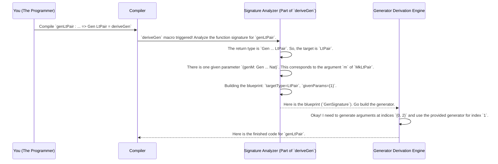

# Chapter 4: Generator Signature Representation

In the [previous chapter on Derivation Tuning](03_derivation_tuning_.md), we learned how to give special instructions to the "auto-chef" (`deriveGen`) to customize the recipes it creates. We saw how to change constructor probabilities and re-order how arguments are generated for tricky dependent types.

But this raises an interesting question: when you write `= deriveGen`, how does the auto-chef even know what you're asking for? How does it understand that you want a generator for `LtPair` and that you're already providing a generator for one of its arguments?

Before the auto-chef can start cooking, it needs a precise, unambiguous order ticket. In `DepTyCheck`, this order ticket is a special internal data structure called the **Generator Signature**.

## The Auto-Chef's Blueprint

Imagine you're at a high-tech restaurant where your order is sent to a robotic chef. You don't just shout "make me a salad!"; you fill out a detailed form on a tablet:
-   **Final Dish:** Caesar Salad
-   **Ingredients I'll Provide:** My own special croutons.
-   **Ingredients the Chef Must Prepare:** Lettuce, dressing, parmesan cheese.

The **Generator Signature (`GenSignature`)** is exactly this form. It's the blueprint that the [Generator Derivation Engine](02_generator_derivation_engine_.md) creates for itself *before* it writes a single line of code. It's a technical specification that translates your function signature into a plan of action.

Let's revisit our `LtPair` example from the last chapter, where we wanted to guide the engine.

```idris
data LtPair : Type where
  MkLtPair : (n : Nat) -> (m : Nat) -> (prf : n `LT` m) -> LtPair

-- The function we want to derive
genLtPair : (genM : Gen MaybeEmpty Nat) => Gen MaybeEmpty LtPair
genLtPair = deriveGen
```

When the compiler sees `deriveGen`, its first job is to create a `GenSignature` blueprint for this request. It would look something like this in plain English:

-   **Target Type:** `LtPair`
-   **User-Provided Parameters:** The parameter at index 1 (which is `m`).
-   **To-Be-Generated Parameters:** The parameters at index 0 (`n`) and index 2 (`prf`).

This blueprint ensures the engine has a crystal-clear understanding of the task. It knows what the final product is, which parts it's being given, and which parts it needs to create from scratch.

## Anatomy of a `GenSignature`

The `GenSignature` is a record that holds this blueprint information. While the actual implementation has many details, its core can be understood by looking at two key fields.

File: `src/Deriving/DepTyCheck/Gen/Signature.idr`
```idris
-- A simplified view of the GenSignature record
record GenSignature where
  constructor MkGenSignature
  -- 1. What type are we trying to generate a value for?
  targetType : TypeInfo
  -- 2. Which arguments are provided by the user? (as list of indices)
  givenParams : SortedSet (Fin targetType.args.length)
```

1.  `targetType: TypeInfo`
    This field describes the type you want to generate (e.g., `LtPair`). `TypeInfo` is a rich data structure that contains the type's name, its constructors, and all of its arguments.

2.  `givenParams: SortedSet (Fin ...)`
    This field is a list of the argument *indices* that you, the user, are providing via function arguments (like the `genM` for our `LtPair` generator). The indices start from 0. For `MkLtPair n m prf`, `n` is at index 0, `m` is at index 1, and `prf` is at index 2.

### What Needs to be Generated?

If the blueprint tells the engine what's *given*, how does it know what it needs to *generate*? By simple subtraction! The engine has a helper function that effectively does this:

`parameters to generate = (all parameters) - (given parameters)`

```idris
-- This function calculates the arguments the engine has to generate.
(.generatedParams) : (sig : GenSignature) -> SortedSet (Fin ...)
sig.generatedParams = fromList (allFins _) `difference` sig.givenParams
```

For our `genLtPair` example:
-   All parameters of `LtPair` are at indices: `{0, 1, 2}`.
-   `givenParams` is `{1}` (for `m`).
-   Therefore, `generatedParams` is `{0, 2}` (for `n` and `prf`).

This simple but powerful data structure provides the complete "what" and "who" for the generation task.

## Under the Hood: Building the Blueprint

The `GenSignature` isn't something you create manually. It's the very first thing the `deriveGen` macro does behind the scenes. It analyzes the type signature of the function you're deriving to build the blueprint.

Let's trace this process.



1.  **You** write your function with `deriveGen`.
2.  The **Compiler** encounters the `deriveGen` macro.
3.  The **Signature Analyzer** (a part of the macro) inspects the function's type signature. It determines the target type from the return value (`Gen ... X` means `X` is the target) and identifies any given generators from the function's arguments.
4.  It constructs the `GenSignature` record and passes this blueprint to the main [Generator Derivation Engine](02_generator_derivation_engine_.md).
5.  The engine then uses this precise blueprint to orchestrate the rest of the code generation, knowing exactly what its responsibilities are.

This blueprint is the "single source of truth" for the derivation process. Everything the engine does—calling itself recursively, using a provided generator, or generating a new value from scratch—is based on the information in the `GenSignature`.

## Conclusion

The `GenSignature` is a critical internal concept that makes `DepTyCheck`'s derivation so robust. It acts as the formal contract between you and the derivation engine.

-   A **`GenSignature`** is a **blueprint** or "order ticket" that `deriveGen` creates for itself.
-   It provides a precise specification of the task, detailing the **`targetType`**, the **`givenParams`** (ingredients you provide), and the **`generatedParams`** (ingredients the auto-chef must create).
-   This blueprint is created **automatically at compile-time** by analyzing the type signature of the function where `deriveGen` is used.
-   It is the foundational data structure that enables the entire [Generator Derivation Engine](02_generator_derivation_engine_.md) to understand your request and act on it correctly.

Understanding this blueprint helps clarify *how* the engine "thinks". But how does the engine get all the detailed information it needs about your types, like argument names and dependencies, to even build this blueprint? That's the job of another set of powerful internal tools.

Next: [Chapter 5: Derivation Code Analysis Utilities](05_derivation_code_analysis_utilities_.md)

---

Generated by [AI Codebase Knowledge Builder](https://github.com/The-Pocket/Tutorial-Codebase-Knowledge)