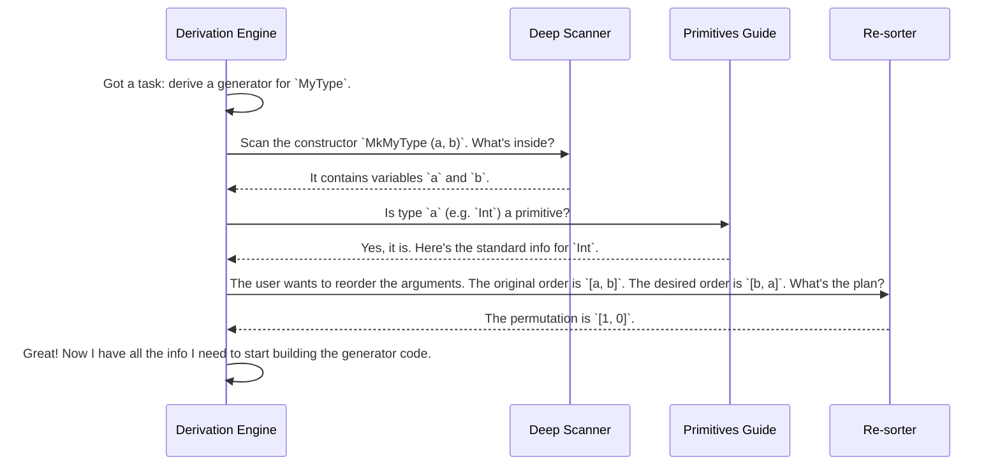

# Chapter 5: Derivation Code Analysis Utilities

In the [previous chapter on Generator Signature Representation](04_generator_signature_representation_.md), we learned that the "auto-chef" (`deriveGen`) works from a detailed blueprint called a `GenSignature`. This blueprint tells the chef *what* to build.

But how does the chef gather all the information it needs to even *read* the blueprint? How does it understand the complex structure of your Idris code, figure out which parts are built-in types like `Int`, and know how to re-arrange things if you ask it to?

The auto-chef has a secret weapon: a special toolkit of **Derivation Code Analysis Utilities**. These are not tools you will use directly, but understanding them shows you just how smart the auto-chef is. Think of them as the chef's specialized measuring cups, ingredient scanners, and magnifying glasses.

## The Auto-Chef's Toolkit

Let's imagine our auto-chef is analyzing a data type you've written. It needs to answer some very specific questions about the underlying code. For this, it pulls out three key tools from its toolkit:

1.  **`DeepConsApp` (The Deep Scanner):** This tool scans a piece of code to see what it's *really* made of. Is this complex expression just a wrapping around a basic data constructor?
2.  **`Primitives` (The Built-in Ingredient Guide):** This is a guidebook for all the common, off-the-shelf ingredients like `Int`, `String`, or `Double` that don't have standard "recipes" (constructors).
3.  **`ArgsPerm` (The Argument Re-sorter):** When you use [Derivation Tuning](03_derivation_tuning_.md) to change the order of ingredients, this tool helps the chef figure out the new assembly-line order.

Let's look at each of these tools in action.

### 1. `DeepConsApp`: The Deep Scanner

Imagine you define a type where an argument is wrapped inside a tuple:

```idris
data Wrapped : Type where
  MkWrapped : (Nat, Bool) -> Wrapped
```

The auto-chef needs to generate a `Nat` and a `Bool`. But when it looks at `MkWrapped`, it doesn't see a `Nat` and a `Bool` directly. It sees a single argument: a tuple of type `(Nat, Bool)`.

That's a problem! The derivation engine needs to know about the `Nat` and `Bool` to find generators for them. This is where the `DeepConsApp` scanner comes in.

`DeepConsApp`'s job is to "deeply" analyze an expression and find the fundamental constructors and variables being used.

-   **Input:** An expression, like `(myNat, myBool)`.
-   **Job:** Scan the expression recursively. It sees the tuple constructor `(,)` and then looks inside at its arguments, `myNat` and `myBool`.
-   **Output:** A list of the basic building blocks it found: `[myNat, myBool]`.

With this tool, the auto-chef can look past the tuple and see the `Nat` and `Bool` it needs to generate. This tool is essential for understanding how your arguments are *actually* used inside a constructor.

### 2. `Primitives`: The Built-in Ingredient Guide

Some types in Idris are special. They're not defined with `data` and constructors like our own types are. These are the built-in, or "primitive," types.

```idris
-- You don't write this, it's built into Idris!
-- data Int = ...?
-- data String = ...?
```

When the auto-chef's [Generator Derivation Engine](02_generator_derivation_engine_.md) encounters a type like `Int`, it can't look for its constructors because it doesn't have any in the traditional sense. So, what does it do?

It consults its `Primitives` guidebook. This utility is a simple but crucial helper that acts as a lookup table for these special types.

-   **Input:** A type name, like `"Int"`.
-   **Job:** Look up the name in its internal list of known primitives.
-   **Output:** If it's a primitive, it returns a special, standardized `TypeInfo` record for it. If not, it does nothing.

This allows the engine to gracefully handle built-in types without crashing because it can't find their constructors. It tells the engine, "Stop looking. This is a special ingredient we get straight from the supplier."

### 3. `ArgsPerm`: The Argument Re-sorter

In [Chapter 3 on Derivation Tuning](03_derivation_tuning_.md), we saw how we could tell the engine to generate arguments in a different order to solve tricky dependent types.

```idris
instance GenOrderTuning "MyApp.LtPair".MkLtPair where
  -- Generate arg `{m}` first, then the proof.
  deriveFirst _ _ = [`{m}, 2]
```

When the engine sees this instruction, it knows the *desired* order. But it still needs to work out the mechanics of reordering. If the original arguments are `[n, m, prf]`, and the desired order is `[m, prf, n]`, it needs a plan.

The `ArgsPerm` utility is the tool for this.

-   **Input:** A list of items (like the arguments `[n, m, prf]`) and a desired final order.
-   **Job:** Calculate a "permutation vector"—a list of indices that describes the re-shuffling. For our example, this would be `[1, 2, 0]` (move item at index 1 to the front, then index 2, then index 0).
-   **Output:** A function that can apply this permutation to any list of arguments, and the re-ordered list itself.

This tool lets the auto-chef easily re-shuffle the arguments according to your tuning instructions before it generates the final code.

## Under the Hood: The Analysis Phase

These utilities are used by the [Generator Derivation Engine](02_generator_derivation_engine_.md) in its very first stage of work, the "analysis phase," right after it builds the [Generator Signature Representation](04_generator_signature_representation_.md).



### Diving into the Code

You can see these utilities in the `src/Deriving/DepTyCheck/Util/` directory. Let's look at a simplified piece of each one.

**`DeepConsApp`**

The core function is `analyseDeepConsApp`. It recursively walks through an expression tree (`TTImp`).

File: `src/Deriving/DepTyCheck/Util/DeepConsApp.idr`
```idris
-- A very simplified idea of the function
analyseDeepConsApp : (expr : TTImp) -> List Name
analyseDeepConsApp expr =
  -- Try to treat the expression as `F(arg1, arg2, ...)`
  let (F, args) = unAppAny expr

  -- If F is a variable we're looking for, we found it!
  if isFreeVariable F
    then [F]
    else -- Otherwise, recursively scan all the arguments.
         concat (map analyseDeepConsApp args)
```
This recursive "un-application" and scanning is how `DeepConsApp` can look inside nested structures like tuples to find what it needs.

**`Primitives`**

This utility is essentially a big pattern-match function.

File: `src/Deriving/DepTyCheck/Util/Primitives.idr`
```idris
-- Returns a standardized TypeInfo for a primitive type.
typeInfoForPrimType : PrimType -> TypeInfo
typeInfoForPrimType IntType     = MkTypeInfo (NS (MkNS ["^prim^"]) (UN "Int")) [] []
typeInfoForPrimType IntegerType = MkTypeInfo (NS (MkNS ["^prim^"]) (UN "Integer")) [] []
typeInfoForPrimType StringType  = MkTypeInfo (NS (MkNS ["^prim^"]) (UN "String")) [] []
-- ... and so on for all other primitive types.
```
It's just a simple, hardcoded map from a primitive type to a standard representation that the rest of the engine can understand.

**`ArgsPerm`**

The `reorder` function is a classic example of applying a permutation to a vector.

File: `src/Deriving/DepTyCheck/Util/ArgsPerm.idr`
```idris
||| Reorders the `original` vector according to the `permutation` of indices.
export
reorder : (permutation : Vect n (Fin n)) -> (original : Vect n a) -> Vect n a
reorder permutation original =
  -- For each index `i` in the permutation,
  -- find the element at `original[i]`.
  permutation <&> (\i => index i original)
```
This compact function is the workhorse that allows `GenOrderTuning` to have its effect.

## Conclusion

The Derivation Code Analysis Utilities are the unsung heroes of the `deriveGen` process. They are the sophisticated sensors and tools that the auto-chef uses to make sense of the raw ingredients—your Idris code.

-   **`DeepConsApp`** is a deep scanner that finds the basic constructors and variables inside complex expressions.
-   **`Primitives`** is a guidebook for handling built-in types like `Int` and `String`.
-   **`ArgsPerm`** is a re-sorting tool that executes the instructions given by `GenOrderTuning`.

These utilities are what allow the derivation engine to be so robust and intelligent. They gather and organize all the low-level details, so the engine can focus on the bigger picture. One of the most important parts of that bigger picture is figuring out how to handle recursion safely. Now that the engine has this detailed analysis, how does it use it to manage fuel and recursive calls?

Next: [Chapter 6: Recursion and Weight Analysis](06_recursion_and_weight_analysis_.md)

---

Generated by [AI Codebase Knowledge Builder](https://github.com/The-Pocket/Tutorial-Codebase-Knowledge)