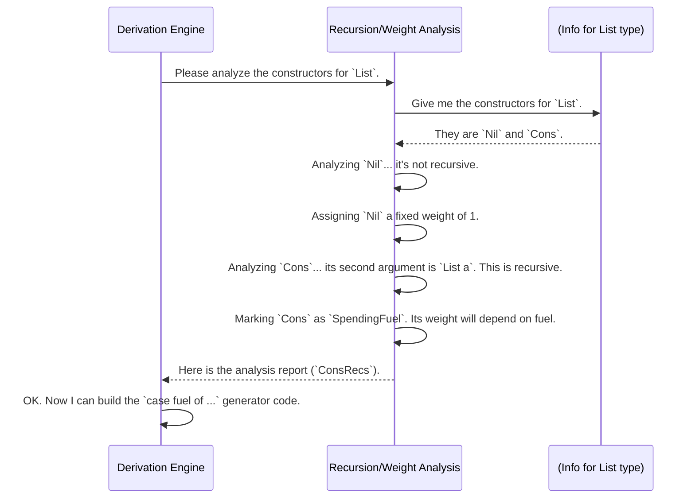

# Chapter 6: Recursion and Weight Analysis

In the [previous chapter](05_derivation_code_analysis_utilities_.md), we saw the special toolkit our "auto-chef" uses to analyze your code. With these tools, the chef can understand the ingredients. But what happens when a recipe calls for making a smaller version of itself?

Consider making a list. A list is either empty (`Nil`) or it's an item attached to another list (`Cons`). If the auto-chef isn't careful, it could just keep picking `Cons` forever, trying to build an infinitely long list and getting stuck in a loop!

This chapter introduces the **Recursion and Weight Analysis** component: the safety inspector for the auto-chef. It's the part of `DepTyCheck` that understands recursion and prevents the generator from running forever.

## The Problem: Infinite Recipes

Let's look at a simple `List` data type:

```idris
data List a = Nil | Cons a (List a)
```

When we ask the [Generator Derivation Engine](02_generator_derivation_engine_.md) to create a generator for `List Nat`, it sees two choices: `Nil` and `Cons`.

-   `Nil` is a simple, "base case." It stops the process.
-   `Cons` is a "recursive case." To make a `Cons`, you need another `List a`.

If the engine just chooses between `Nil` and `Cons` randomly with a 50/50 chance, it might keep picking `Cons` over and over, leading to a program that never finishes.

`Cons 1 (Cons 5 (Cons 10 (Cons 2 (...oh no, this never stops!))))`

We need a way to guarantee that the generation process will eventually end.

## The Solution: A "Fuel" Budget

The safety inspector's solution is simple and elegant: it gives the auto-chef a **"fuel" budget** for recursion.

-   Each time the generator makes a recursive call (like choosing `Cons`), it "spends" some fuel.
-   When the fuel tank is empty, it is **only allowed to choose non-recursive options** (like `Nil`).

This ensures that no matter what, the recursion will eventually stop. You've probably already seen the result of this: it's the `Fuel` parameter that `deriveGen` adds to your generator's signature!

```idris
-- The `Fuel` parameter is the recursion budget.
genList : Fuel -> Gen MaybeEmpty (List Nat)
genList = deriveGen
```

When this generator is run, it might produce code that conceptually looks like this:

```idris
-- This is a simplified idea of the code `deriveGen` creates.
genList fuel =
  case fuel of
    Dry =>
      -- Out of fuel! Can only pick the non-recursive option.
      oneOf [pure Nil]

    More subFuel =>
      -- We have fuel! We can choose either Nil or Cons.
      oneOf [ pure Nil                                           -- The base case
            , [| Cons !(genNat subFuel) !(genList subFuel) |] ]   -- The recursive case
```

Notice that the recursive call to `genList` uses `subFuel`, which is a smaller amount of fuel than we started with. This is how the budget is spent.

## The Safety Inspector's Job: Analyzing Constructors

Before the engine can generate this fuel-aware code, the safety inspector must analyze the data type to figure out which constructors are recursive and which are not.

This analysis is stored in a data structure called `ConsRecs` (Constructor Recursiveness). It's a report that classifies every constructor. For our `List` type, the report would look like this:

-   **`Nil`**: Non-recursive. It has a fixed "weight" (think of it as its probability).
-   **`Cons`**: Recursive. It spends fuel, and its "weight" should be a function of the fuel remaining.

### Weight Analysis: Guiding the Choice

"Weight" is just a number that tells the generator how likely it should be to pick a certain constructor.

-   **Non-recursive (`Nil`)**: The inspector gives it a default weight of `1`.
-   **Recursive (`Cons`)**: This is the clever part. The inspector says, "The weight for `Cons` should be proportional to how much fuel is left." It generates a tiny function `leftDepth` that calculates this. This means:
    -   When you have lots of fuel, `Cons` has a high weight, so you're likely to generate longer lists.
    -   When you're low on fuel, `Cons` has a low weight, making it more likely the generator will pick `Nil` and stop.

This dynamically changing weight is what guides the generator towards finishing its job as it runs out of its recursion budget.

### A Special Case: "Fuel-Free" Recursion

Sometimes, a recursive call is guaranteed to be on a smaller piece of data, like when processing a binary tree:

```idris
data Tree a = Leaf a | Node (Tree a) (Tree a)
```

When you define a function that processes a tree, you might make a recursive call on the `left` child and the `right` child. Because the children are always smaller than the whole tree, Idris knows this recursion will eventually end.

The safety inspector is smart enough to recognize this! If a generator's recursion follows this "structurally decreasing" pattern, it marks the constructor as `StructurallyDecreasing`. This is a special tag that means **this recursive call doesn't need to spend any fuel!** It's a free, safe recursion.

## Under the Hood: The Inspection Process

When `deriveGen` is called, the Recursion and Weight Analysis component gets to work. Its main job is to build the `ConsRecs` report.



The core of this logic lives in `src/Deriving/DepTyCheck/Gen/ConsRecs.idr`. Let's peek at the data structures that represent this analysis.

This record holds the weight plan for a single constructor.

```idris
-- From: src/Deriving/DepTyCheck/Gen/ConsRecs.idr

record ConWeightInfo where
  constructor MkConWeightInfo
  -- Either a fixed weight, or a dynamic plan for a recursive one.
  weight : Either Nat1 RecWeightInfo
```
-   `Either Nat1 ...`: If it's a `Left` value, the weight is a simple number (`Nat1`). This is for non-recursive constructors like `Nil`.
-   `... RecWeightInfo`: If it's a `Right` value, it's a more complex plan for a recursive constructor.

And here is the plan for recursive constructors:

```idris
data RecWeightInfo : Type where
  -- The standard case: weight is a function of the remaining fuel.
  SpendingFuel : ((fuelVarName : Name) -> TTImp) -> RecWeightInfo

  -- The special "fuel-free" case for structurally smaller arguments.
  StructurallyDecreasing : (decrTy : TypeInfo) -> (wExpr : TTImp) -> RecWeightInfo
```
This is the heart of the safety inspector's report. The main analysis function, `getConsRecs`, inspects each constructor using the [Derivation Code Analysis Utilities](05_derivation_code_analysis_utilities_.md) and populates these records. It determines if a constructor is recursive (`isRecursive`), checks for any [Derivation Tuning](03_derivation_tuning_.md) you've provided, and decides whether it's a normal `SpendingFuel` case or a special `StructurallyDecreasing` one.

This final report is then passed back to the main [Generator Derivation Engine](02_generator_derivation_engine_.md), which uses it as the definitive guide for how to handle recursion and constructor weights when it builds the final generator code.

## Conclusion

The Recursion and Weight Analysis component is the crucial safety inspector that makes automatic generator derivation safe and reliable.

-   It tackles the problem of **infinite recursion** by introducing a **`Fuel` budget**.
-   It analyzes every constructor to determine if it is **recursive** (`Cons`) or a **base case** (`Nil`).
-   It assigns **weights** to constructors to guide the generation process, making the generator favor non-recursive options as fuel runs out.
-   It's smart enough to identify special **"fuel-free" recursion** (`StructurallyDecreasing`) for optimization.

This component works entirely behind the scenes, but it's the reason why you can trust `deriveGen` to safely generate data for even the most complex recursive types. But is the generated data any good? Does it cover all the interesting cases? How can we know?

Next: [Chapter 7: Coverage Analysis](07_coverage_analysis_.md)

---

Generated by [AI Codebase Knowledge Builder](https://github.com/The-Pocket/Tutorial-Codebase-Knowledge)