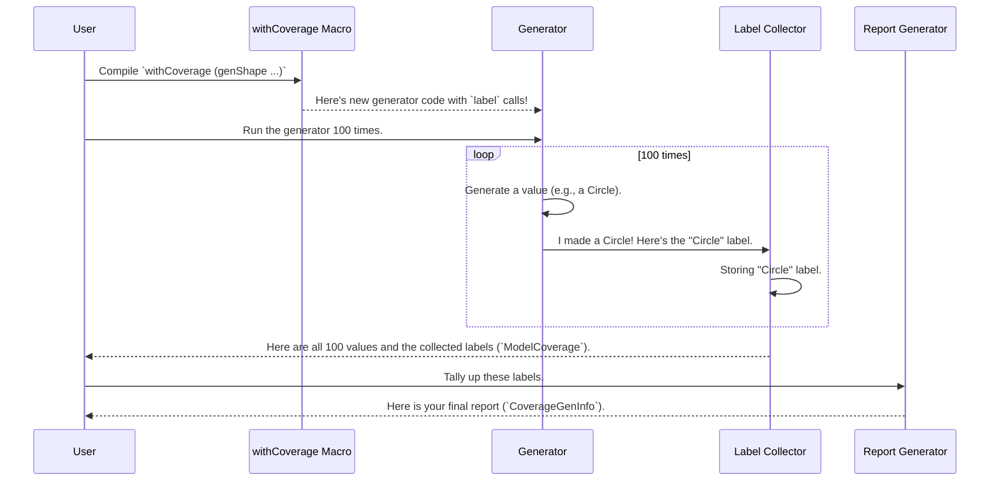

# Chapter 7: Coverage Analysis

In the [previous chapter](06_recursion_and_weight_analysis_.md), we saw how the "auto-chef" uses a fuel budget to safely generate data for even complex, recursive types. We can be confident that our `deriveGen` generators will always finish their work without getting stuck in infinite loops.

But this raises a new, important question: the data we generate is safe, but is it *good*? Does it cover all the interesting cases? If our tests pass, is it because our code is correct, or just because our test data never explored the buggy parts?

This chapter introduces **Coverage Analysis**: `DepTyCheck`'s built-in quality control system. It's a tool that gives you a report on your generated test data, showing you exactly which parts of your data model were exercised and, more importantly, which parts were missed.

## The Blind Spot Problem

Imagine you're testing an application that draws different shapes. You have a `Shape` data type:

```idris
data Shape
  = Circle Nat
  | Square Nat
  | Triangle Nat Nat
```

You use the [Generator Derivation Engine](02_generator_derivation_engine_.md) to create a generator. By default, it will give each constructor equal weight. So, when you generate 100 shapes, you'd expect to get roughly 33 circles, 33 squares, and 33 triangles.

But what if, for some reason, your generator was biased? Maybe you used [Derivation Tuning](03_derivation_tuning_.md) to test very large squares, and made circles and triangles extremely rare.

After running your tests, how would you know if you even tested the `Triangle` case at all? If there's a bug in how you handle triangles, your tests might pass simply because they never saw one. This is a **blind spot** in your testing.

Coverage Analysis is the tool that shines a light on these blind spots.

## The Solution: A Quality Control Report

The idea behind coverage analysis is simple: every time the generator creates a piece of data, we should "tag" it to record what it is.

-   If it creates a `Circle`, we put a "Circle" tag on it.
-   If it creates a `Square`, we put a "Square" tag on it.

After generating a hundred values, we can just count the tags to see what we got. The final report might look something like this:

-   `Circle`: 49 times
-   `Square`: 51 times
-   `Triangle`: **0 times** (Uh oh!)

This report immediately tells us we have a problem: our tests aren't covering triangles.

### Step 1: Automatically Tagging the Data with `withCoverage`

Manually adding these tags would be tedious. `DepTyCheck` provides a macro, `withCoverage`, that automatically wraps your generator and injects the tagging logic for you.

Let's say you have a generator for `Shape` created with `deriveGen`:

```idris
-- This is your standard derived generator.
genShape : Fuel -> Gen MaybeEmpty Shape
genShape = deriveGen
```

To add coverage tracking, you simply create a new generator that wraps the old one using `withCoverage`.

```idris
import Test.DepTyCheck.Gen.Coverage

-- A new generator with automated coverage tagging.
genShapeWithCoverage : Fuel -> Gen MaybeEmpty Shape
genShapeWithCoverage f = withCoverage (genShape f)
```

That's it! `genShapeWithCoverage` behaves just like `genShape`, but now, every time it produces a `Shape`, it secretly attaches a **`Label`**—a special tag identifying which constructor (`Circle`, `Square`, or `Triangle`) was used.

### Step 2: Running the Generator and Collecting the Tags

Now we need to run our new, "tagged" generator and collect all the labels. The function `unGenTryND` is perfect for this. It runs a generator `N` times and gives you back a list of results, where each result contains both the value *and* the collection of tags (`ModelCoverage`) that were generated along with it.

```idris
import Test.DepTyCheck.Gen.Coverage
import Data.List.Lazy

-- Generate 100 shapes and their coverage data.
let results : LazyList (ModelCoverage, Shape) =
      unGenTryND 100 mySeed genShapeWithCoverage
```
*Note: `mySeed` is a random seed, which you need to provide to start the random generation.*

The `results` list now contains pairs like `(tags_for_shape_1, shape_1)`, `(tags_for_shape_2, shape_2)`, and so on.

### Step 3: Creating and Viewing the Final Report

We have all the raw tag data. Now we just need to tally it up and present it in a readable report.

First, we create an empty "report card" for our `Shape` type. `initCoverageInfo` uses compile-time reflection to inspect the `Shape` type and prepare a slot for each of its constructors.

```idris
-- Create an empty report card for the `Shape` type.
let emptyReport : CoverageGenInfo Shape =
      %runElab initCoverageInfo genShape
```

Next, we fold over our `results`, using `registerCoverage` to add the information from each run into our report.

```idris
-- Tally up all the coverage data from our 100 runs.
let finalReport : CoverageGenInfo Shape =
      foldl (\report, (coverage, _) => registerCoverage coverage report)
            emptyReport
            results
```

Finally, we can just print the report!

```idris
-- Print the final quality control report.
printLn finalReport
```

If our generator was biased and never produced a triangle, the output would look something like this:

```
MyApp.Shape.Shape covered partially (100 times)
  - MyApp.Shape.Circle: covered (49 times)
  - MyApp.Shape.Square: covered (51 times)
  - MyApp.Shape.Triangle: not covered
```

The report immediately highlights our blind spot: the `Triangle` constructor was "not covered". Now we can go back and fix our generator!

## Under the Hood: How the Magic Works

This process seems magical, but it's built on a few clever components working together.



1.  **`withCoverage` Macro (The Automated Tagger):**
    -   When you write `withCoverage myGen`, you're using a compile-time macro.
    -   This macro looks at the type being generated (e.g., `Shape`).
    -   It automatically writes new code that says: "Run `myGen`. When you get the result, pattern match on it. If it's a `Circle`, add a `Label` for `"Circle"`. If it's a `Square`, add a `Label` for `"Square"`, etc."
    -   The core of its work is to wrap your generator in a `label` call.
    File: `src/Test/DepTyCheck/Gen/Coverage.idr`
    ```idris
    -- A simplified look at what `withCoverage` expands to.
    -- It takes your original generator `gen` and...
    gen >>= \val =>
      -- ...it wraps it in a label call.
      label (getLabelFor val) (pure val)

    -- where `getLabelFor` is a generated function like:
    -- getLabelFor (Circle _) = "MyApp.Shape.Circle (user-defined)"
    -- getLabelFor (Square _) = "MyApp.Shape.Square (user-defined)"
    -- ...
    ```

2.  **`Label` and `ModelCoverage` (The Tags and the Tag Bag):**
    -   A `Label` is just a string wrapper.
        File: `src/Test/DepTyCheck/Gen/Labels.idr`
        ```idris
        data Label : Type where
          StringLabel : String -> Label
        ```
    -   `ModelCoverage` is a record that holds a map of labels to their counts.
        File: `src/Test/DepTyCheck/Gen/Coverage.idr`
        ```idris
        record ModelCoverage where
          constructor MkModelCoverage
          unModelCoverage : SortedMap Label Nat
        ```
    -   `DepTyCheck`'s generators use a `WriterT` monad transformer under the hood. The `label` function is just an alias for `tell`, which is the standard way to add information to a `Writer`. This is how the labels are collected without disturbing the main generation logic.

3.  **`registerCoverage` (The Report Writer):**
    -   This function takes the raw `ModelCoverage` (like `Map ("Circle", 49), ("Square", 51)`) and an empty `CoverageGenInfo` report card.
    -   For each label, it parses the string (e.g., `"MyApp.Shape.Circle (user-defined)"`) to identify the constructor name (`Circle`).
    -   It then looks up `Circle` in the report card and updates its count.

This combination of compile-time code generation, monad transformers, and simple data processing provides a powerful, non-intrusive way to get deep insights into your test data.

## Conclusion

Coverage Analysis is your quality-control inspector, ensuring your test data is as thorough as you think it is.

-   It solves the **"blind spot" problem** by tracking which parts of your data model are actually generated.
-   You enable it with the **`withCoverage`** macro, which automatically adds tagging logic to any generator.
-   The process involves **generating data**, **collecting `Label`s**, and using **`registerCoverage`** to create a final, readable report.
-   This system works behind the scenes, using macros and `WriterT` to provide powerful insights without complicating your testing code.

With this tool, you can be much more confident that when your tests pass, it's because your code is genuinely robust across all possible kinds of inputs. Now that we have a full suite of tools for generating and analyzing test data, let's look at how to put it all together.

Next: [Chapter 8: Project Build and Configuration](08_project_build_and_configuration_.md)

---

Generated by [AI Codebase Knowledge Builder](https://github.com/The-Pocket/Tutorial-Codebase-Knowledge)