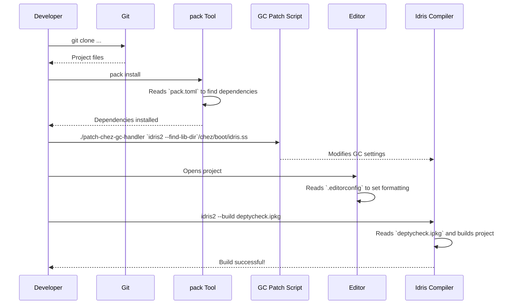

# Chapter 8: Project Build and Configuration

In the [previous chapter on Coverage Analysis](07_coverage_analysis_.md), we explored the powerful quality control tools that `DepTyCheck` provides to ensure your test data is thorough. We've now seen how to generate data, customize the generation process, and even check the quality of the results.

For this final part of our tour, we're going to step back. We'll move from looking at the code *inside* `DepTyCheck` to looking at the project itself. How is a project of this size organized? How do you compile it? What tools are used to keep the code clean and the documentation up-to-date?

This chapter is a look into the **blueprints and tool shed** of the `DepTyCheck` project. It's the collection of configuration files and scripts that make development a smooth, consistent experience for everyone involved.

## A Tour of the Project's Workshop

Imagine a well-organized workshop. You'd have:
*   A master blueprint for the object you're building (`deptycheck.ipkg`).
*   A list of suppliers for all your parts and where to find them (`pack.toml`).
*   A set of rules for keeping the workshop tidy (`.editorconfig`).
*   Instructions for creating an instruction manual for the final product (`.readthedocs.yaml`).
*   And maybe even a custom-modified power tool for a very specific, tricky task (`.patch-chez-gc-handler`).

The `DepTyCheck` project has digital versions of all of these. Let's take a look at each one.

### 1. The Master Blueprint: `deptycheck.ipkg`

The `.ipkg` file is the heart of any Idris project. It's like a `package.json` in JavaScript or a `Cargo.toml` in Rust. It tells the Idris compiler what the project is, what code files it contains, and what other libraries it needs.

File: `deptycheck.ipkg`
```idris
package deptycheck

authors = "Denis Buzdalov"
license = "MPL-2.0"
sourcedir = "src"

modules = Deriving.DepTyCheck.Gen
        , Test.DepTyCheck.Gen
        , -- ... and many more modules
        
depends = ansi
        , best-alternative
        , -- ... other dependencies
```
-   **`package deptycheck`**: The name of our project.
-   **`modules = ...`**: This is a list of all the code modules that are part of the `DepTyCheck` library. When you run `idris2 --build deptycheck.ipkg`, the compiler reads this list to know what to compile.
-   **`depends = ...`**: This is our project's "shopping list" of other libraries it needs to function.

### 2. The Supplier Directory: `pack.toml`

The `.ipkg` file lists *what* we need, but not *where* to get it. That's the job of `pack.toml`. This file works with a tool called `pack`, the community package manager for Idris 2. It gives `pack` the locations for all our dependencies.

File: `pack.toml`
```toml
# Tell `pack` where to find a dependency.
[custom.nightly-251007.fin-lizzie]
type   = "git"
url    = "https://github.com/buzden/idris2-fin-lizzie"
commit = "latest:master"

# This project also contains local sub-packages.
[custom.all.deptycheck]
type = "local"
path = "."
ipkg = "deptycheck.ipkg"
```
-   **`[custom...fin-lizzie]`**: This section tells `pack`: "To get the `fin-lizzie` library, go to this `git` URL and grab the latest version from the `master` branch."
-   **`[custom...deptycheck]`**: This tells `pack` that `deptycheck` itself is a local package found right here in the current directory (`.`).

When you run `pack install` in the project, it reads this file to download all the git dependencies and find all the local ones, getting your environment ready for building.

### 3. The Tidy Workshop Rules: `.editorconfig`

When many people work on the same project, they might have different settings in their code editors. One person might use tabs, another might use spaces. This can lead to messy, inconsistent code.

`.editorconfig` is a simple file that sets the formatting rules for the project. Most code editors will automatically read this file and apply its rules.

File: `.editorconfig`
```ini
# Rules for Idris files
[*.{idr,ipkg}]
indent_style = space
indent_size = 2
end_of_line = lf
trim_trailing_whitespace = true
```
This file ensures that no matter who is writing the code, it always follows the same basic style, keeping everything neat and readable.

### 4. The Docs Assembly Line: `.readthedocs.yaml`

These tutorial chapters and all the API documentation are built automatically by a service called Read the Docs. The `.readthedocs.yaml` file is the set of instructions we give to that service.

File: `.readthedocs.yaml`
```yaml
version: 2
build:
  os: ubuntu-22.04
  tools:
    python: "3.10"

python:
  install:
    - requirements: docs/requirements.txt
```
This tells the Read the Docs server what operating system to use, what version of Python it needs, and where to find the list of Python packages required to build the documentation website.

### 5. The Custom Power Tool: `.patch-chez-gc-handler`

This is the most unique and advanced part of the project's "tool shed."

*   **The Problem:** As we've seen, the [Generator Derivation Engine](02_generator_derivation_engine_.md) does a lot of heavy lifting at compile-time. This can use a lot of memory. The default garbage collector (GC) in the Idris compiler backend can sometimes run too frequently during this process, slowing down compilation significantly.

*   **The Analogy:** Imagine you're trying to build a complex model, and a robot vacuum cleaner keeps turning on every 30 seconds to clean up tiny specks of dust, getting in your way and slowing you down. You'd rather it waited until you've made a real mess and then did a big clean-up all at once.

*   **The Solution:** The `.patch-chez-gc-handler` script is a tool that modifies this "robot vacuum." It's a shell script that finds the garbage collector settings in your installed Idris compiler and replaces them with settings that are better tuned for `DepTyCheck`'s workload. It makes the GC less aggressive, leading to much faster compile times when working on the library.

File: `.patch-chez-gc-handler`
```sh
#!/bin/sh
SS="$1"
# ... finds the compiler file ...

# The original GC handler to look for
ORIG_CRH="^(collect-request-handler ...)"

# A new, smarter GC handler that is less aggressive
CRH="(collect-request-handler (let* ([gc-counter 1] ...)))"

# Replaces the original with the new one
sed -i "s/$ORIG_CRH/$CRH/" "$SS"
```
This is an advanced technique, but it's a perfect example of how the project is configured not just for correctness, but also for developer productivity.

## Under the Hood: A New Developer's First Build

Let's see how these files work together when a new developer wants to contribute to `DepTyCheck`.



1.  The developer clones the repository.
2.  They run `pack install`. `pack` reads `pack.toml` to download and link all dependencies.
3.  They run the `.patch-chez-gc-handler` script to optimize their compiler for working on `DepTyCheck`.
4.  When they open the code in their editor, `.editorconfig` ensures their formatting is correct.
5.  Finally, they build the project. The Idris compiler reads `deptycheck.ipkg` to know which files to compile and which dependencies to use.

## Conclusion

You've now had a full tour of the `DepTyCheck` workshop. You've seen that a successful software project is more than just its source code. It's also the robust infrastructure that supports it.

-   **`deptycheck.ipkg`** is the project's master blueprint.
-   **`pack.toml`** is the directory of suppliers for all the project's parts.
-   **`.editorconfig`** keeps the workshop tidy and the code consistent.
-   **`.readthedocs.yaml`** provides the instructions for building the user manual.
-   **`.patch-chez-gc-handler`** is a specialized tool to make the development process faster and more efficient.

These configuration files are the foundation that allows `DepTyCheck` to be a stable, maintainable, and developer-friendly library. While these tools manage the project's structure, there are also a few extra scripts to help with day-to-day tasks.

Next: [Chapter 9: Developer Utility Scripts](09_developer_utility_scripts_.md)

---

Generated by [AI Codebase Knowledge Builder](https://github.com/The-Pocket/Tutorial-Codebase-Knowledge)