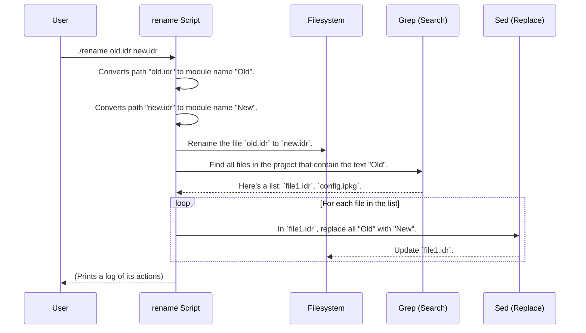

# Chapter 9: Developer Utility Scripts

In the [previous chapter on Project Build and Configuration](08_project_build_and_configuration_.md), we got a high-level view of the `DepTyCheck` workshop, looking at the configuration files that organize the project and its dependencies. These files are the foundation.

Now, we'll look at the custom tools sitting on the workbench. These are small, handy scripts that aren't part of the main library code but make the day-to-day life of a developer working on the project much easier. This chapter introduces you to the idea of **Developer Utility Scripts** using one great example from the project: the `rename` script.

## The Pain of Renaming a Module

Imagine you're deep into development and you decide a module name is no longer a good fit. You have a file `src/Utils/OldName.idr`, which corresponds to the Idris module `Utils.OldName`. You want to rename it to `Utils.BetterName`.

What do you have to do?
1.  Rename the file `src/Utils/OldName.idr` to `src/Utils/BetterName.idr`.
2.  Now, search your *entire* codebase for every single file that imports or mentions `Utils.OldName`.
3.  In every one of those files, manually change `import Utils.OldName` to `import Utils.BetterName`.
4.  You also have to update any other references, like in the `.ipkg` file or documentation.

This is tedious and very easy to get wrong. If you miss just one import, your project will break! This is where a custom utility script comes in.

## The Solution: A Project-Aware "Find and Replace"

The `DepTyCheck` project includes a utility script called `./rename`. It's a special tool that acts like a project-wide "find and replace" that is smart enough to understand Idris's module naming conventions.

You tell it which file you want to rename, and it handles everything for you automatically: renaming the file and updating every single usage across the entire project.

### How to Use the `rename` Script

Using the script is simple. From the root directory of the project, you run it with two arguments: the old file path and the new file path.

Let's say we want to rename `src/Test/DepTyCheck/Gen.idr` to `src/Test/DepTyCheck/Generator.idr`. You would run this command in your terminal:

```sh
./rename src/Test/DepTyCheck/Gen.idr src/Test/DepTyCheck/Generator.idr
```

When you run it, you'll see output that looks something like this, as it tells you what it's doing:

```
Renaming Test.DepTyCheck.Gen to Test.DepTyCheck.Generator...
  - usage in src/Deriving/DepTyCheck/Gen.idr...
  - usage in deptycheck.ipkg...
  - usage in docs/tutorial/01_test_data_generator_gen.md...
  - usage in ... (and so on)
```

And just like that, the job is done. The file has been renamed, and every `import`, link, and reference has been updated automatically. No more manual searching!

## Under the Hood: How `rename` Works

The script seems magical, but it's really just a clever sequence of common command-line tools working together. Let's follow the steps it takes when you run it.



The script is a simple shell script (`.rename`) that orchestrates this entire process. Let's look at its key parts.

### Step 1: Converting File Paths to Module Names

The script's "intelligence" comes from its ability to translate a file path like `src/Test/DepTyCheck/Gen.idr` into an Idris module name `Test.DepTyCheck.Gen`. It does this using a small helper function and a tool called `sed`.

File: `.rename`
```sh
filename_to_module() {
  echo "$1" | sed -e 's|^src/||' -e 's|\.idr$||' -e 's|/|\.|g'
}

FROM_MODULE="$(filename_to_module "$1")"
TO_MODULE="$(filename_to_module "$2")"
```

This function does three replacements:
1.  `s|^src/||`: Removes the `src/` prefix.
2.  `s|\.idr$||`: Removes the `.idr` suffix.
3.  `s|/|\.|g`: Replaces all `/` characters with `.` characters.

### Step 2: Renaming the File

This is the simplest step. It just uses the standard `mv` (move) command to rename the file on the filesystem.

File: `.rename`
```sh
mv "$FROM_FILE" "$TO_FILE"
```

### Step 3: Finding and Replacing All Usages

This is the workhorse of the script. It chains together `grep` (to find files) and `sed` (to do the replacement).

File: `.rename`
```sh
# Find all files with the old module name and loop through them.
grep -l -r ... "$FROM_MODULE" ... |
  while read -r r; do
    # For each file found, run `sed` to replace the text inside it.
    sed -i -e "s/$FROM_MODULE.../$TO_MODULE.../g" "$r"
  done
```
-   `grep -l -r`: This tells `grep` to recursively (`-r`) search the project and list (`-l`) the names of files that contain the old module name.
-   `while read -r r`: This loop processes each filename that `grep` finds.
-   `sed -i`: This runs the `sed` text-replacement tool and tells it to edit the file *in-place* (`-i`).

This powerful combination ensures that no usage is missed, whether it's in an Idris source file, a configuration file, or even a Markdown documentation file like this one!

## Conclusion

This concludes our tour of `DepTyCheck`! We've journeyed from the most fundamental building block, the [Test Data Generator (`Gen`)](01_test_data_generator___gen___.md), all the way up to these helpful developer scripts.

The `rename` script is a perfect example of a **developer utility script**: a small, focused tool designed to automate a tedious task and improve the quality of life for developers on the project. While it's not part of the library's public API, it's a vital part of the project's health and maintainability. Most mature software projects accumulate a collection of these helpful scripts over time.

You have now seen `DepTyCheck` from top to bottom:
-   The core aPI for **generating data**.
-   The powerful compile-time engine for **deriving generators automatically**.
-   The internal machinery for **analyzing code and managing recursion**.
-   The tools for **checking test coverage**.
-   The project's overall **build and configuration** structure.
-   And finally, the handy **utility scripts** that make development smoother.

You are now well-equipped to start using `DepTyCheck` for your own projects, and hopefully, to contribute back to its development. Happy testing

---

Generated by [AI Codebase Knowledge Builder](https://github.com/The-Pocket/Tutorial-Codebase-Knowledge)