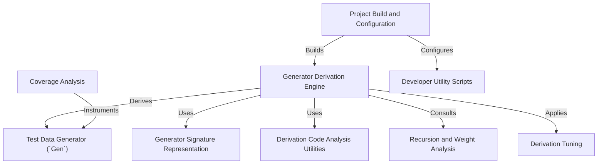

# Tutorial: DepTyCheck

DepTyCheck is an Idris 2 library for **property-based testing**, a powerful way to find bugs by testing your code with lots of random data. Its central feature is the *test data generator* (`Gen`), which is like a recipe for creating this random data. What makes DepTyCheck special is its ability to **automatically write these recipes for you**, even for the very complex and dependent types that Idris is famous for, saving you from a lot of tedious manual work.

**Source Repository:** [None](None)

## Chapters

1. [Test Data Generator (`Gen`)
](01_test_data_generator___gen___.md)
2. [Generator Derivation Engine
](02_generator_derivation_engine_.md)
3. [Derivation Tuning
](03_derivation_tuning_.md)
4. [Generator Signature Representation
](04_generator_signature_representation_.md)
5. [Derivation Code Analysis Utilities
](05_derivation_code_analysis_utilities_.md)
6. [Recursion and Weight Analysis
](06_recursion_and_weight_analysis_.md)
7. [Coverage Analysis
](07_coverage_analysis_.md)
8. [Project Build and Configuration
](08_project_build_and_configuration_.md)
9. [Developer Utility Scripts
](09_developer_utility_scripts_.md)

---

Generated by [AI Codebase Knowledge Builder](https://github.com/The-Pocket/Tutorial-Codebase-Knowledge)