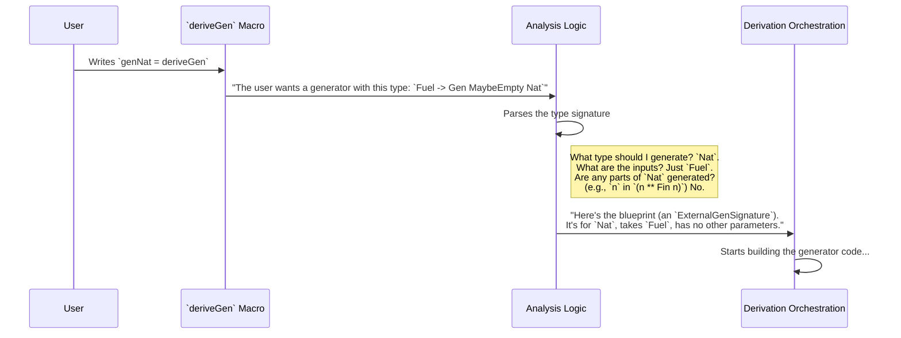

# Chapter 1: Derivation Entry Point

Welcome to the `DepTyCheck` tutorial! We're about to embark on a journey to understand how to automatically generate test data for even the most complex, dependently-typed data structures in Idris. Our first stop is the very beginning of this magical process: the "Derivation Entry Point".

## The Problem: Tedious Test Data

Imagine you're building a social media app and you've defined a data type for a user profile:

```idris
data UserProfile = MkProfile
  { userId : Nat
  , username : String
  , followers : List Nat
  }
```

To test functions that work with `UserProfile`, you need to create example profiles. Writing them by hand is boring and error-prone.

```idris
profile1 : UserProfile
profile1 = MkProfile 1 "alice" [2, 3]

profile2 : UserProfile
profile2 = MkProfile 2 "bob" []
```

What if you could just ask the computer to generate hundreds of random, valid `UserProfile`s for you? That's what `DepTyCheck` helps you do. The "Derivation Entry Point" is the way you make that request.

Think of it like this: `DepTyCheck` is an automated engineering firm. The Derivation Entry Point is the main "design request" form you fill out. You tell it what you want (a `UserProfile` generator), and it takes care of the rest.

## Your First Request: `deriveGen`

Let's ask `DepTyCheck` to build a generator for an incredibly simple type: `Nat`. The main tool for this is the `deriveGen` macro.

Here’s how you write the request:

```idris
%language ElabReflection

import Deriving.DepTyCheck.Gen

-- Our request for a Nat generator
genNat : Fuel -> Gen MaybeEmpty Nat
genNat = deriveGen
```

Let's break this down piece by piece:

1.  `%language ElabReflection`: This is a special command for the Idris compiler. It's like saying, "Hey, for this file, please enable your advanced, code-writing-code features." `DepTyCheck` uses these features to perform its magic.

2.  `genNat : Fuel -> Gen MaybeEmpty Nat`: This is our specification, or the "design request" itself. We're defining the type of the generator we want.
    *   `Gen MaybeEmpty Nat`: This means we want a **Gen**erator for the type `Nat`. We'll dive into the [Generator (`Gen`) Abstraction](02_generator___gen___abstraction_.md) in the next chapter, but for now, just think of it as a "box that can produce random `Nat`s".
    *   `Fuel`: What's this? Recursive types like `Nat` (`Z` or `S n`) could be generated infinitely (`S (S (S ...))`). `Fuel` is a simple mechanism to prevent this. It's like a countdown timer for the generator; when it runs out, the generator stops making bigger values.

3.  `genNat = deriveGen`: This is the magic button! We're telling `DepTyCheck`: "Look at the type signature I wrote for `genNat` and automatically write the function body for me."

When the compiler sees this, `DepTyCheck` kicks in, analyzes the `Nat` data type, and generates the code that can produce `0`, `1`, `2`, and so on, right where you put `deriveGen`.

## How It Works: From Request to Blueprint

So what happens when you press that `deriveGen` button? The system doesn't just randomly start building code. It follows a clear process, starting with analyzing your request.

Let's follow the journey of our `genNat` request.



1.  **Submit the Form**: You write `genNat = deriveGen`.
2.  **Initial Triage**: The `deriveGen` macro grabs the type signature you wrote (`Fuel -> Gen MaybeEmpty Nat`).
3.  **Analysis**: This raw type signature is sent to an internal function, `checkTypeIsGen`, which acts as the "analysis department". It carefully reads the signature to understand exactly what you're asking for. It answers questions like:
    *   What is the final data type we need to generate values for? **Answer:** `Nat`.
    *   What inputs does the user promise to provide? **Answer:** A value of type `Fuel`.
    *   Are there any dependent parts of the type that also need to be generated? **Answer:** No, not in this simple case.
4.  **Create the Blueprint**: Once the analysis is complete, the information is neatly packaged into a standardized format called an `ExternalGenSignature`. You can think of this as the final, approved blueprint that the rest of the factory (the [Derivation Orchestration](04_derivation_orchestration_.md)) can understand and work with. We'll learn more about this blueprint in a later chapter on [Generator Signature Representation](10_generator_signature_representation_.md).

### Peeking at the Code

This analysis happens inside the `Deriving.DepTyCheck.Gen` module. The main entry function is `deriveGenExpr`, which orchestrates the first step.

```idris
-- In src/Deriving/DepTyCheck/Gen.idr

export
deriveGenExpr : ... -> Elab TTImp
deriveGenExpr signature = do
  -- Step 1: Analyze the user's request
  checkResult <- checkTypeIsGen DerivationTask signature

  -- Step 2: Kick off the rest of the derivation with the analysis result
  -- ... code to call the main derivation logic ...
  ...
```

The most important part here is `checkTypeIsGen`. This function is the heart of the analysis. It meticulously deconstructs the `signature` you provide, ensuring it's a valid request and extracting all the necessary details to create the `ExternalGenSignature` blueprint.

## `deriveGen` vs. `deriveGenFor`

`DepTyCheck` offers a second, more explicit way to request a generator: `deriveGenFor`.

Look at our `genNat` example again:

```idris
-- Using deriveGen
genNat : Fuel -> Gen MaybeEmpty Nat
genNat = deriveGen

-- Using deriveGenFor
genNat = deriveGenFor (Fuel -> Gen MaybeEmpty Nat)
```

They achieve the exact same result! So what's the difference?

*   `deriveGen` is convenient. It implicitly finds the type signature you wrote on the line above (what Idris calls the "goal type").
*   `deriveGenFor` is explicit. You pass the type signature directly to the macro as an argument.

You can use `deriveGenFor` to write a generator definition in a single line, which can be handy. It can also sometimes be more robust if the "goal-finding" mechanism of `deriveGen` has trouble. For most cases, `deriveGen` is perfectly fine.

## Summary and Next Steps

Congratulations, you've just taken your first step! You've learned how to make a request to `DepTyCheck` to automatically build a test data generator.

*   The **Derivation Entry Point** is your interface to `DepTyCheck`'s powerful derivation engine.
*   You use the `deriveGen` or `deriveGenFor` macros to make a request.
*   The request is a **type signature** that specifies exactly what kind of generator you want.
*   `DepTyCheck` analyzes this signature and turns it into a standardized blueprint (`ExternalGenSignature`) that the rest of the system uses to build the generator.

We've mentioned the `Gen` type a few times, calling it a "box that produces values." But what exactly *is* it, and how can we use the generators we create?

In the next chapter, we will open up that box and explore the core concept of the [Generator (`Gen`) Abstraction](02_generator___gen___abstraction_.md).

---

Generated by [AI Codebase Knowledge Builder](https://github.com/The-Pocket/Tutorial-Codebase-Knowledge)