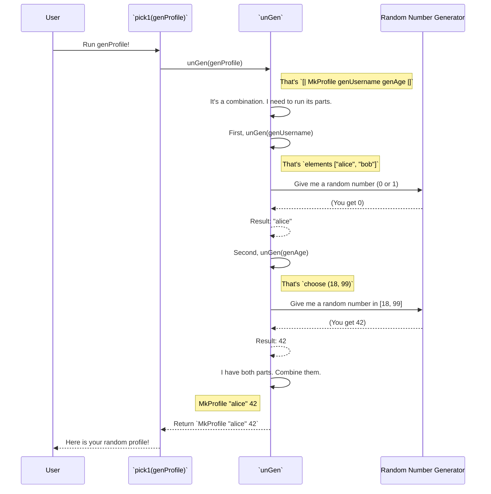

# Chapter 2: Generator (`Gen`) Abstraction

In the [previous chapter](01_derivation_entry_point_.md), we used `deriveGen` to magically create a "box that can produce random `Nat`s". We called this box a `Gen MaybeEmpty Nat`. But what exactly *is* this `Gen` thing? How does it work, and how can we build our own?

This chapter pulls back the curtain on `Gen`, the fundamental building block of `DepTyCheck`.

## The Problem: What is "Randomness"?

Imagine you want to test a function that processes user profiles. You need a way to create random profiles. How would you represent the *idea* of a random profile in your code?

You could write a function `IO UserProfile` that uses random IO. But that mixes the *description* of what you want with the *action* of getting it. `DepTyCheck` takes a different approach.

It introduces the **Generator (`Gen`) Abstraction**.

Think of a `Gen a` value as a **blueprint for a factory**. It's not the final product; it's the detailed set of instructions for how to manufacture random products of type `a`.

*   A `Gen String` is a blueprint for a string-making factory.
*   A `Gen Nat` is a blueprint for a number-making factory.
*   A `Gen UserProfile` is a blueprint for a profile-making factory.

The beauty of this approach is that we can work with these blueprints: we can combine small, simple blueprints to build large, complex ones.

## Running the Factory: `pick1`

A blueprint is useless if you can't build the factory and get a product. The simplest way to "run" a generator is with the `pick1` function.

Let's start with a very basic blueprint. The `elements` function creates a generator that randomly picks one item from a list.

```idris
import Test.DepTyCheck.Gen

-- A blueprint for a factory that produces one of three callsigns.
genCallsign : Gen1 String
genCallsign = elements ["Maverick", "Goose", "Iceman"]
```
Here, `genCallsign` is our `Gen1 String`. The `1` in `Gen1` is a shorthand for `NonEmpty`, which is a promise that this generator will *always* succeed in producing a value. It can't fail.

Now, let's fire up the assembly line and get one product:

```idris
-- In an IO block...
main : IO ()
main = do
  callsign <- pick1 genCallsign
  putStrLn ("Your callsign is: " ++ callsign)
```

If you run this program, it will print one of the following lines, chosen randomly:

```
Your callsign is: Maverick
```
or
```
Your callsign is: Goose
```
or
```
Your callsign is: Iceman
```

`pick1` takes the blueprint (`genCallsign`), runs the factory once, and gives you the resulting `String`.

## Basic Blueprints

`DepTyCheck` comes with a set of pre-made, simple blueprints (or blueprint-making tools) that you can use.

### `elements`
As we just saw, `elements` creates a generator from a hard-coded list of values.
Analogy: An assembly line arm that picks one item from a bin of pre-made parts.

```idris
-- A generator for HTTP methods
genMethod : Gen1 String
genMethod = elements ["GET", "POST", "PUT"]
```

### `choose`
`choose` creates a generator for a number within a specific range. It works for any type that Idris knows how to generate random values for (like `Nat`, `Int`, `Double`).
Analogy: A machine that produces a random-sized bolt, but only between 10mm and 20mm.

```idris
-- A generator for a dice roll
genD6 : Gen1 Nat
genD6 = choose (1, 6)
```

### `pure`
`pure` creates a generator that *always* produces the exact same value. It's not very random, but it's incredibly useful for combining generators.
Analogy: A factory that is hard-coded to only ever produce one specific model of car.

```idris
-- A generator that only ever produces the number 42.
genTheAnswer : Gen1 Nat
genTheAnswer = pure 42
```

## Combining Blueprints

The real power of `Gen` comes from composition. Let's revisit our `UserProfile` example from Chapter 1, but simplify it.

```idris
data UserProfile = MkProfile String Nat
```

We want a factory that produces `UserProfile`s. We can build it by combining a string factory and a number factory! `DepTyCheck` uses a special syntax `[| ... |]` for this.

```idris
-- Blueprint for a username factory
genUsername : Gen1 String
genUsername = elements ["alice", "bob"]

-- Blueprint for an age factory
genAge : Gen1 Nat
genAge = choose (18, 99)

-- The combined blueprint for a UserProfile factory!
genProfile : Gen1 UserProfile
genProfile = [| MkProfile genUsername genAge |]
```

This is incredibly readable! You're telling the system: "To make a `UserProfile`, run the `genUsername` factory to get the first part, run the `genAge` factory to get the second part, and then put them together with `MkProfile`."

When you call `pick1 genProfile`, it will:
1.  Run `genUsername` (and get, say, `"bob"`).
2.  Run `genAge` (and get, say, `35`).
3.  Construct and return `MkProfile "bob" 35`.

## Advanced Assembly: `oneOf` and Monads

There are more powerful ways to combine blueprints for more complex scenarios.

### `oneOf`

`oneOf` takes a list of *generators* and creates a new generator that randomly picks one of them to run.

Analogy: A factory manager who flips a coin. Heads, we run the "sedan" assembly line today. Tails, we run the "truck" assembly line.

```idris
-- A generator for vowels
genVowel : Gen1 Char
genVowel = elements ['a', 'e', 'i', 'o', 'u']

-- A generator for some consonants
genConsonant : Gen1 Char
genConsonant = elements ['b', 'c', 'd', 'f', 'g']

-- 50% chance of getting a vowel, 50% chance of a consonant
genLetter : Gen1 Char
genLetter = oneOf [genVowel, genConsonant]
```
Running `pick1 genLetter` will first randomly choose between `genVowel` and `genConsonant`, and then run the chosen generator.

### `do`-notation (Monadic Bind)

Sometimes, the blueprint for the *second* part of an object depends on the value produced by the *first* part. This is especially common in dependent types.

Analogy: An assembly line where the first station builds a phone chassis (`iPhone 15` or `iPhone 15 Pro`). The second station looks at the chassis it received and then runs a different machine to install the correct camera module (standard or pro).

Let's look at the classic example: generating a pair of `(n ** Fin n)`, a number `n` and a proof that some other number is less than `n`.

```idris
-- A generator for a number from 1 to 3
genSize : Gen1 Nat
genSize = elements [1, 2, 3]

-- A generator for Fin n, which can fail if n is 0!
genFin : (n : Nat) -> Gen0 (Fin n)
genFin 0 = empty -- Can't make a Fin 0, so this blueprint is "empty"
genFin (S k) = elements' (allFins k)

-- A blueprint for a sized number
genSizedFin : Gen1 (n ** Fin n)
genSizedFin = do
  n <- genSize          -- First, produce a size `n`
  fin <- genFin n       -- Then, use `n` to produce a `fin`
  pure (n ** fin)
```
This is powerful! The `genFin` generator is chosen *based on the random value* `n` produced by `genSize`.

Notice `Gen0` and `empty`. `Gen0` is shorthand for `Gen MaybeEmpty`. `genFin 0` produces an `empty` generator—a blueprint for a factory that can't produce anything. This is a vital concept we'll explore in the next chapter on [Generator Emptiness Tracking](03_generator_emptiness_tracking_.md).

## What's Under the Hood?

So how does `DepTyCheck` represent this "blueprint"? It's a data structure! Here's a simplified view of it from `src/Test/DepTyCheck/Gen.idr`:

```idris
data Gen : Emptiness -> Type -> Type where
  Empty : Gen MaybeEmpty a         -- The impossible blueprint
  Pure  : a -> Gen em a            -- The "always this value" blueprint
  Raw   : RawGen a -> Gen em a     -- A primitive random action (like `choose`)
  OneOf : ... -> Gen em a          -- A choice between several blueprints
  Bind  : ... -> (c -> Gen biem a) -> Gen em a -- A dependent blueprint
```

Each function we've used constructs one of these `Gen` values:
*   `pure "hello"` creates a `Pure "hello"`.
*   `elements ["a", "b"]` creates a `OneOf` containing `Pure "a"` and `Pure "b"`.
*   The `do`-notation for `genSizedFin` creates a `Bind` value.

When you call `pick1`, an internal function called `unGen` traverses this data structure, making random choices along the way.



## Summary and Next Steps

You've now seen the core of `DepTyCheck`!

*   A **`Gen a`** is a **blueprint** for generating random values of type `a`.
*   You can run these blueprints using functions like **`pick1`**.
*   You can build simple blueprints from scratch with **`elements`**, **`choose`**, and **`pure`**.
*   Most importantly, you can **combine** simple blueprints into complex ones using `[| ... |]` syntax, **`oneOf`**, and **`do`**-notation.

We briefly touched on `Gen0` (`Gen MaybeEmpty`) and the `empty` generator. This seems like a small detail, but the ability for a generator to represent an *impossible* generation is the key that unlocks testing for complex dependent types.

In the next chapter, we will dive deep into this idea and explore [Generator Emptiness Tracking](03_generator_emptiness_tracking_.md).

---

Generated by [AI Codebase Knowledge Builder](https://github.com/The-Pocket/Tutorial-Codebase-Knowledge)