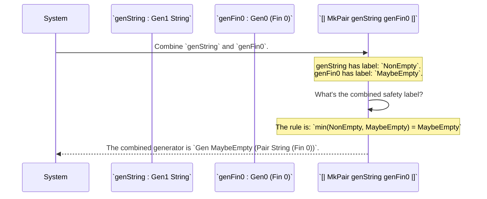

# Chapter 3: Generator Emptiness Tracking

In the [previous chapter](02_generator___gen___abstraction_.md), we got a sneak peek at a mysterious concept when we built a generator for a `(n ** Fin n)` pair. We saw that `genFin 0` resulted in an `empty` generator and forced our function to return a `Gen0`, or `Gen MaybeEmpty`.

Why is this `MaybeEmpty` so important? What problem does it solve? Welcome to the heart of `DepTyCheck`'s power: its ability to reason about the "emptiness" of a type.

## The Problem: Impossible Objects

In dependently-typed programming, you can define types that are impossible to create. These are called **uninhabited types**. The simplest example is `Fin 0`, a number that is "less than 0". There are no natural numbers less than 0, so you can never create a value of this type.

Now, imagine we have a data type for a team roster, which must contain at least one player.

```idris
import Data.Vect

-- A team has a name and a non-empty vector of player IDs.
data Team = MkTeam String (Vect 1 (Fin 5))
```

This definition is perfectly valid. But let's ask a question: could `DepTyCheck` automatically generate a `Team` for us? What if the type was `Vect 1 (Fin 0)` instead?

```idris
-- An IMPOSSIBLE team structure.
data ImpossibleTeam = MkImpossibleTeam String (Vect 1 (Fin 0))
```

To create an `ImpossibleTeam`, the generator would need to create a `Vect` of length 1 containing a `Fin 0`. But we know creating a `Fin 0` is impossible! A naive generator would get stuck in a loop, trying forever to create something that can't exist.

`DepTyCheck` needs a way to know, *before even trying*, that some generation tasks are doomed to fail. This is what Emptiness Tracking is all about.

Think of it like a safety label on a factory blueprint. The label tells you: "This factory is guaranteed to produce a product" or "Warning: Under certain conditions, this factory might not produce anything."

## The Core Concepts: Safety Labels

`DepTyCheck` implements this safety label system with a simple type called `Emptiness`.

```idris
-- From: src/Test/DepTyCheck/Gen/Emptiness.idr

public export
data Emptiness = NonEmpty | MaybeEmpty
```

This tiny piece of code is the foundation. Every generator (`Gen`) carries one of these two labels.

1.  **`NonEmpty`**: This is a promise. It says, "This generator will *always* succeed in producing a value." It's a blueprint for a reliable factory.
2.  **`MaybeEmpty`**: This is a warning. It says, "This generator *might* fail to produce a value." It could be because it's trying to build an impossible object, or because it depends on another generator that might fail.

### `Gen1` and `Gen0`: Convenient Shorthands

To make our code cleaner, `DepTyCheck` provides two simple aliases for generators with these labels.

*   `Gen1 a` is just a nickname for `Gen NonEmpty a`.
*   `Gen0 a` is a nickname for `Gen MaybeEmpty a`.

```idris
-- This generator is GUARANTEED to work.
genGuaranteed : Gen1 Nat
genGuaranteed = pure 42

-- This generator MIGHT fail.
genRisky : Gen0 (Fin 0)
genRisky = empty_ -- We'll see what `empty` is next.
```

When you see a `Gen1`, you can be confident. When you see a `Gen0`, you must be careful and handle the possibility of failure.

### The `empty` Generator: A Blueprint for Nothing

So how do we represent a blueprint for a factory that we *know* will fail? `DepTyCheck` provides a special generator for this: `empty`.

The `empty` generator is the ultimate `MaybeEmpty` generator. It never produces a value. It's the blueprint for an impossible task.

Let's look at the `Gen` data type definition again to see how this fits in.

```idris
-- Simplified from: src/Test/DepTyCheck/Gen.idr

data Gen : Emptiness -> Type -> Type where
  -- A blueprint for a factory that is guaranteed to fail.
  -- Notice its Emptiness is hard-coded to `MaybeEmpty`!
  Empty : Gen MaybeEmpty a

  -- Other constructors like Pure, Raw, OneOf...
  Pure  : a -> Gen em a
```

The `Empty` constructor can *only* create a `Gen` with the `MaybeEmpty` label. This is enforced by the type system itself.

Now our `genFin` example from the last chapter should make perfect sense:

```idris
genFin : (n : Nat) -> Gen0 (Fin n)
genFin 0 = empty -- Impossible to make a Fin 0, so return the `empty` blueprint.
genFin (S k) = elements' (allFins k) -- Possible, return a blueprint for a list of choices.
```
Because the `genFin 0` case returns `empty` (which is `Gen MaybeEmpty (Fin 0)`), the entire function's return type *must* be `Gen0 (Fin n)` to accommodate this possibility.

## How Emptiness Propagates

The real magic happens when `DepTyCheck` combines generators. The type system follows one simple, crucial rule:

**A chain is only as strong as its weakest link.**

If you build a complex generator out of smaller parts, its safety label is determined by the "riskiest" part.

*   `NonEmpty` + `NonEmpty` = `NonEmpty` (Combining two reliable blueprints gives a reliable blueprint).
*   `NonEmpty` + `MaybeEmpty` = `MaybeEmpty` (If one part might fail, the whole thing might fail).
*   `MaybeEmpty` + `MaybeEmpty` = `MaybeEmpty`

Let's see this in a diagram. Imagine we are combining a generator for a `String` (which is `NonEmpty`) and a generator for a `Fin 0` (which is `MaybeEmpty`).



The `MaybeEmpty` label from `genFin0` "infects" the combined generator. The system now knows that `[| MkPair genString genFin0 |]` is a risky blueprint that might fail. This prevents you from accidentally using it in a context that requires a guaranteed `Gen1` generator, catching the error at compile time instead of as a mysterious bug at runtime.

### Under the Hood: `min` and `NoWeaker`

This "weakest link" rule is implemented in the type system using `NoWeaker`, a relation that defines an order on `Emptiness`.

```idris
-- From: src/Test/DepTyCheck/Gen/Emptiness.idr

-- `NoWeaker from to` means `from` is at least as strong as `to`.
-- You can use a `from` where a `to` is expected.
data NoWeaker : (from, to : Emptiness) -> Type where
  NN : NonEmpty `NoWeaker` NonEmpty -- NonEmpty is as strong as NonEmpty
  AS : em       `NoWeaker` MaybeEmpty -- Any emptiness level is as strong as MaybeEmpty
```

This confirms that `MaybeEmpty` is the "weakest" level. You can always use a `NonEmpty` generator where a `MaybeEmpty` one is needed, but not the other way around.

When `DepTyCheck` combines generators (for example, with the applicative `<*>` operator), it uses the `min` function on the `Emptiness` types to compute the new label, automatically enforcing the "weakest link" rule.

```idris
-- A simplified look at how combining generators works internally
-- The resulting emptiness is `min lem rem`
(<**>) : (g : Gen lem f) -> (h : Gen rem a) -> Gen (min lem rem) b
```

This ensures that emptiness tracking is not just a convention, but a process that is mathematically and automatically verified by the Idris compiler every time you build a generator.

## Summary and Next Steps

You've just learned the secret sauce that makes `DepTyCheck` safe and powerful for dependent types!

*   **Emptiness Tracking** is a system of safety labels (`NonEmpty`, `MaybeEmpty`) that tell us if a generator might fail.
*   Types that are impossible to create (like `Fin 0`) lead to an **`empty`** generator, which has the `MaybeEmpty` label.
*   We use the shorthands **`Gen1`** (`NonEmpty`) for guaranteed generators and **`Gen0`** (`MaybeEmpty`) for risky ones.
*   When combining generators, the `MaybeEmpty` label propagates. If any part of a generator might fail, the whole generator is marked as potentially failing.
*   This allows `DepTyCheck` to detect impossible generation tasks at **compile time**.

We've seen how `DepTyCheck` uses these safety labels when combining generators. But how does it manage the entire, complex process of analyzing a user's data type, figuring out the emptiness for all its constructors, and assembling the final, correctly-labeled generator?

In the next chapter, we'll get a bird's-eye view of this entire process and look at the main engine that drives it all: [Derivation Orchestration](04_derivation_orchestration_.md).

---

Generated by [AI Codebase Knowledge Builder](https://github.com/The-Pocket/Tutorial-Codebase-Knowledge)