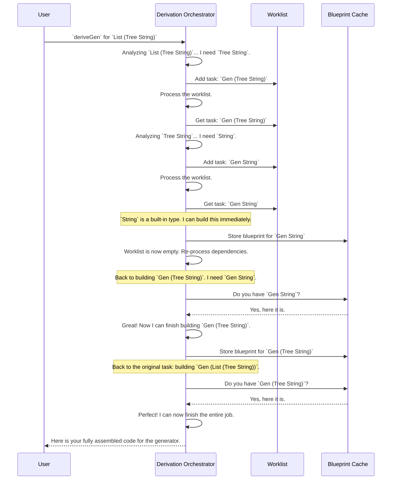

# Chapter 4: Derivation Orchestration

In the [previous chapter](03_generator_emptiness_tracking_.md), we learned how `DepTyCheck` uses safety labels like `Gen1` (guaranteed) and `Gen0` (risky) to reason about whether a generator can fail. This is a crucial detail for individual generators. But what happens when we ask `DepTyCheck` to build something complex?

How does it manage all the interlocking pieces? Who is the project manager?

## The Problem: A Complex Product with Many Parts

Imagine you're running an automated factory. A client comes to you with a request to build a complex product: a `List` of `Tree`s.

```idris
-- A simplified Tree data type
data Tree a = Leaf | Node (Tree a) a (Tree a)

-- The complex product we want to generate
myGenerator : Fuel -> Gen MaybeEmpty (List (Tree String))
myGenerator = deriveGen
```

When you look at the blueprint for `List (Tree String)`, you immediately spot a problem. To build a factory for this, you first need factories for its parts:
1.  A factory for `Tree String`.
2.  And to build *that*, you first need a factory for `String`.

This creates a chain of dependencies. A naive system might get confused, build a `String` factory twice, or get stuck in a loop. `DepTyCheck` needs a central coordinator to manage this process efficiently.

This coordinator is the **Derivation Orchestrator**.

Think of it as the project manager for the entire automated factory design process. It keeps track of all the sub-tasks, ensures no work is repeated, and makes sure all the finished blueprints are correctly assembled.

## The Project Manager's Toolkit

Our Derivation Orchestrator has two key tools to stay organized: a worklist and a cache.

1.  **The Worklist (To-Do List):** This is a simple list of generator blueprints that still need to be designed. When the orchestrator discovers a new dependency (like needing a `String` generator), it adds it to this list.

2.  **The Cache (Completed Blueprints):** This is a collection of all the generator blueprints that have already been designed. Before starting a new task from the worklist, the orchestrator first checks the cache. If the blueprint is already there, it just re-uses it instead of doing the same work all over again.

### The Derivation Loop

The orchestrator works in a simple, effective loop:

1.  **Get the initial request:** "Design a factory for `List (Tree String)`".
2.  **Analyze dependencies:** The orchestrator looks at `List (Tree String)` and says, "Aha, I first need a factory for `Tree String`." It adds `Tree String` to its worklist.
3.  **Process the worklist:** It picks `Tree String` from the list. It analyzes this new task and says, "Okay, to build this, I first need a `String` factory." It adds `String` to the worklist.
4.  **Process again:** It picks `String` from the worklist. A `String` generator is a basic, built-in type. The orchestrator quickly "builds" it and puts the finished blueprint into its cache of completed designs. The worklist for `String` is now empty.
5.  **Continue processing:** It goes back to the `Tree String` task. Now, when it needs the `String` blueprint, it finds it instantly in the cache. It finishes designing the `Tree String` factory and adds that blueprint to the cache.
6.  **Finish the job:** Finally, it can complete the original request for `List (Tree String)`, since its dependency is now in the cache.

This process ensures that every needed blueprint is designed exactly once.

## A Step-by-Step Walkthrough

Let's visualize this process for our `List (Tree String)` request.



This systematic process allows `DepTyCheck` to handle data types of arbitrary complexity without getting lost.

## Under the Hood: `callGen` and `deriveAll`

The logic for this orchestration lives in `Deriving.DepTyCheck.Gen.ForAllNeededTypes.Impl`. The two most important pieces are a function called `callGen` and a loop called `deriveAll`.

### `callGen`: The Gatekeeper

`callGen` is the function that gets called whenever the system needs a generator for a particular type. It acts as the gatekeeper to the cache and the worklist. Its logic is simple:

1.  Is this a special, user-provided generator? If so, use it.
2.  Have we already designed a generator for this type? Check the **cache**. If so, return its name.
3.  If not, this is a new task!
    a. Give it a unique name.
    b. Add it to the **cache** (so we don't try to derive it again).
    c. Add it to the **worklist** (so the `deriveAll` loop will process it).
    d. Return its new name.

Here's a very simplified view of what `callGen` does:

```idris
-- Simplified from: src/Deriving/DepTyCheck/Gen/ForAllNeededTypes/Impl.idr

callGen : (neededSig : GenSignature) -> ... -> m TTImp
callGen neededSig fuel values = do
  -- Step 1: Check for user-provided external generators (not shown)
  -- ...

  -- Step 2: Check the cache of already-derived generators
  let existing = lookup neededSig !(get {stateType=SortedMap _})
  case existing of
    Just name => pure (callInternalGen name fuel values) -- Found it!
    Nothing => do
      -- Step 3: Not found. It's a new task!
      let name = nameForGen neededSig
      modify {stateType=SortedMap _} $ insert neededSig name -- Add to cache
      modify {stateType=List _} $ (::) (neededSig, name)  -- Add to worklist
      pure (callInternalGen name fuel values)             -- Return its name
```
This snippet shows how every request for a generator is either fulfilled from the cache or becomes a new item on the to-do list.

### `deriveAll`: The Worker

`deriveAll` is the main loop that does the actual work. It's a simple but powerful recursive function:

1.  Get the current **worklist**.
2.  Clear the worklist (we're about to process it).
3.  For each task on the list, call another component to build the actual code for that one generator. (We'll learn about this in the [Constructor-Specific Generator Derivation](06_constructor_specific_generator_derivation_.md) chapter).
4.  If the worklist wasn't empty, some new dependencies might have been discovered. Run `deriveAll` again to handle them.
5.  If the worklist was empty, we're done!

```idris
-- Simplified from: src/Deriving/DepTyCheck/Gen/ForAllNeededTypes/Impl.idr

deriveAll : m ()
deriveAll = do
  -- Step 1: Get the worklist
  toDerive <- get {stateType=List _}

  -- Step 2: Clear it
  put {stateType=List _} []

  -- Step 3: Process each task
  for_ toDerive (\(sig, name) => deriveOne sig name)

  -- Step 4: If we did work, there might be new tasks. Loop!
  when (not $ null toDerive) $ deriveAll
```
Together, `callGen` and `deriveAll` form the engine of the derivation orchestrator, ensuring every part is built efficiently and correctly.

## Summary and Next Steps

You've now seen the big picture! The **Derivation Orchestrator** is the project manager that makes `DepTyCheck`'s complex derivations possible.

*   It breaks down a large derivation task (e.g., for `List (Tree String)`) into a series of smaller, manageable sub-tasks (for `Tree String` and `String`).
*   It uses a **worklist** to track what needs to be done and a **cache** to avoid repeating work.
*   The `callGen` function manages the cache and worklist, while the `deriveAll` loop processes the tasks until the entire job is complete.

We've seen how the orchestrator manages *which* blueprints to build. But once all the blueprints are ready, how does it actually stitch the resulting code together into a final, working generator function?

In the next chapter, we will examine the final assembly stage and explore [Type-Level Generator Assembly](05_type_level_generator_assembly_.md).

---

Generated by [AI Codebase Knowledge Builder](https://github.com/The-Pocket/Tutorial-Codebase-Knowledge)