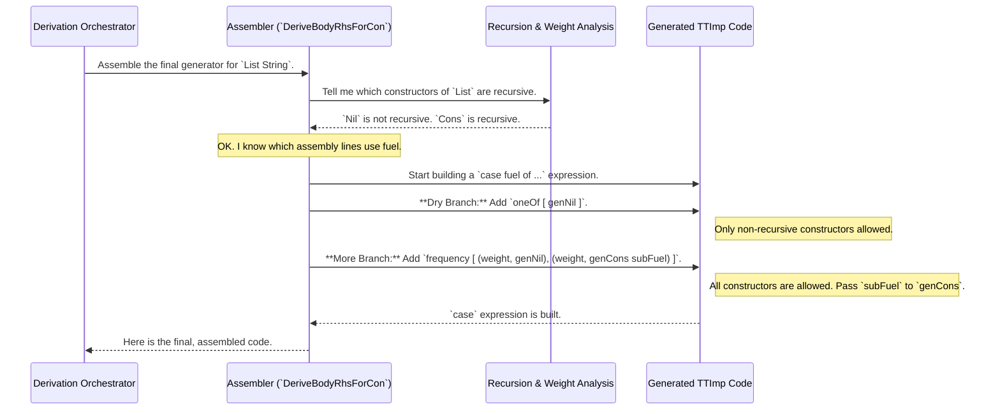

# Chapter 5: Type-Level Generator Assembly

In the [previous chapter](04_derivation_orchestration_.md), we saw how the Derivation Orchestrator acts like a project manager, creating a to-do list (`Worklist`) and tracking completed blueprints (`Cache`) to ensure all necessary sub-generators are built. It manages the "what" and "who" of the derivation process.

Now, we'll look at the final, crucial step for a single data type: the assembly line. Once we have the individual blueprints for each part of a type (its constructors), how do we combine them into a single, cohesive generator for the whole type?

## The Problem: Picking the Right Assembly Line

Let's consider a classic data type: `List`.

```idris
data List a = Nil | Cons a (List a)
```

A `List` can be one of two things:
1.  `Nil`: An empty list.
2.  `Cons a (List a)`: A cell containing a value of type `a` and another `List a`.

In the last chapter, the orchestrator would have ensured we have blueprints for any type parameters like `a`. In the next chapter, we'll see how `DepTyCheck` creates mini-generators for `Nil` and `Cons` individually. Let's assume for now that we have them:
*   A `genNil` factory that produces an empty list.
*   A `genCons` factory that takes a value and another list, and produces a new, longer list.

The question is: how do we build the main `genList` factory? It's not as simple as flipping a coin and picking one. The `Cons` factory is **recursive**—it needs to build *another* list. If we keep picking `Cons`, we could end up in an infinite loop!

This is where `Fuel` comes back into play. We need a master controller that intelligently chooses between the `Nil` and `Cons` assembly lines based on how much `Fuel` we have left.

Think of it like designing a car factory. You have two assembly lines:
*   **Line A (Sedan):** A simple, quick process (`Nil`).
*   **Line B (SUV):** A more complex process that uses more resources (`Cons`).

The **Type-Level Generator Assembly** is the factory's main control system. It checks the resource levels (`Fuel`). If resources are critically low (`Dry`), it shuts down Line B and only runs the efficient Line A to guarantee it can finish a product. If resources are plentiful (`More`), it can choose to run either line.

## The Assembly Strategy: A Tale of Two Fuels

The core strategy is to generate a `case` expression that switches on the `Fuel` parameter. This creates two distinct paths for the generator.

Let's imagine we're asking `DepTyCheck` to build `genList : Fuel -> Gen MaybeEmpty (List String)`. The final assembled generator code will look conceptually like this:

```idris
genList : Fuel -> Gen MaybeEmpty (List String)
genList fuel =
  -- Inside here is a 'local' block containing genNil and genCons
  -- which we will learn about in the next chapter.

  case fuel of
    Dry =>
      -- Fuel is empty! We MUST choose a non-recursive path.
      oneOf [ genNil ] -- Only the 'Nil' factory is available.

    More subFuel =>
      -- We have fuel to spend! We can choose either path.
      frequency
        [ (1, genNil) -- Give 'Nil' a weight of 1
        , (1, genCons subFuel) -- 'Cons' gets weight 1 and the remaining fuel
        ]
```

Let's break down this brilliant strategy:

1.  **Check the Fuel:** The entire logic is wrapped in a `case` statement on the `fuel` argument.
2.  **`Dry` Branch (Out of Gas):** If the fuel is `Dry`, the generator is forced to choose a path that doesn't consume more fuel. It can only call the generator for `Nil`, which is a "terminal" constructor (non-recursive). This guarantees the generation will eventually stop.
3.  **`More subFuel` Branch (Fuel to Spare):** If the fuel is `More`, the generator has a choice. It can use `Nil` *or* `Cons`.
    *   It uses a function like `frequency` to make a weighted choice. This allows us to tune how often we pick the recursive step.
    *   If it picks `genNil`, it passes the original `fuel` (because `Nil` doesn't spend any).
    *   If it picks `genCons`, it crucially passes the *remaining* fuel, `subFuel`, to the recursive call. This ensures the countdown continues.

This `case` statement is the "intelligent controller" that makes `DepTyCheck`'s generators both productive and safe from infinite loops.

## Under the Hood: The `fuelDecisionExpr`

This assembly logic is implemented inside the `DeriveBodyRhsForCon` interface in `src/Deriving/DepTyCheck/Gen/ForOneType/Impl.idr`. The main workhorse is a helper function called `fuelDecisionExpr`.

Let's trace how it builds the final generator for our `List` type.



The assembler first consults a component that performs [Recursion and Weight Analysis](07_recursion_and_weight_analysis_.md) to determine which constructors are "fuel-spenders". Then, it uses this information to construct the two branches of the `case` expression.

### Diving into the Code

Let's look at a simplified snippet of `fuelDecisionExpr` to see how this translates to actual code.

First, it separates the constructors into two groups: those that spend fuel (recursive ones) and those that don't.

```idris
-- Simplified from: src/Deriving/DepTyCheck/Gen/ForOneType/Impl.idr

fuelDecisionExpr : (fuelArg : Name) -> List (Con, ...) -> TTImp
fuelDecisionExpr fuelArg consRecs =

  -- Are there any non-recursive constructors at all?
  let nonSpendCons = mapMaybe findNonRecursive consRecs in
```

`nonSpendCons` will be a list containing just the `Nil` constructor information.

Next, it builds the `case` expression. This is the `Dry` branch:

```idris
-- The case expression starts here
iCase (var fuelArg) ... [
  -- if fuel is dry, call all non-recursive constructors...
  var `{Data.Fuel.Dry} .=
    callConstFreqs "dry fuel" (var fuelArg) nonSpendCons
]
```
This Idris metaprogramming code generates `Dry => ...`. The `callConstFreqs` function is a helper that generates a call to `oneOf` or `frequency` using *only* the constructors in `nonSpendCons`. For our `List` example, this results in `oneOf [ genNil ]`.

Finally, this is the `More` branch:

```idris
-- Continuing the case expression...
[
  ... -- Dry branch from above
  , do -- if fuel is `More`...
    let subFuelArg = UN "subFuel"
    var `{Data.Fuel.More} .$ bindVar subFuelArg .=
      callFrequency "non-dry fuel" (
        consRecs <&> \(con, rec) =>
          ... -- Logic to get the right fuel and weight
          (weight, callConsGen fuelToUse con)
      )
]
```
This code generates the `More subFuel => ...` part. It creates a new variable name `subFuelArg` for the remaining fuel. Then, it calls `callFrequency` with *all* constructors (`consRecs`). The clever part is inside the loop: it figures out for each constructor whether to pass the full `fuelArg` (for non-recursive ones like `Nil`) or the new `subFuelArg` (for recursive ones like `Cons`).

This single, elegant piece of metaprogramming is responsible for safely assembling generators for any recursive data type.

## Summary and Next Steps

You've now seen the final step in producing a generator for a single type!

*   The **Type-Level Generator Assembly** is the process of combining the mini-generators for each constructor into one main generator.
*   The core strategy is to build a `case` statement that branches on **`Fuel`**.
*   When `Fuel` is `Dry`, only **non-recursive** constructors are chosen, guaranteeing termination.
*   When `Fuel` is `More`, all constructors can be chosen, and the remaining `subFuel` is passed to any recursive calls.
*   This assembly happens automatically inside the `DeriveBodyRhsForCon` implementation.

We've been assuming that the mini-generators for constructors like `Nil` and `Cons` just magically exist. But how does `DepTyCheck` build those? How does it know to generate an `a` and recursively call for a `List a` when it sees the `Cons` constructor?

In the next chapter, we'll zoom in on that exact process and explore [Constructor-Specific Generator Derivation](06_constructor_specific_generator_derivation_.md).

---

Generated by [AI Codebase Knowledge Builder](https://github.com/The-Pocket/Tutorial-Codebase-Knowledge)