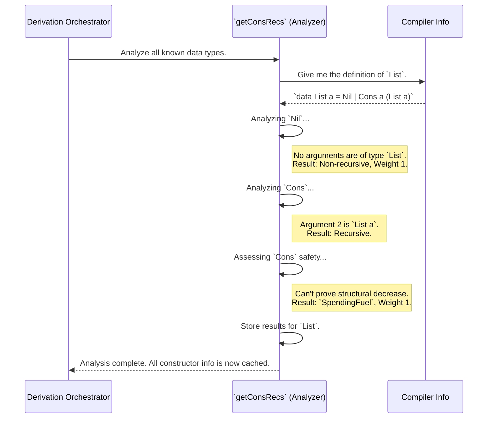

# Chapter 7: Recursion and Weight Analysis

In previous chapters, especially [Constructor-Specific Generator Derivation](06_constructor_specific_generator_derivation_.md) and [Type-Level Generator Assembly](05_type_level_generator_assembly_.md), we've taken for granted that `DepTyCheck` somehow *knows* which constructors of a data type are recursive. When building a generator for `List`, it knew that `Cons` was the recursive step and `Nil` was the simple base case. This knowledge is what allowed it to use `Fuel` correctly.

But how does it know? What's the secret? Welcome to the "Recursion and Weight Analysis" phase.

## The Problem: Infinite Loops and Boring Data

Let's go back to our trusty `List` type.

```idris
data List a = Nil | Cons a (List a)
```

To build a generator for `List`, `DepTyCheck` needs to answer two fundamental questions:

1.  **Which constructor is the "loopy" one?** The `Cons` constructor contains another `List a` inside it. If we pick `Cons` over and over, we'll get `Cons x (Cons y (Cons z ...))`, potentially forever. The system needs to identify `Cons` as the recursive constructor so it knows to use `Fuel` when calling it.

2.  **How often should we pick `Nil` vs. `Cons`?** If the generator always picks `Nil`, we'll only ever get empty lists. If it almost always picks `Cons`, we'll get very long lists and run out of `Fuel` quickly. To generate a nice variety of list lengths, we need a way to balance the choice.

This is the job of the **Recursion and Weight Analysis** component.

Think of it as a safety inspector examining the blueprints for a data type. The inspector's job is to:
*   **Find self-references:** Mark any part of the blueprint that refers back to itself (recursion).
*   **Assess risk:** Determine if the self-reference is "safe" (e.g., getting smaller each time) or if it needs a safety budget (`Fuel`).
*   **Make recommendations:** Suggest how frequently each part of the design should be used (assign "weights").

This analysis happens *before* any generator code is written. It provides the crucial intelligence needed by the other parts of `DepTyCheck`.

## Key Concepts: Inspection and Assessment

The analysis has three main outcomes for each constructor of a data type. Let's inspect `Cons a (List a)`.

### 1. Recursion Detection

The inspector's first task is to spot recursion. `DepTyCheck` does this by looking at the types of all the arguments for a constructor.

*   `Nil`: Has no arguments. **Not recursive.**
*   `Cons a (List a)`: Has two arguments. The first is `a`. The second is `List a`. `DepTyCheck` sees that `List a` is the very type it's currently analyzing. **It's recursive!**

This simple check allows the system to partition all constructors into two groups: recursive and non-recursive.

### 2. Safety Assessment: Fuel-Spending vs. Structurally Decreasing

Once a constructor is marked as recursive, the inspector assesses its risk. Is this a controlled recursion, or an open-ended one that could run forever?

#### The "Unsafe" Default: `SpendingFuel`

For `Cons a (List a)`, the recursive part (the inner `List a`) isn't getting "smaller" in any provable way. It's just another list. `DepTyCheck` treats this as the standard "unsafe" case. It labels this constructor as `SpendingFuel`, which tells the rest of the system: "If you use this constructor, you *must* decrement the `Fuel` counter."

This is the most common case and the default safety mechanism that prevents infinite loops.

#### The "Safe" Optimization: `StructurallyDecreasing`

Some recursive types are designed to always get smaller. Consider a hand-made `PeanoNat` type:

```idris
data PeanoNat = Z | S PeanoNat
```

We could write a function to measure the "size" of a `PeanoNat`: `size Z = 1` and `size (S n) = 1 + size n`.

`DepTyCheck` is smart enough to detect these special cases. If it can prove that a recursive argument is "structurally smaller" than the thing it's trying to build, it marks the constructor as `StructurallyDecreasing`.

A constructor marked this way is considered "safe" and **does not need to spend `Fuel`**. This is an advanced optimization that allows for more efficient generation of certain types. For most common types like `List` and `Tree`, `SpendingFuel` is the norm.

The data type that stores this information reflects these two possibilities:

```idris
-- From: src/Deriving/DepTyCheck/Gen/ConsRecs.idr
public export
data RecWeightInfo : Type where
  SpendingFuel : ... -> RecWeightInfo
  StructurallyDecreasing : ... -> RecWeightInfo
```

### 3. Assigning Weights

Finally, the inspector makes a recommendation on how often to use each design. This is its "weight". This weight is used by the `frequency` function we saw in the [Type-Level Generator Assembly](05_type_level_generator_assembly_.md) chapter to decide which constructor to pick.

*   **Default Weight:** By default, every constructor (`Nil` and `Cons`) gets a weight of 1. This means that when `Fuel` is available, `Nil` and `Cons` have an equal chance of being picked.
*   **Tuning:** These weights are the primary way you can influence the *shape* of the generated data. If you want shorter lists, you can give `Nil` a higher weight. We'll explore exactly how to do this in the next chapter on [Derivation Tuning](08_derivation_tuning_.md).

## Under the Hood: `getConsRecs`

This entire analysis is orchestrated by a single, powerful function: `getConsRecs` in `src/Deriving/DepTyCheck/Gen/ConsRecs.idr`. It's called once at the beginning of the derivation process. It looks at all known data types and pre-computes the recursion and weight information for every constructor, storing it for later use.

Let's trace how it analyzes our `List` type.



The core logic iterates through the constructors of a type and uses `isRecursive` to make the initial decision.

```idris
-- A very simplified look inside `getConsRecs`
-- in src/Deriving/DepTyCheck/Gen/ConsRecs.idr

getConsRecs : ... => m ConsRecs
getConsRecs = do
  -- For each known data type...
  for knownTypes $ \targetType => do
    -- For each constructor of that type...
    for targetType.cons $ \con => do
      -- Check if it's recursive
      w <- case isRecursive {containingType=Just targetType} con of
        False => Left <$> ... -- Not recursive, assign default weight
        True  => Right <$> ... -- Recursive, do further analysis
      pure (con ** w)
```
If `isRecursive` returns `True`, another helper function, `finCR`, is called. This function performs the safety assessment, trying to prove structural decrease. If it can't, it defaults to marking the constructor as `SpendingFuel`.

```idris
-- A simplified concept from `finCR`
-- in src/Deriving/DepTyCheck/Gen/ConsRecs.idr

-- If we can prove the recursive argument is smaller...
if isStructurallyDecreasing then
  -- It's safe! No fuel needed.
  pure $ StructurallyDecreasing ...
else
  -- It's the standard case. Fuel is required.
  pure $ SpendingFuel ...
```
This deep analysis provides all the intelligence needed for the rest of `DepTyCheck` to build safe, correct, and configurable generators.

## Summary and Next Steps

You've now seen the hidden brain of `DepTyCheck`! The **Recursion and Weight Analysis** is a critical pre-computation step.

*   It inspects every constructor of a data type to determine if it is **recursive**.
*   For recursive constructors, it assesses whether they are **`StructurallyDecreasing`** (safe, no `Fuel` needed) or require **`SpendingFuel`** (the default).
*   It assigns a **weight** to each constructor, which controls the probability of it being chosen during generation.
*   This information is cached and used by other parts of the system to build `Fuel`-aware and terminating generators.

We've mentioned that the default weight for all constructors is 1. But what if we want to change that? What if we want to generate mostly short lists, or almost-full binary trees?

In the next chapter, we will learn how to customize this behavior and fine-tune the output of our generators by exploring [Derivation Tuning](08_derivation_tuning_.md).

---

Generated by [AI Codebase Knowledge Builder](https://github.com/The-Pocket/Tutorial-Codebase-Knowledge)