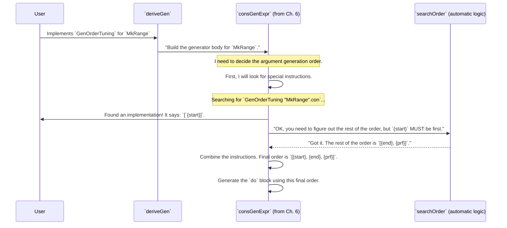

# Chapter 8: Derivation Tuning

In the [previous chapter on Recursion and Weight Analysis](07_recursion_and_weight_analysis_.md), we learned that `DepTyCheck` is clever enough to figure out which parts of a data type are recursive and assign "weights" to each constructor. By default, every constructor gets an equal shot at being chosen. This is a great starting point, but what if it's not what you want? What if the default strategy is inefficient or produces data that isn't quite right for your tests?

This is where you, the programmer, can step in and provide some expert guidance.

## The Problem: When the Automatic Factory Gets It Wrong

Imagine `DepTyCheck` is an automated factory designer. You give it a blueprint for a product, and it designs the entire assembly line for you. Usually, it does a fantastic job. But sometimes, its standard process isn't ideal.

1.  **Unbalanced Production**: For our `List` type, the default is to give `Nil` and `Cons` equal weight. This means you have a 50% chance of ending the list at each step. This tends to produce very short lists. What if you want to test your functions with longer lists? Or what if you want to test the "empty list" case far more often? You need a way to tell the factory: "make twice as many sedans as SUVs."

2.  **Inefficient Assembly Order**: For some complex dependent types, the order in which you build the parts matters. Consider this type:
    ```idris
    data ValidRange = MkRange (start : Nat) (end : Nat) (prf : LT start end)
    ```
    The default factory might try to build `start` (say, `100`), then build `end` (say, `20`), and then try to build the proof `prf` that `100 < 20`. This is impossible! The factory will constantly fail and throw away parts. A smarter human engineer would say: "Build `start` first, then build `end` to be *greater than* `start`."

You need a way to give the factory designer these kinds of special instructions. This is exactly what **Derivation Tuning** provides.

## Your Toolkit: Special Instructions

Derivation Tuning gives you two main tools, implemented as Idris `interface`s, to influence the generation process.

1.  **`ProbabilityTuning`**: Controls the *frequency* of different constructors.
2.  **`GenOrderTuning`**: Controls the *order* in which a constructor's arguments are generated.

Let's see how to use them.

### Tool 1: `ProbabilityTuning` (Changing Production Ratios)

Let's solve our `List` problem. We want to generate more empty lists (`Nil`) than non-empty lists (`Cons`). By default, both have a weight of 1. Let's give `Nil` a weight of 10.

To do this, we implement the `ProbabilityTuning` interface for the `Nil` constructor.

```idris
%language ElabReflection
import Deriving.DepTyCheck.Gen

-- Give `Nil` a weight of 10 instead of the default 1.
implementation ProbabilityTuning "Nil".con where
  isConstructor = itIsConstructor
  tuneWeight defaultW = 10
```

Let's break down this magic:

1.  `implementation ProbabilityTuning "Nil".con`: We declare that we are providing a special rule for the constructor named `Nil`. The `.con` suffix is a bit of syntax magic to refer to the constructor itself.
2.  `isConstructor = itIsConstructor`: This is a required sanity check. The `itIsConstructor` macro confirms at compile-time that `"Nil"` is, in fact, a real constructor. If you misspelled it, you'd get an error here.
3.  `tuneWeight defaultW = 10`: This is the core instruction. The `tuneWeight` function is given the `defaultW`eight (which is `1` for `Nil`) and must return a new weight. We're simply returning `10`.

That's it! Now, when `DepTyCheck` derives a generator for any `List` type, it will see this implementation. In the `More fuel` branch, instead of using `frequency [ (1, genNil), (1, genCons) ]`, it will use `frequency [ (10, genNil), (1, genCons) ]`. Your generated lists will now be empty much more often.

### Tool 2: `GenOrderTuning` (Fixing the Assembly Order)

Now for our `ValidRange` problem. We need to force `DepTyCheck` to generate the `start` argument before the `end` argument.

We do this by implementing the `GenOrderTuning` interface for the `MkRange` constructor.

```idris
-- Tell the factory how to build a `MkRange`
implementation GenOrderTuning "MkRange".con where
  isConstructor = itIsConstructor
  deriveFirst givenTyArgs givenConArgs =
    [`{start}]
```

This looks similar, but the key is the `deriveFirst` function.

1.  `deriveFirst ... = [`{start}]`: This function must return a `List` of constructor arguments that should be generated first, in order. We are returning a list containing just one item: `{start}`.
2.  `{start}`: This is a "name literal". It refers to the argument named `start` in the `MkRange` constructor.

By providing this implementation, we are telling `DepTyCheck`: "When you're about to build the arguments for `MkRange`, stop. Don't use your automatic `searchOrder` logic. Instead, do what I say: generate the `start` argument first. After that, you can go back to your automatic process for the rest of the arguments (`end` and `prf`)."

Now, the generator will pick a value for `start`, and when it later generates `end`, `DepTyCheck`'s internal machinery is smart enough to use the known value of `start` to help generate a valid `end` and `prf`. The factory becomes much more efficient!

## How It Works: The Factory Supervisor Listens

How does `DepTyCheck` know to use your special instructions? When it starts its work, it actively looks for them. Idris's `interface` mechanism lets it "search" for any implementations you've provided.

Let's trace the `GenOrderTuning` case.



The system doesn't blindly follow the automatic `searchOrder` logic. It first checks for a `GenOrderTuning` implementation and uses that as a prefix for the final generation order.

### Under the Hood: `findUserImposedDeriveFirst`

This logic lives inside the `consGenExpr` function in `src/Deriving/DepTyCheck/Gen/ForOneTypeConRhs/Impl.idr`. Before doing anything else, it tries to find your tuning instructions.

Here is a simplified snippet of how it computes the final order:

```idris
-- Simplified from Impl.idr

-- Use `search` to find a user implementation.
userImposed <- findUserImposedDeriveFirst

-- ... some logic to handle existing arguments ...

-- Prepend the user's order to the automatically derived one.
let theOrder = userImposed ++ searchOrder nonDetermGivs
```

And `findUserImposedDeriveFirst` is a small helper that performs the search:

```idris
findUserImposedDeriveFirst : m (List (Fin con.args.length))
findUserImposedDeriveFirst = do
  -- Search for an implementation for the current constructor
  Just impl <- search (GenOrderTuning (Con.name con))
    | Nothing => pure [] -- Not found, return an empty list.

  -- Found! Use its `deriveFirst` method.
  let df = deriveFirst @{impl} ...
  pure (conArgIdx <$> df)
```

This code clearly shows the "listen first, then think" strategy. The user's input from `deriveFirst` is retrieved and simply prepended (`++`) to whatever the automatic `searchOrder` logic decides for the remaining arguments.

The process for `ProbabilityTuning` is similar. During the [Recursion and Weight Analysis](07_recursion_and_weight_analysis_.md), when `getConsRecs` is calculating the weight for a constructor, it first searches for a `ProbabilityTuning` implementation and applies the `tuneWeight` function to the default weight before storing the result.

## Summary and Next Steps

You've just learned how to become the supervisor of the `DepTyCheck` factory!

*   **Derivation Tuning** allows you to give `DepTyCheck` special instructions to override its default behavior.
*   **`ProbabilityTuning`** lets you change the "weight" of constructors to influence the *distribution* of generated data (e.g., make more short lists).
*   **`GenOrderTuning`** lets you force a specific generation *order* for a constructor's arguments, which is crucial for making dependent type generation efficient and successful.
*   These tunings are implemented as standard Idris `interface`s, which `DepTyCheck` automatically discovers and respects.

We've seen how to generate data and how to fine-tune that generation process to our liking. But how do we know if our generator is actually any good? Are we testing all the important edge cases? Are we covering all the constructors of our data type?

In the next chapter, we will explore the tools `DepTyCheck` provides to answer these questions by looking into [Coverage Analysis](09_coverage_analysis_.md).

---

Generated by [AI Codebase Knowledge Builder](https://github.com/The-Pocket/Tutorial-Codebase-Knowledge)