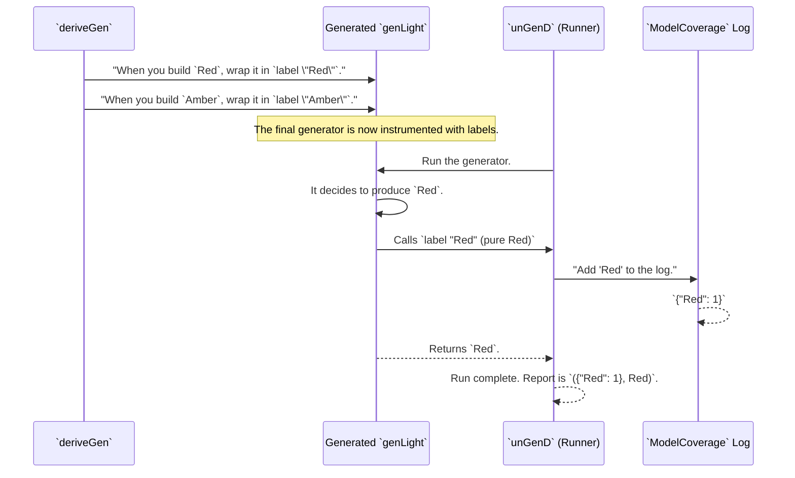

# Chapter 9: Coverage Analysis

In the [previous chapter on Derivation Tuning](08_derivation_tuning_.md), you learned how to act as a supervisor, giving `DepTyCheck` special instructions to change how it generates data. Now that you have this powerful generator, a new question arises: how good is it? Is it actually creating a wide variety of data, or is it stuck testing the same simple cases over and over?

Welcome to Coverage Analysis, `DepTyCheck`'s built-in quality assurance system.

## The Problem: Are We Testing Everything?

Imagine you've defined a simple data type for a traffic light signal:

```idris
data TrafficLight = Red | Amber | Green
```

You use `DepTyCheck` to create a generator and run 100 tests for a function that uses `TrafficLight`. Your tests all pass. Great! But what if, due to a bug or a strange weight tuning, your generator only ever produced `Red` and `Green` values? You would have zero confidence that your function works correctly for the `Amber` case. You have a blind spot in your testing.

You need a way to measure how thoroughly your generated data explores the structure of your data types.

This is what **Coverage Analysis** is for.

Think of it this way: your data type (`TrafficLight`) is a factory blueprint with three assembly lines (`Red`, `Amber`, `Green`). When you run tests, it's like a quality assurance team is watching the factory floor. At the end of the day, they give you a report that shows exactly which assembly lines were used and how many times. This report tells you if you accidentally forgot to even turn on the "Amber" line.

## Your Toolkit for Quality Assurance

`DepTyCheck` provides a simple, three-step process to get this coverage report.

1.  **Create the Blueprint (`initCoverageInfo`):** First, we need a list of all possible assembly lines. The `initCoverageInfo` macro inspects your generator to create this master list.
2.  **Run the Factory and Collect Data (`ModelCoverage`):** Next, you run your generator in a special mode that tracks which constructors are used, producing a `ModelCoverage` report.
3.  **Compare and Visualize (`registerCoverage`):** Finally, you combine the usage report with the master blueprint to get a beautiful, color-coded summary.

Let's walk through it with our `TrafficLight` example.

### Step 1: Create the Blueprint

First, we need our generator.

```idris
%language ElabReflection

import Test.DepTyCheck.Gen
import Test.DepTyCheck.Gen.Coverage

-- A simple generator for our TrafficLight data type
genLight : Fuel -> Gen MaybeEmpty TrafficLight
genLight = deriveGen
```

Now, we use `initCoverageInfo` to create the "blueprint"—an initial report where all counts are zero.

```idris
-- Create a blank coverage report template for our generator.
lightBlueprint : CoverageGenInfo _
lightBlueprint = initCoverageInfo genLight
```
This inspects `genLight`, sees that it produces `TrafficLight`s, and creates a structure that knows about `Red`, `Amber`, and `Green`, all with a usage count of `0`.

### Step 2: Run and Collect Usage Data

Next, we need to generate some values and collect the usage data. Instead of `pick1`, we'll use a special function called `unGenTryND`. It takes a number of samples to generate (`100`), a random seed, and our generator. It returns a list where each element is a pair: the `ModelCoverage` for that single run, and the value that was generated.

```idris
import Data.List.Lazy

-- In an IO block or a function that can produce a random seed...
generateWithCoverage : RandomGen g => g -> LazyList (ModelCoverage, TrafficLight)
generateWithCoverage seed =
  unGenTryND 100 seed genLight
```

Now we have 100 individual reports. We need to combine them into one master report. The `ModelCoverage` type is a `Monoid`, so we can just fold them all together.

```idris
import Data.Semigroup

-- Combine all the small reports into one big one.
totalCoverage : LazyList (ModelCoverage, a) -> ModelCoverage
totalCoverage results = foldl (<+>) neutral (map fst results)
```

At the end of this, `totalCoverage` will be a single `ModelCoverage` value containing the total counts for `Red`, `Amber`, and `Green` across all 100 runs.

### Step 3: Visualize the Report

The `totalCoverage` report is just raw data. To make it useful, we pass it to `registerCoverage`, which updates our blueprint with the real counts.

```idris
-- Update our blank blueprint with the actual usage counts.
finalReport : CoverageGenInfo _
finalReport = registerCoverage totalCoverage lightBlueprint
```

Now for the best part: printing the result! When you `show` this `finalReport` (with the `Colourful` interface in scope), you get a lovely, readable summary.

```idris
-- In an IO block...
main : IO ()
main = do
  -- ... get a seed and generate results ...
  let coverage = totalCoverage results
  let report = registerCoverage coverage lightBlueprint
  putStrLn (show {a=Colourful} report)
```

If our generator was well-behaved, the output might look like this:

```
Tutorial.TrafficLight covered fully (100 times)
  - Red: covered (33 times)
  - Amber: covered (34 times)
  - Green: covered (33 times)
```

But what if our generator had a bug and never produced `Amber`? The output would instantly show us the problem:

```
Tutorial.TrafficLight covered partially (100 times)
  - Red: covered (50 times)
  - Amber: not covered
  - Green: covered (50 times)
```
This immediate feedback is invaluable for finding blind spots in your test data generation!

## How It Works: The QA Inspector's Logbook

How does `DepTyCheck` track all of this? It's a collaboration between the code generator and the `Gen` runner.



1.  **Instrumentation:** When `DepTyCheck` builds a generator (using `deriveGen`), it automatically "instruments" the code. For each constructor, it wraps the resulting sub-generator in a call to `label`. A call like `pure Red` becomes `label "Red" (pure Red)`.

2.  **Logging:** The special runners like `unGenD` or `unGenTryND` are designed to listen for these labels. Internally, they use a `WriterT ModelCoverage` monad. When `label "Red"` is called, the runner's `tell` function is invoked, adding `"Red"` and a count of 1 to its logbook (the `ModelCoverage` value).

3.  **Reporting:** When the generator finishes, the runner returns both the final product (`Red`) and the complete logbook it collected along the way.

### Under the Hood: The Key Functions

The magic is spread across a few key places.

-   **`Deriving.DepTyCheck.Gen.Labels.labelGen`**: This is the metaprogramming function used during derivation that wraps a piece of generated code with the `Test.DepTyCheck.Gen.label` call.

    ```idris
    -- In src/Deriving/DepTyCheck/Gen/Labels.idr
    export
    labelGen : (desc : CTLabel) -> TTImp -> TTImp
    labelGen (MkCTLabel desc) expr = `(Test.DepTyCheck.Gen.label (fromString ~desc) ~expr)
    ```
    This takes a description (like the string `"Red"`) and an expression and produces the code `label "Red" (...)`.

-   **`Test.DepTyCheck.Gen.Coverage.unGenD`**: This is the core "runner with coverage". It runs a generator using a `WriterT ModelCoverage` monad transformer, which provides the `tell` functionality for `label` to use.

    ```idris
    -- In src/Test/DepTyCheck/Gen/Coverage.idr
    export
    unGenD : ... => Gen em a -> m (ModelCoverage, a)
    unGenD = map swap . runWriterT . unGen {m = WriterT ModelCoverage $ m}
    ```
    This shows how `unGen` is run inside `runWriterT`, which is what enables the collection of `ModelCoverage`.

-   **`Test.DepTyCheck.Gen.Coverage.initCoverageInfo`**: This macro is the blueprint generator. It uses Idris's reflection capabilities (`getInfo'`) to analyze the type your generator produces. It walks the type's definition, finds all its constructors, and builds the initial `CoverageGenInfo` record with all counts set to zero.

-   **`Test.DepTyCheck.Gen.Coverage.registerCoverage`**: This is a surprisingly simple pure function. It just iterates through the collected labels in the `ModelCoverage` report and updates the corresponding counters in the `CoverageGenInfo` blueprint. There's no magic here, just a map update.

## Summary and Next Steps

You've now learned how to use `DepTyCheck`'s powerful quality assurance tools to ensure your tests are thorough.

-   **Coverage Analysis** helps you measure how well your generated data covers the constructors of your data types.
-   The process involves creating a blueprint with **`initCoverageInfo`**, collecting usage data into a **`ModelCoverage`** report, and visualizing the result with **`registerCoverage`**.
-   This system works by automatically **instrumenting** generated code with `label` calls and using a special runner that **logs** these labels.
-   The result is a clear, human-readable report that instantly highlights any blind spots in your testing.

Throughout these last few chapters, we've seen `DepTyCheck` perform incredible feats of analysis. It figures out recursion, GADT constraints, and argument dependencies. But how does it keep track of all this complex information as it passes it from one component to another? How is a "design request" for a generator formally represented?

In the next chapter, we will explore the data structure at the heart of this communication: the [Generator Signature Representation](10_generator_signature_representation_.md).

---

Generated by [AI Codebase Knowledge Builder](https://github.com/The-Pocket/Tutorial-Codebase-Knowledge)