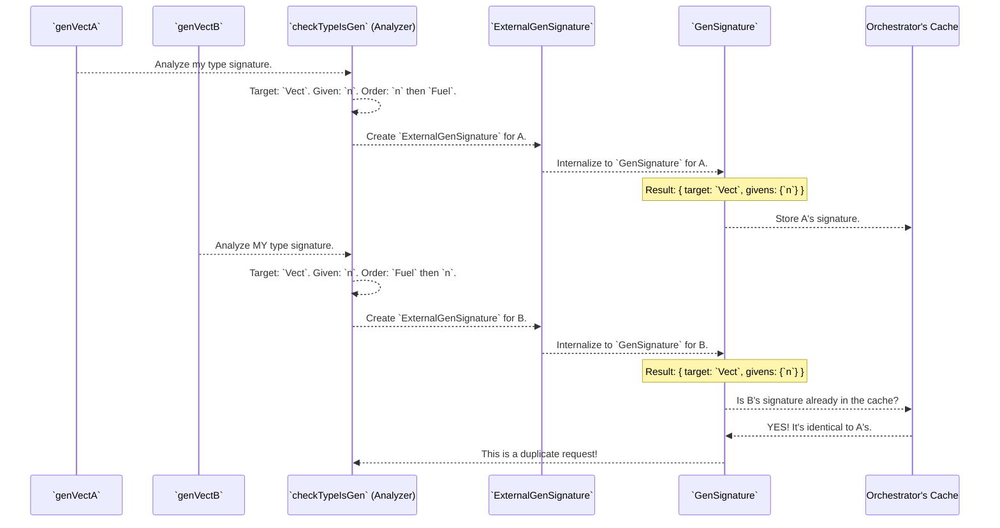

# Chapter 10: Generator Signature Representation

In the [previous chapter on Coverage Analysis](09_coverage_analysis_.md), we learned how to check if our derived generators are exploring all the different parts of our data types. This is a form of quality control on the *output* of the generation process.

But what about inside the `DepTyCheck` factory itself? With so many components—the [Orchestrator](04_derivation_orchestration_.md), the [Recursion Analyzer](07_recursion_and_weight_analysis_.md), the [Constructor Deriver](06_constructor_specific_generator_derivation_.md)—how do they communicate with each other? How do they pass around requests for "a generator for a `Vect` of length `n`" in a clear, unambiguous way?

This is where the **Generator Signature Representation** comes in.

## The Problem: Ambiguous Work Orders

Imagine you're the manager of an advanced car factory. Two different clients submit a request.

*   **Client A's order:** "I want a blue, 4-door sedan."
*   **Client B's order:** "I want a 4-door, blue sedan."

As a human, you can instantly see that these are the *exact same request*. But a naive computer system might see them as two different jobs because the words are in a different order. This could lead to designing the same factory blueprint twice, wasting time and resources.

`DepTyCheck` faces this exact same problem with Idris's type signatures. Consider these two generator requests for a `Vect n String`:

```idris
-- Request A
genVectA : (n : Nat) -> Fuel -> Gen MaybeEmpty (Vect n String)
genVectA = deriveGen

-- Request B
genVectB : Fuel -> (n : Nat) -> Gen MaybeEmpty (Vect n String)
genVectB = deriveGen
```

Technically, these are different function types because the `(n : Nat)` argument is in a different place. But conceptually, they are asking for the same thing: "a generator for `Vect n String` where `n` is given by the user."

`DepTyCheck` needs a standardized, canonical way to represent these requests so it can recognize that A and B are identical. This standardized form is the Generator Signature.

Think of it as the factory's official "Engineering Design Document". No matter how a client phrases their request, it gets translated into this standard document, which strips away superficial details like argument order and focuses only on the essential characteristics.

## The Solution: A Standardized Blueprint

`DepTyCheck` uses two main data structures to represent these blueprints: `ExternalGenSignature` and `GenSignature`.

1.  **`ExternalGenSignature`**: This is the "detailed intake form". It captures all the information from the user's request, including the original argument order and names. It's used at the very beginning and very end of the process to interact with the user's code correctly.

2.  **`GenSignature`**: This is the "canonical engineering spec". It's a simplified version that throws away all the superficial details. **This is the key to identifying duplicate requests.** It contains only two pieces of information:
    *   `targetType`: What's the final product we're making? (e.g., `Vect`)
    *   `givenParams`: What materials does the user promise to provide? (e.g., the length `n`)

Crucially, `givenParams` is represented as a **`SortedSet`**, which is an unordered collection. By using a set, the system automatically ignores the original order of the arguments.

Let's see how this works for our `genVectA` and `genVectB` requests.



Even though the initial requests `genVectA` and `genVectB` had different argument orders, they both get boiled down to the *exact same* `GenSignature`. When the [Derivation Orchestrator](04_derivation_orchestration_.md) checks its cache for the second request, it finds a perfect match and can reuse the work it did for the first request.

## Under the Hood: From Raw Type to Canonical Spec

This entire translation process is handled by a function called `checkTypeIsGen`, which is the very first step in the [Derivation Entry Point](01_derivation_entry_point_.md).

### The Data Structures

Let's look at the simplified definitions of these records from `src/Deriving/DepTyCheck/Gen/Signature.idr`.

This is the canonical internal blueprint, `GenSignature`. Notice that `givenParams` is an unordered `SortedSet`.

```idris
-- src/Deriving/DepTyCheck/Gen/Signature.idr

public export
record GenSignature where
  constructor MkGenSignature
  targetType : TypeInfo
  givenParams : SortedSet (Fin targetType.args.length)
```
*   `targetType`: Information about the type we are building, like `Vect`.
*   `givenParams`: A set of indices telling us which of `Vect`'s arguments (e.g., the 0-th argument, `n`) are provided by the user.

This is the more detailed external form, `ExternalGenSignature`. It holds extra information needed to interface with the user's code.

```idris
-- src/Deriving/DepTyCheck/Gen/Signature.idr

public export
record ExternalGenSignature where
  constructor MkExternalGenSignature
  targetType : TypeInfo
  givenParams : SortedMap (Fin ...) (ArgExplicitness, Name)
  givensOrder : Vect givenParams.size (Fin givenParams.size)
  -- ... and some other details ...
```
*   `givenParams`: This is now a `SortedMap`, which stores not just *that* an argument is given, but also its `Name` and whether it was explicit `()` or implicit `{}` (`ArgExplicitness`).
*   `givensOrder`: A permutation vector that remembers the original order of the user's arguments.

### The `checkTypeIsGen` Analyzer

The `checkTypeIsGen` function (`src/Deriving/DepTyCheck/Gen.idr`) is the master parser. When you write `myGen = deriveGen`, this function receives the raw `TTImp` (the type information) for `myGen`. It then performs a complex analysis:

1.  It deconstructs the function type into its arguments (`sigArgs`) and its result (`sigResult`).
2.  It verifies the result is a `Gen MaybeEmpty ...`.
3.  It extracts the `targetType` (e.g., `Vect`) from inside the `Gen`.
4.  It goes through all the `sigArgs` (except for `Fuel` and other auto-implicit generators) and identifies them as "given parameters".
5.  It a new `ExternalGenSignature` record with all this information.

A very simplified piece of the logic might look like this:

```idris
-- Simplified concept from src/Deriving/DepTyCheck/Gen.idr

checkTypeIsGen : (rawType : TTImp) -> Elab ...
checkTypeIsGen rawType = do
  -- Separate arguments from the result type
  let (sigArgs, sigResult) = unPi rawType

  -- Get the target type from inside `Gen MaybeEmpty ...`
  let targetType = ... -- logic to extract from sigResult

  -- Find all user-given parameters in the arguments
  let givenParams = findGivenParams sigArgs

  -- ... bunch of checks and analysis ...

  -- Create the standardized blueprint
  let genSig = MkExternalGenSignature targetType givenParams ...

  pure genSig
```

Finally, there's a simple function `internalise` that converts the detailed `ExternalGenSignature` into the simple `GenSignature` used for caching by just extracting the set of keys from the `givenParams` map.

## Summary and Next Steps

You've just learned about the "lingua franca" of `DepTyCheck`!

*   The **Generator Signature Representation** (`GenSignature` and `ExternalGenSignature`) is a standardized way to describe a generator request.
*   It separates essential characteristics (`targetType`, `givenParams`) from superficial details like argument order.
*   The internal `GenSignature` is **canonical**, meaning two conceptually identical but textually different user requests will produce the same `GenSignature`.
*   This allows the [Derivation Orchestration](04_derivation_orchestration_.md) cache to work effectively, preventing redundant work and making the whole system more robust and efficient.

`DepTyCheck` is a masterwork of metaprogramming—it's code that writes code. This involves manipulating Idris's internal `TTImp` representation of code, which can be quite complex. To make this process manageable, `DepTyCheck` includes a whole suite of helper functions.

In the next chapter, we'll take a look at this powerful toolbox as we explore the [Metaprogramming Utilities](11_metaprogramming_utilities_.md).

---

Generated by [AI Codebase Knowledge Builder](https://github.com/The-Pocket/Tutorial-Codebase-Knowledge)