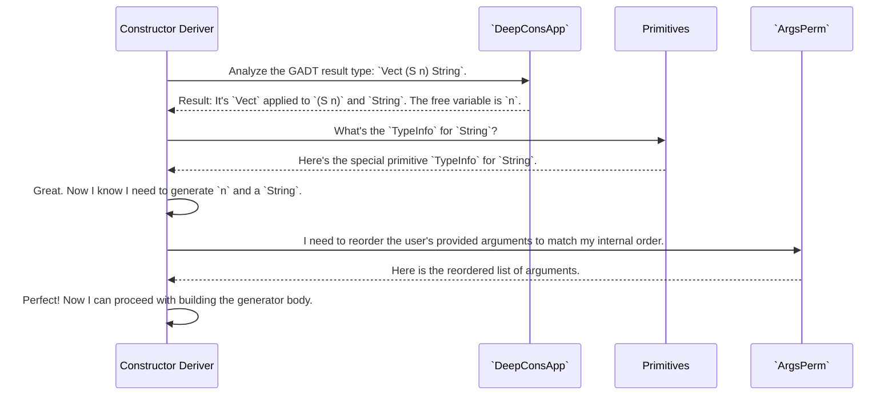

# Chapter 11: Metaprogramming Utilities

In the [previous chapter on Generator Signature Representation](10_generator_signature_representation_.md), we learned how `DepTyCheck` uses a standardized format, `GenSignature`, to represent and track all the different generator requests. This helps the high-level components communicate clearly.

But what about the deep, nitty-gritty work of building code? When `DepTyCheck` generates a function, it's literally building an abstract syntax tree (`TTImp`). This is a complex task, like assembling a Swiss watch. To do it reliably, the system needs a set of very precise and specialized tools. This chapter opens up that toolbox.

## The Problem: Assembling Code is Hard

Imagine you are a master robot builder. You have a high-level blueprint for a complex robot. This blueprint tells you things like "attach the arm to the torso" or "connect the head sensor to the main CPU."

This is great, but it doesn't tell you *how* to do it. You still need the right tools: a wrench to tighten bolts, a soldering iron to connect wires, and a voltmeter to check connections. Trying to build the robot with your bare hands would be impossible.

Metaprogramming—writing code that writes code—is the same. The [Derivation Orchestration](04_derivation_orchestration_.md) pipeline is the high-level blueprint. But to actually *generate* the Idris code `TTImp`, it needs a toolbox of helper functions. These are the **Metaprogramming Utilities**.

This toolbox contains specialized tools for low-level tasks like:
*   **Analyzing expressions:** Taking apart a complex piece of code like `Just (S (S n))` to see what it's made of.
*   **Handling special types:** Dealing with built-in types like `String` and `Int` that behave differently from user-defined `data` types.
*   **Reordering arguments:** Shuffling a list of arguments into a different order.

These utilities provide the low-level power that the high-level derivation pipeline relies on to function correctly.

## Opening the Toolbox

Let's look at three of the most important tools in `DepTyCheck`'s toolbox.

### Tool 1: `DeepConsApp` - The Expression X-Ray

The `DeepConsApp` utility, primarily the `analyseDeepConsApp` function, is like an X-ray machine for Idris expressions. You give it a complex expression, and it tells you exactly what constructors and variables it's built from.

This is absolutely essential for handling GADTs. Remember the `Vect` constructor `Cons` from [Chapter 6](06_constructor_specific_generator_derivation_.md)?

```idris
Cons : a -> Vect n a -> Vect (S n) a
```

When trying to generate a `Vect 3 String`, `DepTyCheck` needs to analyze the result type `Vect (S n) a`. The `analyseDeepConsApp` tool is what allows it to "see inside" `Vect (S n) a` and understand that it's built from the `Vect` type constructor, applied to the arguments `(S n)` and `a`. It can then recursively analyze `(S n)` to find the variable `n`.

This analysis is what allows `DepTyCheck` to generate those critical `decEq` checks to ensure that `S n` is equal to `3`.

### Tool 2: `Primitives` - The Special Type Adapter

In Idris, not all types are created equal. You define your data types with `data`, like `List` or `Vect`. But what about `String`, `Int`, or `Char`? These are "primitive" types, built directly into the compiler. They don't have constructors in the same way.

The `Primitives` utility is a collection of helpers that act as special adapters for these types. It's a simple but vital tool that knows how to translate between a type `DepTyCheck` sees (like `String`) and the compiler's internal representation for it (`PrT StringType`).

For example, when `DepTyCheck` needs to get a `TypeInfo` record for `String`, it can't just look up a data definition. The `typeInfoForPrimType` function in this module provides the correct `TypeInfo` for it.

```idris
-- From: src/Deriving/DepTyCheck/Util/Primitives.idr
export
typeInfoForPrimType : PrimType -> TypeInfo
typeInfoForPrimType StringType = primTypeInfo "String"
typeInfoForPrimType IntType    = primTypeInfo "Int"
-- ...and so on for other primitives
```
This ensures that the rest of the system can treat `String` just like any other type, without needing to worry about its special status.

### Tool 3: `ArgsPerm` - The Argument Sorter

We've seen that users can provide generator arguments in any order they want.

```idris
genVectA : (n : Nat) -> Fuel -> ...
genVectB : Fuel -> (n : Nat) -> ...
```

The `ArgsPerm` utility provides the tools to sort these arguments back into a canonical, predictable order when needed. The most important function here is `reorder`.

```idris
-- From: src/Deriving/DepTyCheck/Util/ArgsPerm.idr
export
reorder : (perm : Vect n (Fin n)) -> Vect n a -> Vect n a
```
This function takes a vector of items `Vect n a` and a "permutation vector" `perm`, which describes the new order. It returns a new vector with the items shuffled according to the permutation. This tool is used to apply the `givensOrder` permutation we saw in the `ExternalGenSignature` in the [last chapter](10_generator_signature_representation_.md).

## How the Tools Work Together

These utilities are not typically used by the end-user, but by `DepTyCheck`'s internal components. Let's see a simplified scenario of how the [Constructor-Specific Generator Derivation](06_constructor_specific_generator_derivation_.md) logic might use these tools to analyze a GADT constructor.



This shows how the high-level logic delegates specific, tricky tasks to these specialized utilities.

### A Peek at the Code

Let's look at a simplified function signature from each utility to understand them better.

**`DeepConsApp`**
The main workhorse is `analyseDeepConsApp`. Its signature is complex, but its purpose is to recursively break down an expression.

```idris
-- Simplified from: src/Deriving/DepTyCheck/Util/DeepConsApp.idr

analyseDeepConsApp :
     (freeNames : SortedSet Name) ->
     (analysedExpr : TTImp) ->
     m (List (Name, ConsDetermInfo) ** ...)
```
It takes a set of `freeNames` to look for and the `analysedExpr` to X-ray. It returns a pair: a list of the free names it found, and a function to rebuild the expression with new variables.

**`Primitives`**
These helpers are often simple pattern-matching functions. `extractTargetTyExpr` does the reverse of `typeInfoForPrimType`: it takes a `TypeInfo` and produces the code (`TTImp`) for that type.

```idris
-- From: src/Deriving/DepTyCheck/Util/Primitives.idr

extractTargetTyExpr : TypeInfo -> TTImp
extractTargetTyExpr ti@(MkTypeInfo (NS (MkNS ["^prim^"]) ...) [] [])
  = -- ...pattern match on the name to return the right primitive type...
extractTargetTyExpr ti = var ti.name
```
Here, it checks if the `TypeInfo` has the special `"^prim^"` namespace. If so, it handles it specially; otherwise, it treats it as a normal type.

**`ArgsPerm`**
The `orderIndices` function is a great example of what this module does. It takes a list and returns a permutation vector that would sort that list.

```idris
-- From: src/Deriving/DepTyCheck/Util/ArgsPerm.idr

export
orderIndices : Ord a => (xs : List a) -> Vect xs.length (Fin xs.length)
```
If you give it `[30, 10, 20]`, it will compute a permutation that, when applied, would reorder the list to `[10, 20, 30]`.

## Summary and Next Steps

You've just explored the essential low-level toolbox that `DepTyCheck` uses to perform its metaprogramming magic.

*   The **Metaprogramming Utilities** are a collection of helper functions that the high-level derivation pipeline relies on.
*   **`DeepConsApp`** acts like an X-ray, analyzing complex expressions and is crucial for GADT support.
*   **`Primitives`** provides special handling for built-in types like `String` and `Int`.
*   **`ArgsPerm`** contains tools for shuffling arguments into different orders.
*   Together, these utilities handle the complex and error-prone details of code generation, allowing the rest of the system to focus on the high-level logic.

We have now journeyed through the entire `DepTyCheck` derivation process, from the initial `deriveGen` request to the low-level tools that build the final code. We've seen the factory's design, its assembly lines, its quality control, and its toolbox.

In the final chapter, we will zoom out and look at how the entire `DepTyCheck` project is put together: how to build it, how its modules are organized, and what dependencies it relies on. Let's explore the [Project & Build Configuration](12_project___build_configuration_.md).

---

Generated by [AI Codebase Knowledge Builder](https://github.com/The-Pocket/Tutorial-Codebase-Knowledge)