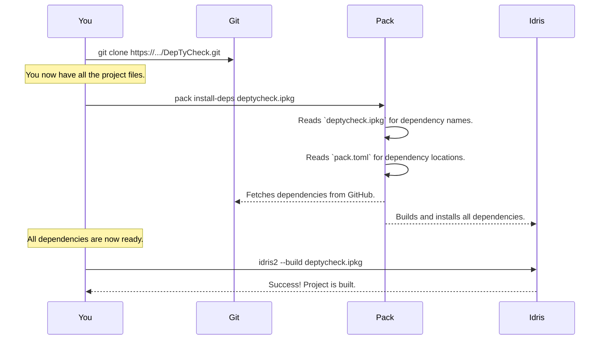

# Chapter 12: Project & Build Configuration

In the [previous chapter](11_metaprogramming_utilities_.md), we opened up the low-level toolbox of [Metaprogramming Utilities](11_metaprogramming_utilities_.md) that `DepTyCheck` uses to perform its code-generation magic. We've journeyed from the highest-level concepts all the way down to the nuts and bolts. For our final chapter, let's zoom all the way out and look at the project itself. How is it organized? How do you build it? How does it manage its dependencies?

Welcome to the project's "administrative office"—its project and build configuration.

## The Problem: Organized Chaos

Imagine you have a brilliant idea for a new library. You write dozens of `.idr` files, all working together beautifully. You upload them to GitHub. A friend wants to contribute, so they download the files. Now what?

*   How do they know which version of Idris to use?
*   How do they get all the other libraries your project depends on?
*   How do they tell Idris which files to compile and in what order?
*   How do they maintain the same code style as you?

Without a formal structure, a project is just a folder of files. To turn it into a living, breathing, and collaborative piece of software, you need an administrative layer. This layer is the **Project & Build Configuration**. It's the collection of special files that define what the project is, what it needs, and how to work with it.

## The Administrative Office: A Tour of the Files

For `DepTyCheck`, this office has several key departments, each represented by a configuration file. Let's take a tour.

### `deptycheck.ipkg`: The Project's ID Card

This is the most important file for any Idris project. It tells the Idris compiler who the project is.

*   **Identity:** Defines the project's name (`package deptycheck`).
*   **Contents:** Lists all the modules that are part of the public library (`modules = ...`).
*   **Dependencies:** Lists the other libraries it needs to function (`depends = ...`).

Think of it as the project's official registration document. When you run `idris2 --build deptycheck.ipkg`, the compiler reads this file to know exactly what to do.

```idris
-- From: deptycheck.ipkg
package deptycheck

-- The list of all modules to be compiled
modules = Deriving.DepTyCheck.Gen
        , Deriving.DepTyCheck.Gen.ConsRecs
        -- ... and many more ...

-- The list of other libraries needed
depends = ansi
        , best-alternative
        -- ... and many more ...
```
This file is your main entry point for compiling the project from source.

### `pack.toml`: The Supply Chain Manager

The `.ipkg` file says *what* dependencies `DepTyCheck` needs, but not *where* to get them. That's the job of `pack.toml`. This file is the instruction manual for `pack`, the community-standard build tool and package manager for Idris 2.

`pack` reads this file to understand how to find, download, and install all the libraries listed in `deptycheck.ipkg`'s `depends` section. It can fetch them from a central repository, from a Git repository, or even from a local folder.

```toml
# From: pack.toml

[custom.all.deptycheck]
type = "local"
path = "."
ipkg = "deptycheck.ipkg"

[custom.nightly-251007.collection-utils]
type   = "git"
url    = "https://github.com/buzden/idris2-collection-utils"
commit = "latest:master"
ipkg   = "collection-utils.ipkg"
```
This tells `pack` that the `deptycheck` package itself is in the current directory (`.`), and that a dependency like `collection-utils` should be cloned from a specific GitHub URL.

### `.readthedocs.yaml`: The Public Relations Department

A great library needs great documentation. This file contains instructions for [Read the Docs](https://readthedocs.org/), a free service that automatically builds and hosts documentation for open-source projects.

```yaml
# From: .readthedocs.yaml
version: 2

build:
  os: ubuntu-22.04
  tools:
    python: "3.10"

python:
  install:
    - requirements: docs/requirements.txt
```
When `DepTyCheck`'s code is pushed to GitHub, Read the Docs sees this file and knows exactly which tools and commands to run to turn the source documentation files into a public website.

### `.editorconfig`: The Style Guide Committee

When multiple people work on a project, their code editors might have different settings for tabs, spaces, and line endings. This can lead to messy, inconsistent formatting. An `.editorconfig` file solves this by defining a universal style guide.

```ini
# From: .editorconfig

[*]
end_of_line = lf
insert_final_newline = true
trim_trailing_whitespace = true

# Idris source files
[*.idr]
indent_style = space
indent_size = 2
```
Modern code editors automatically detect and apply these rules, ensuring that every contributor's code looks a consistent part of the whole.

## Building from Source: Your First Contribution

Let's say you want to contribute to `DepTyCheck`. How would you use these files to get a working development environment? Here's the typical workflow.



1.  **Clone the Repository:** You get a local copy of the code and all the configuration files.
2.  **Install Dependencies:** You run `pack install-deps deptycheck.ipkg`. `pack` does all the hard work of finding and installing everything needed.
3.  **Build the Project:** You run `idris2 --build deptycheck.ipkg`. The Idris compiler reads the `.ipkg` file and compiles all the modules, creating the final library.

You are now ready to make changes, run tests, and contribute back to the project!

## Special Tools for Special Jobs

You might notice some unusual files in the repository, like `.patch-chez-gc-handler`. These are custom shell scripts created to solve very specific problems.

The `.patch-chez-gc-handler` script, for example, is a fascinating piece of automation. `DepTyCheck`'s heavy metaprogramming can sometimes put a lot of strain on the Idris compiler's garbage collector (GC). This script modifies the GC settings of the compiler to be more efficient for `DepTyCheck`'s specific workload, preventing slowdowns during development. It's a prime example of how build configuration can go beyond simple compilation to deeply customize the development environment.

## Summary and Farewell

You've now seen the full picture of `DepTyCheck`, from its core philosophy down to the configuration files that hold it all together.

*   **Project & Build Configuration** is the administrative layer that defines a project's identity, dependencies, and automation.
*   `deptycheck.ipkg` is the project's **ID card** for the Idris compiler.
*   `pack.toml` is the **supply chain manifest** for the `pack` build tool.
*   Files like `.readthedocs.yaml` and `.editorconfig` automate documentation and code style, making collaboration seamless.
*   Understanding these files is the key to being able to **build, modify, and contribute** to the project.

This concludes our journey through the architecture of `DepTyCheck`. We hope this tutorial has not only demystified the magic behind automatic, dependently-typed property-based testing but has also inspired you to explore the code, use the library in your own projects, and perhaps even contribute back to its development. The world of dependent types is rich and rewarding, and tools like `DepTyCheck` are here to make the journey even more productive and fun. Happy coding

---

Generated by [AI Codebase Knowledge Builder](https://github.com/The-Pocket/Tutorial-Codebase-Knowledge)