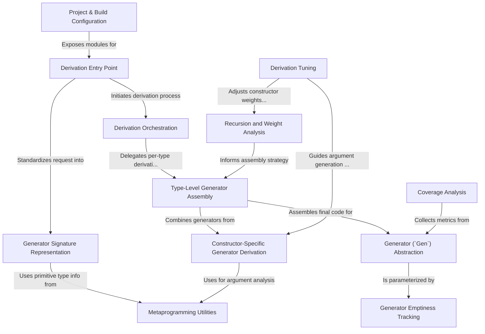

# Tutorial: DepTyCheck

DepTyCheck is a library for *property-based testing* in the Idris 2 programming language, designed specifically to handle **dependent types**. Its main purpose is to help developers test their code by automatically creating complex test data.

The core of the library is the `Gen` abstraction, which is a blueprint for generating random values. The most powerful feature is its ability to **automatically derive** these `Gen` blueprints for sophisticated data types just by looking at their definitions. This saves developers from writing a lot of tedious, error-prone code and makes it easy to test properties of advanced data structures that are common in dependently-typed programming.

**Source Repository:** [None](None)

## Chapters

1. [Derivation Entry Point
](01_derivation_entry_point_.md)
2. [Generator (`Gen`) Abstraction
](02_generator___gen___abstraction_.md)
3. [Generator Emptiness Tracking
](03_generator_emptiness_tracking_.md)
4. [Derivation Orchestration
](04_derivation_orchestration_.md)
5. [Type-Level Generator Assembly
](05_type_level_generator_assembly_.md)
6. [Constructor-Specific Generator Derivation
](06_constructor_specific_generator_derivation_.md)
7. [Recursion and Weight Analysis
](07_recursion_and_weight_analysis_.md)
8. [Derivation Tuning
](08_derivation_tuning_.md)
9. [Coverage Analysis
](09_coverage_analysis_.md)
10. [Generator Signature Representation
](10_generator_signature_representation_.md)
11. [Metaprogramming Utilities
](11_metaprogramming_utilities_.md)
12. [Project & Build Configuration
](12_project___build_configuration_.md)

---

Generated by [AI Codebase Knowledge Builder](https://github.com/The-Pocket/Tutorial-Codebase-Knowledge)