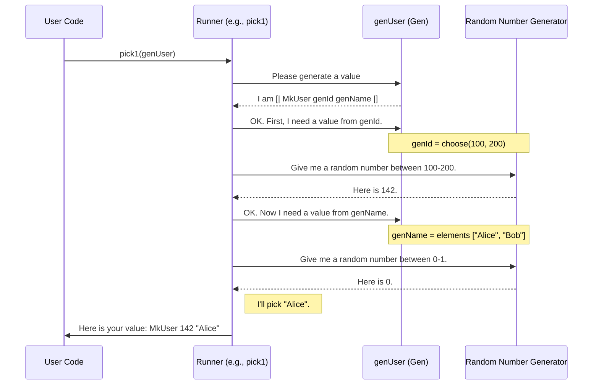

# Chapter 1: Test Data Generator (`Gen`)

Welcome to the `DepTyCheck` tutorial! We're excited to show you how to supercharge your testing with the power of dependent types. In this first chapter, we'll dive into the most fundamental concept in the library: the test data generator, known as `Gen`.

### The Challenge: Creating Test Data

Imagine you've written a function, say, one that sorts a list of numbers. How do you test it? You could write a few test cases by hand:

*   `sort([3, 1, 2])` should be `[1, 2, 3]`
*   `sort([])` should be `[]`
*   `sort([5, 5, 1])` should be `[1, 5, 5]`

This is a good start, but it's tedious. What if you miss an important edge case? This is where **property-based testing** comes in. Instead of writing individual test cases, we state a general "property" that should always be true. For our sorting function, a good property is: "For *any* list of numbers, the output should be sorted."

But to check this property, we need a way to generate hundreds or even thousands of different lists. Doing this by hand is out of the question. We need an automatic way to create this test data.

This is exactly the problem `Gen` solves.

### `Gen`: A Recipe for Random Data

Think of a `Gen` as a sophisticated **recipe for creating random data**.
*   A simple recipe might just say, "give me any number between 1 and 100."
*   A more complex recipe could say, "first, create a random number `n`, then create a list of `n` random characters."

`DepTyCheck` provides all the tools to write these recipes, combine them, and create exactly the test data you need. Let's start cooking!

### Your First Generators

The simplest recipe is one that isn't random at all. If you want a generator that always produces the number `42`, you can use `pure`:

```idris
genTheAnswer : Gen NonEmpty Nat
genTheAnswer = pure 42
```

This creates a `Gen` that, when run, will always give you `42`. The type `Gen NonEmpty Nat` tells us two things:
1.  It's a `Gen`erator that produces values of type `Nat` (natural numbers).
2.  It's `NonEmpty`, meaning it is guaranteed to successfully produce a value every time.

A more useful kind of generator picks a random value from a predefined list. For this, we use `elements`:

```idris
genSomeLetters : Gen NonEmpty Char
genSomeLetters = elements ['a', 'b', 'c']
```

This recipe says: "Randomly pick 'a', 'b', or 'c' with equal probability."

### Combining Recipes with `oneOf`

Now, let's get more creative. What if we want to combine different recipes? The `oneOf` function is our "chef" for this. It takes a list of *generators* and randomly picks one of them to run.

Let's make a generator that produces either a vowel or a consonant.

```idris
genVowel : Gen NonEmpty Char
genVowel = elements ['a', 'e', 'i', 'o', 'u']

genConsonant : Gen NonEmpty Char
genConsonant = elements ['b', 'c', 'd']

genLetter : Gen NonEmpty Char
genLetter = oneOf [genVowel, genConsonant]
```
When we run `genLetter`, it will first make a 50/50 choice: either run `genVowel` or run `genConsonant`.
*   If it chooses `genVowel`, it will then randomly pick one of 'a', 'e', 'i', 'o', or 'u'.
*   If it chooses `genConsonant`, it will randomly pick one of 'b', 'c', or 'd'.

This is different from `elements ['a', 'e', 'i', 'o', 'u', 'b', 'c', 'd']`, where every character would have the same probability. With `oneOf`, the probability of getting 'a' is not the same as getting 'b'!

### Assembling Complex Data

Most of the time, we aren't testing with simple characters or numbers; we're testing with complex data structures. Let's see how `Gen` helps us build them.

Imagine we have a `User` record:

```idris
data User = MkUser Nat String

-- A generator for some user IDs
genId : Gen NonEmpty Nat
genId = choose (100, 200) -- a random Nat between 100 and 200

-- A generator for some names
genName : Gen NonEmpty String
genName = elements ["Alice", "Bob"]
```

To create a generator for a `User`, we can use a special, easy-to-read syntax `[| ... |]`. This lets us "plug" generators into a constructor:

```idris
genUser : Gen NonEmpty User
genUser = [| MkUser genId genName |]
```

This is incredibly powerful! The recipe reads just like the data it creates: "To make a `User`, get a random ID from `genId` and a random name from `genName`, then put them together with `MkUser`."

### Generators that Depend on Each Other

Sometimes, the recipe for one piece of data depends on a previously generated value. For example, "generate a random number `n`, and *then* generate a list of that exact length `n`."

This is where `Gen` truly shines, especially with dependent types. Let's look at the type `Fin n`, which represents a number between `0` and `n-1`. The type `Fin 0` is uninhabited (it has no values), while `Fin 3` has values `0`, `1`, and `2`.

Let's write a generator that first picks a number `n` (say, between 1 and 5), and *then* picks a valid `Fin n`.

```idris
import Data.Fin

-- A generator that might be empty. For Fin 0, it produces nothing.
genFin : (n : Nat) -> Gen MaybeEmpty (Fin n)
genFin Z     = empty
genFin (S k) = elements (allFins k) -- a list of all Fins for S k

-- A generator for the container size
genSize : Gen NonEmpty Nat
genSize = elements [1, 2, 3, 4, 5]
```
Notice that `genFin` returns a `Gen MaybeEmpty (Fin n)`. `MaybeEmpty` tells us this generator might fail. This is crucial: if we ask for `genFin 0`, there are no values to create, so the generator must be "empty".

Now we can use a `do` block to chain these recipes together:

```idris
genSizedFin : Gen NonEmpty (n ** Fin n)
genSizedFin = do
  n <- genSize
  f <- genFin n
  pure (n ** f)
```

Let's break this down:
1.  `n <- genSize`: Run the `genSize` recipe to get a number `n`.
2.  `f <- genFin n`: Now that we have `n`, use it to create the *next* recipe, `genFin n`, and run it to get a value `f`.
3.  `pure (n ** f)`: Package the results `n` and `f` together. The type `(n ** Fin n)` is an existential pair, meaning "a number `n` and a `Fin` that is valid for that `n`".

When we run `genSizedFin`, we might get `(3 ** 1)`, `(5 ** 4)`, or `(2 ** 0)`, but we will never get an invalid pair like `(2 ** 3)`.

### Under the Hood

So what is a `Gen` really? It's not a random value. It's a data structure that represents the *instructions* for how to generate a value. When you ask for a random value, a "runner" function executes these instructions.

Let's trace a simple call like `pick1(genUser)`.



The `Gen` data type itself in [`src/Test/DepTyCheck/Gen.idr`](../../src/Test/DepTyCheck/Gen.idr) looks something like this (simplified):

```idris
data Gen : Emptiness -> Type -> Type where
  Empty : Gen MaybeEmpty a      -- A recipe that produces nothing.
  Pure  : a -> Gen em a         -- A recipe for a fixed value.
  Raw   : RawGen a -> Gen em a  -- A primitive recipe, like "a random integer".
  OneOf : ... -> Gen em a       -- A choice between several other recipes.
  Bind  : ... -> Gen em a       -- For dependent recipes (the `do` block).
```

Each of our generator functions (`elements`, `oneOf`, etc.) is just a convenient way to build up a value of this `Gen` data type. The real magic happens when the runner interprets this structure.

### What's Next?

You now know the fundamental building block of `DepTyCheck`: the `Gen` type. You've learned how to:
*   Create simple generators with `elements`.
*   Combine generators with `oneOf`.
*   Build complex, structured data using `[| ... |]` and `do` blocks.

Writing these recipes by hand is powerful, but for very complex data types, it can still be a lot of work. What if `DepTyCheck` could analyze your data type and write a generator for you automatically?

That's exactly what we'll cover in the next chapter: [Automatic Generator Derivation (`deriveGen`)](02_automatic_generator_derivation___derivegen___.md).

---

Generated by [AI Codebase Knowledge Builder](https://github.com/The-Pocket/Tutorial-Codebase-Knowledge)