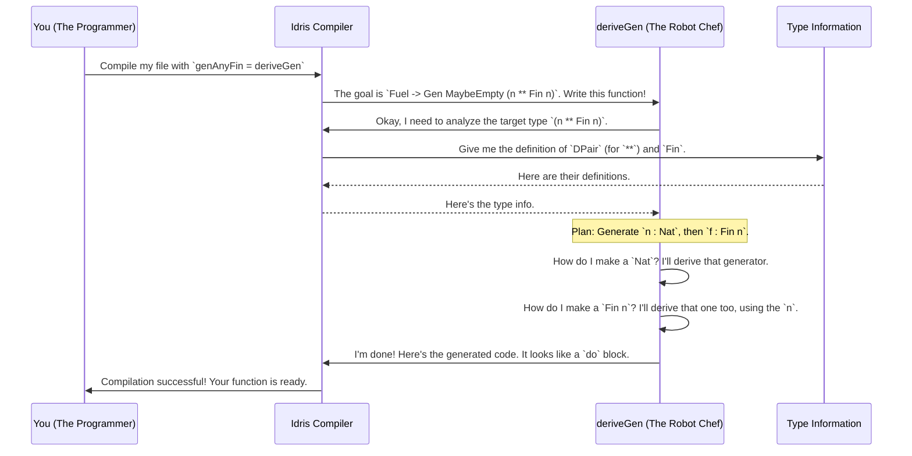

# Chapter 2: Automatic Generator Derivation (`deriveGen`)

In the [previous chapter](01_test_data_generator___gen___.md), we learned how to be a "chef" for test data, carefully writing our own recipes (`Gen`) to create exactly the values we need. This is great for simple data, but what happens when our data types get complicated? Writing generators for complex, dependently-typed structures can be a headache. It's tedious, and it's easy to make a mistake.

What if we had a robot chef that could look at the final dish we want and instantly figure out the recipe for us? That's exactly what `deriveGen` does.

### The "Robot Chef" for Test Data

`deriveGen` is the headline feature of `DepTyCheck`. It's a powerful tool that automatically writes a `Gen` for you. Instead of writing the recipe step-by-step, you just show `deriveGen` the data type you want to generate, and it does all the hard work.

Let's start with a very simple data type we all know: `Nat`, the natural numbers (0, 1, 2, ...). Manually, we'd have to write a recursive generator. With `deriveGen`, it's just one line.

```idris
-- The type of the generator we want
genNat : Fuel -> Gen MaybeEmpty Nat
-- The implementation: "Compiler, you figure it out!"
genNat = deriveGen
```

This might look like magic, so let's break it down:
*   `deriveGen` is a special command (a *macro*) that tells the Idris compiler to write the body of this function for us at compile time.
*   `Fuel`: You might notice this new `Fuel` argument. Think of it as a safety switch. For recursive data types like `Nat` (`S (S (S ... Z))`), a generator could run forever. `Fuel` is a simple counter that tells the generator when to stop, preventing infinite loops. For now, just know that derived generators for recursive types will always need it.
*   `Gen MaybeEmpty Nat`: The generator produces `Nat`s. It's marked as `MaybeEmpty` because it might fail to produce a value if it runs out of `Fuel`.

### Enabling the Magic

To use `deriveGen`, you need to enable a powerful Idris 2 feature called "Elaborator Reflection". This feature lets code inspect and build other code during compilation. Just add this line to the top of your file:

```idris
%language ElabReflection
```

With this enabled, the compiler allows `deriveGen` to work its magic.

### Deriving Generators for Your Own Types

`deriveGen` isn't just for built-in types. It can inspect any data type you define. Remember our `User` record from Chapter 1?

```idris
data User = MkUser Nat String
```

We previously wrote `genUser` by hand, combining `genId` and `genName`. With `deriveGen`, we can just ask for it:

```idris
%language ElabReflection

-- The generator we want.
genUser : Fuel -> Gen MaybeEmpty User
-- Let deriveGen do the work.
genUser = deriveGen
```

When the compiler sees this, `deriveGen` kicks in. It analyzes `User` and sees that it's constructed with `MkUser Nat String`. It thinks, "To make a `User`, I need to make a `Nat` and a `String`." Since `Nat` and `String` are common types, it already knows how to generate them. It automatically creates the necessary sub-generators and pieces them together, just as if we had written `[| MkUser someNatGenerator someStringGenerator |]` ourselves!

### The Real Superpower: Dependent Types

This is all very convenient, but `deriveGen` truly shines when we deal with dependent types. In the last chapter, we manually wrote a generator to create a pair of a number `n` and a `Fin n` (a number between `0` and `n-1`).

```idris
-- The manual version from Chapter 1
genSizedFin : Gen NonEmpty (n ** Fin n)
genSizedFin = do
  n <- genSize
  f <- genFin n
  pure (n ** f)
```

This required us to use a `do` block to ensure the generated `Fin` was valid for the generated `Nat`.

With `deriveGen`, we just state what we want. The type `(n ** Fin n)` is all the information it needs.

```idris
%language ElabReflection
import Data.Fin

-- The type says: "Generate a Nat `n` AND a `Fin n` that depends on it"
genAnyFin : Fuel -> Gen MaybeEmpty (n ** Fin n)
genAnyFin = deriveGen
```

This is incredible! We didn't have to write any `do` block or chain generators together. `deriveGen` looked at the type `(n ** Fin n)`, understood the dependency, and automatically generated the correct logic:
1.  Generate a `Nat`, let's call it `n`.
2.  Use that `n` to generate a valid `Fin n`.
3.  Package them together.

You just describe the shape of the data, and the robot chef handles the entire complex recipe.

### Under the Hood: How Does it Work?

`deriveGen` acts like a detective inside the Idris compiler. When you write `myGen = deriveGen`, the following sequence of events happens at compile time:



This whole process relies on **Elaborator Reflection**. The `deriveGen` macro is an "elaboration script" written in Idris itself. It receives the type it needs to generate (in a special format called `TTImp`), inspects its structure, and builds a new `TTImp` expression for the function body.

The code that performs this analysis lives in `src/Deriving/DepTyCheck/Gen.idr`. A simplified view of the "detective" function might look like this:

```idris
-- In src/Deriving/DepTyCheck/Gen.idr (conceptual)
checkTypeIsGen : (signature : TTImp) -> Elab ...
checkTypeIsGen sig = do
  -- Step 1: Break the signature `Fuel -> Gen MaybeEmpty (n ** Fin n)` apart
  let (args, resultType) = unPi sig

  -- Step 2: Look inside the `Gen` to find the target
  let (gen, target) = unApp resultType

  -- Step 3: Analyze the target. Is it a dependent pair `(**)`?
  let Just (paramsToGen, finalType) = unDPairUnAlt target
    -- `paramsToGen` is now `(n : Nat)`
    -- `finalType` is now `Fin n`

  -- Step 4: Form a plan based on this structure
  ...
```

The real implementation is much more sophisticated, handling all sorts of data structures, constructors, and edge cases. We will explore this machinery more in a later chapter on [The Derivation Pipeline](06_the_derivation_pipeline.md).

### Overriding the Robot Chef

What if `deriveGen`'s default recipe isn't quite what you want? For example, you might want to generate `User` records where the ID is always a positive number, not just any `Nat`.

You can "inject" your own custom generators using `auto`-implicit arguments in the signature.

```idris
import Test.DepTyCheck.Gen

data MyRecord = MkRecord Nat String

-- A custom generator for positive Nats
genPositiveNat : Fuel -> Gen MaybeEmpty Nat
genPositiveNat fuel = map S (deriveGen fuel) -- Generates a Nat, then adds 1

-- Tell deriveGen to use our custom generator for Nats
genSpecialRecord : (Fuel -> Gen MaybeEmpty Nat) => Fuel -> Gen MaybeEmpty MyRecord
genSpecialRecord @{genForNat} = deriveGen
```

By adding `(Fuel -> Gen MaybeEmpty Nat) =>` to the function signature, you are telling `deriveGen`: "When you're building a `MyRecord` and you need a `Nat`, don't use your default recipe. Instead, use the generator I am providing here (`genForNat`)."

This powerful mechanism allows you to customize the derivation process, giving you the perfect blend of automation and control.

### What's Next?

In this chapter, you've unlocked the power of `deriveGen`. You've learned how to:
*   Automatically generate test data recipes with a single line of code.
*   Let `deriveGen` handle the complexities of recursive and dependent types.
*   Get a glimpse of how this compile-time magic works.
*   Tune the derivation process by providing your own custom generators.

Now that we know how to create generators both by hand and with our "robot chef", we're ready to tackle a variety of interesting examples. In the next chapter, we'll see how `DepTyCheck` handles a gallery of different [Example Data Structures](03_example_data_structures_.md).

---

Generated by [AI Codebase Knowledge Builder](https://github.com/The-Pocket/Tutorial-Codebase-Knowledge)