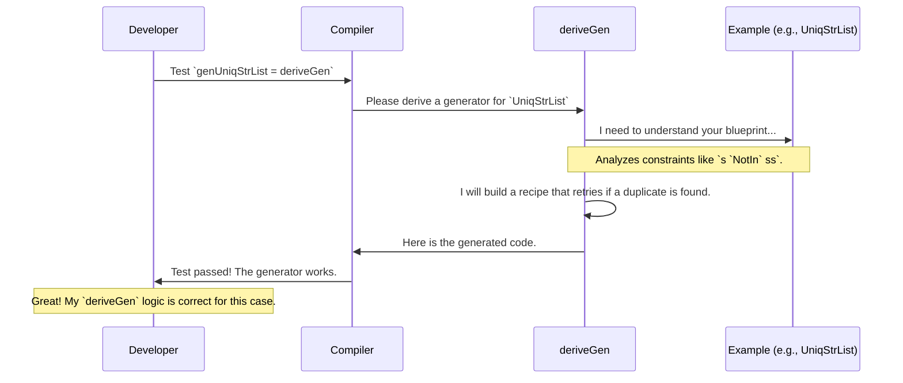

# Chapter 3: Example Data Structures

In the [previous chapter](02_automatic_generator_derivation___derivegen___.md), we met our "robot chef," `deriveGen`, which can automatically write test data recipes for us. We saw how it works for simple types and even for basic dependent types.

Now it's time to see what our chef can *really* cook. This chapter is a tour of the `DepTyCheck` kitchen's "demonstration dishes." These aren't just simple meals; they are sophisticated blueprints that showcase the true power of automatic generation for complex, property-rich data structures.

### A Gallery of Blueprints

The `examples` directory in the `DepTyCheck` project is our gallery. It contains a collection of data structures where important properties are baked right into their types. Think of a list that *cannot* be unsorted, or a list that *cannot* have duplicate elements.

Let's look at a few of these "dishes" to see what `deriveGen` is capable of.

### Dish #1: The Sorted List

**The Goal:** We want to generate lists of numbers that are guaranteed to be sorted in ascending order. A list like `[1, 3, 8]` is valid, but `[1, 8, 3]` is not.

**The Blueprint:** How can we enforce this rule in the type system? We define our `SortedList` so that adding a new element is only allowed if it's "less than or equal to" the head of the rest of the list.

```idris
-- From examples/sorted-list-so-comp/src/Data/List/Sorted.idr

data SortedList : Type where
  Nil  : SortedList
  (::) : (x : Nat) -> (xs : SortedList) -> LTEHead x xs => SortedList

data LTEHead : Nat -> SortedList -> Type where
  NoHead   : LTEHead n []
  SomeHead : So (n < x) -> LTEHead n $ (x::xs) @{_}
```

This looks complicated, so let's break it down:
*   A `SortedList` is either empty (`Nil`) or a number `x` followed by another `SortedList` `xs`.
*   The `=>` symbol introduces a constraint. To build a list `x :: xs`, you must provide a proof of `LTEHead x xs`.
*   `LTEHead x xs` is our "sortedness checker." It's true if the list `xs` is empty (`NoHead`) or if `x` is less than or equal to the first element of `xs` (`SomeHead`). The `So (n < x)` part is like a certificate that proves the condition `n < x` is true.

Writing a generator for this by hand would be tricky! You'd have to generate a number, then generate the *next* number making sure it's larger, and so on.

**The Recipe (via `deriveGen`):** With our robot chef, it's trivial.

```idris
%language ElabReflection

genSortedList : Fuel -> Gen MaybeEmpty SortedList
genSortedList = deriveGen
```

That's it! `deriveGen` analyzes the `SortedList` blueprint and automatically creates a generator that respects all the rules. It understands that to satisfy the `LTEHead` constraint, it must generate numbers in increasing order. When you run it, you will only ever get perfectly sorted lists.

### Dish #2: The Unique-Element List

**The Goal:** We want to generate lists of strings where no string appears more than once. `["cat", "dog", "rat"]` is valid, but `["cat", "dog", "cat"]` is not.

**The Blueprint:** Similar to the sorted list, we can build this constraint into the type.

```idris
-- From examples/uniq-list/src/Data/List/Uniq.idr

data UniqStrList : Type where
  Nil  : UniqStrList
  (::) : (s : String) -> (ss : UniqStrList) -> s `NotIn` ss => UniqStrList

data NotIn : String -> UniqStrList -> Type where
  N : NotIn x []
  S : So (x /= s) => x `NotIn` ss -> NotIn x (s::ss) @{sub}
```

Let's read the blueprint:
*   A `UniqStrList` is `Nil` or a string `s` followed by another `UniqStrList` `ss`.
*   The constraint is that you must provide a proof that `s` is `NotIn` `ss`.
*   The `NotIn` type checks this recursively: a string `x` is not in an empty list (`N`). It's not in `s::ss` if it's not equal to `s` (`So (x /= s)`) AND it's not in the rest of the list `ss`.

**The Recipe (via `deriveGen`):** Again, we just ask for it.

```idris
%language ElabReflection

genUniqStrList : (Fuel -> Gen MaybeEmpty String) => Fuel -> Gen MaybeEmpty UniqStrList
genUniqStrList @{genString} = deriveGen
```
`deriveGen` sees the `NotIn` constraint and understands that to generate a valid list, it must:
1. Generate a new string.
2. Check if that string is already in the list it has built so far.
3. If it is, throw it away and try again. If not, add it.

This is a very sophisticated strategy, and `deriveGen` discovers it all on its own!

### Dish #3: The Indexed Sorted Tree

**The Goal:** Now for a truly fancy dish. We want a binary tree of numbers that is sorted. This means for any node in the tree, all values in its left subtree must be smaller, and all values in its right subtree must be larger.

**The Blueprint:** We can enforce this with *type indices*. We "tag" the tree's type with the minimum and maximum values it's allowed to contain.

```idris
-- From examples/sorted-tree-indexed/src/Data/SortedBinTree.idr

data SortedBinTree1 : (mi, ma : Nat) -> Type where
  Leaf : (x : Nat) -> SortedBinTree1 x x
  Node : (left : SortedBinTree1 lmi lma) ->
         (right : SortedBinTree1 rmi rma) ->
         lma `LT` rmi => SortedBinTree1 lmi rma
```

Decoding this advanced blueprint:
*   `SortedBinTree1 mi ma` is a tree where all values are between `mi` (minimum) and `ma` (maximum), inclusive.
*   A `Leaf` with value `x` is a tree where the min and max are both `x`. Makes sense!
*   A `Node` has a `left` and `right` subtree. The crucial constraint is `lma < rmi`. This means the maximum value in the left subtree must be less than the minimum value in the right subtree. This *guarantees* the entire tree is sorted!

**The Recipe (via `deriveGen`):**

```idris
%language ElabReflection

-- We want a tree of any size, so we ask for an existential pair
-- `(mi, ma ** SortedBinTree1 mi ma)`
genSortedTree : Fuel -> Gen MaybeEmpty (mi, ma ** SortedBinTree1 mi ma)
genSortedTree = deriveGen
```

When `deriveGen` sees this, it generates a recipe that respects the indices. When building a `Node`, it knows it can't just generate any two subtrees. It has to generate a left subtree, see what its maximum value `lma` is, and then generate a right subtree whose minimum value `rmi` is greater than `lma`. This is an incredible display of automated, dependency-aware reasoning.

### Under the Hood: The Toughest Proving Ground

These examples are more than just a pretty gallery. They form the **most important test suite for `deriveGen` itself**. Each of these tricky data structures is a deliberate challenge thrown at the derivation system.

When a developer works on `DepTyCheck`, they can run the tests on these examples. If `deriveGen` fails to create a valid generator for any of them, or if it gets stuck in a loop, the developer knows there's a bug in the "robot chef's" logic.

This process ensures that `deriveGen` remains robust and can handle the complex, real-world dependent types you might throw at it.



The ability to successfully derive generators for all the blueprints in the `examples` directory is the gold-standard proof that the entire [Derivation Pipeline](06_the_derivation_pipeline.md) is working correctly.

### What's Next?

We've seen how `deriveGen` can master sophisticated blueprints for data structures. But what about something even more complex, like a small programming language? In the next chapter, we'll explore the [Primitive Imperative Language (PIL) Examples](04_primitive_imperative_language__pil__examples_.md) to see how `DepTyCheck` can generate entire valid *programs* as test data.

---

Generated by [AI Codebase Knowledge Builder](https://github.com/The-Pocket/Tutorial-Codebase-Knowledge)