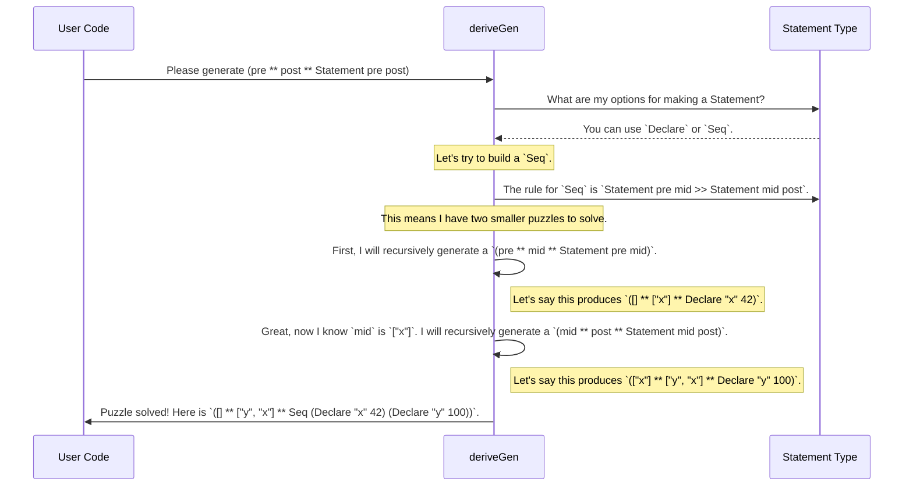

# Chapter 4: Primitive Imperative Language (PIL) Examples

In the [previous chapter](03_example_data_structures_.md), we saw `DepTyCheck` act like a skilled chef, automatically creating recipes for complex data "dishes" like sorted lists and trees. We're now ready to enter the "master chef" competition.

Instead of a single dish, we're going to generate an entire multi-course meal where each course must be perfectly compatible with the next. In programming terms, we're going to generate entire **programs** as test data, where every line of code is guaranteed to be correct according to the language's rules.

### The Challenge: Testing a Compiler

Imagine you're building a new programming language. Maybe it's a simple language for a game, or a powerful one for data science. How do you test your compiler or interpreter? You need to feed it thousands of different programs to make sure it handles everything correctly.

Writing these test programs by hand is slow and error-prone. A common approach is to generate them randomly. But this often produces nonsense:

```
// An invalid program
x = y + 10;   // ERROR! 'y' has not been defined yet.
b = "hello";  // ERROR! 'b' was declared as a number, not a string.
```

Programs like this are full of basic errors (like using undeclared variables) that a simple syntax check would catch. They aren't very useful for testing the deeper logic of your compiler. What you really want are programs that are **syntactically correct and type-safe**, so you can test the more interesting parts of your language tools.

This is where `DepTyCheck`'s "master chef" examples shine.

### The Blueprint: A Language Defined in Types

The trick is to define our miniature programming language not just with rules on paper, but with rules enforced by the Idris type system itself. Let's design a tiny language with just integers and variable assignments.

First, we need a way to represent the **state** of our program—that is, which variables are currently in scope. We can use a simple list of names.

```idris
-- A list of variable names currently available.
-- e.g., ["x", "y", "z"]
Variables : Type
Variables = List String
```

Now, the master stroke: we define our language `Statement`s so that their very **type** describes how they change the program's state.

```idris
data Statement : (before : Variables) -> (after : Variables) -> Type where
  -- ... our language rules go here
```
A value of type `Statement ["x"] ["x", "y"]` represents a piece of code that is only valid if the variable `"x"` is already defined, and which, after running, results in both `"x"` and `"y"` being defined.

Let's add two rules to our language:
1.  **Declare:** A statement to declare a new variable.
2.  **Sequence:** A way to run two statements one after the other.

```idris
data Statement : (before : Variables) -> (after : Variables) -> Type where
  Declare : (name : String) ->
            (val : Nat) ->
            Statement before (name :: before)

  Seq : Statement before middle ->
        Statement middle after ->
        Statement before after
```

Let's read these blueprints:
*   `Declare name val`: This statement takes a `name` and a value `val`. It transforms the state from `before` to `name :: before` (the old state with the new variable added to the front). It's a valid way to get from `["x"]` to `["y", "x"]`.
*   `Seq s1 s2`: This combines two statements. For `Seq s1 s2` to be valid, the "after" state of `s1` must exactly match the "before" state of `s2`. This is the glue that ensures our program steps are logically connected.

With this definition, it is *impossible* to construct an invalid program. The Idris type checker simply won't allow it.

### The Recipe: Generating a Valid Program

Now that we have the blueprint for a well-typed language, writing a generator by hand would still be a nightmare. We'd have to carefully track the `before` and `after` states.

But with `DepTyCheck`, we can just ask our "robot chef" `deriveGen` to do the work. We can ask it for a truly amazing thing: "Give me a 'before' state, an 'after'state, AND a valid program that transforms the 'before' to the 'after'."

This is written as an existential pair `(pre ** post ** Statement pre post)`.

```idris
%language ElabReflection

-- A generator for a complete, valid program
genValidProgram : Fuel -> Gen MaybeEmpty (pre ** post ** Statement pre post)
genValidProgram = deriveGen
```

This is the ultimate demonstration of `DepTyCheck`'s power. It will automatically generate code that looks like this:

```idris
-- A possible generated value (conceptual)
( [] ** ["y", "x"] ** Seq (Declare "x" 42) (Declare "y" 100) )
```

This represents the program:
1.  Start with no variables (`[]`).
2.  `Declare "x" 42`. The state is now `["x"]`.
3.  `Declare "y" 100`. The state is now `["y", "x"]`.
4.  The final state matches the `post` state (`["y", "x"]`).

`DepTyCheck` generates all three parts—the start, the end, and the valid path between them—all automatically.

### Under the Hood: A Puzzle-Solving Generator

How can `deriveGen` find a valid program? It works like a puzzle solver. It knows the final goal (`Statement pre post`) and it knows the available puzzle pieces (the constructors `Declare` and `Seq`).



`deriveGen` intelligently navigates the dependencies. To build a `Seq`, it knows it must first generate the left-hand statement to find out what the `middle` state is, before it can proceed to generate the right-hand statement.

### The Real "Master Chef" Examples

Our `Statement` example was a simplified toy. The real examples in the `DepTyCheck` repository, such as `pil-reg` and `pil-fun`, are far more sophisticated. They define miniature languages that track:
*   Variable types (integers, booleans, strings).
*   Registers and memory.
*   Function definitions and scopes.
*   Mutable vs. immutable variables.

For example, a real `Statement` type from `examples/pil-reg/src/Example/Pil/Lang/Statement.idr` has a type signature that looks something like this:

```idris
data Statement : (preV : Variables) -> (preR : Registers) ->
                 (postV : Variables) -> (postR : Registers) -> Type
```
This is a statement that transforms not just the variables (`preV` to `postV`) but also the state of the machine's registers (`preR` to `postR`).

By using `deriveGen` on these complex language definitions, `DepTyCheck` can produce a huge volume of valid, non-trivial test programs. This is an invaluable tool for anyone building compilers, interpreters, static analyzers, or any tool that consumes code as input. These generated programs act as a robust conformance suite, ensuring the tool behaves correctly according to the language's formal specification.

### What's Next?

We've seen how `DepTyCheck` can tackle the incredibly complex task of generating valid programs. This relies on the generator being able to successfully navigate a web of type-level constraints.

But what happens if a set of constraints is impossible to satisfy? For example, what if we ask for a program to transform state `A` to state `B`, but no such program can exist? The generator would have nothing to produce. This leads us to a very important concept: [Generator Emptiness](05_generator_emptiness_.md).

---

Generated by [AI Codebase Knowledge Builder](https://github.com/The-Pocket/Tutorial-Codebase-Knowledge)