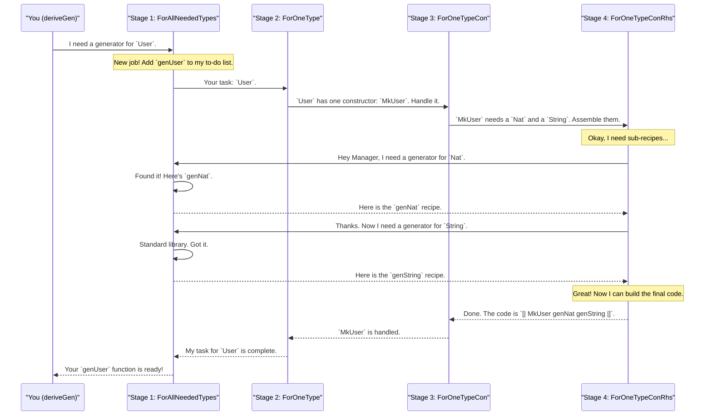

# Chapter 6: The Derivation Pipeline

In the previous chapters, we've treated `deriveGen` a bit like magic. We give it a type, and poof! A test data generator appears. We even saw how it handles seemingly impossible requests with the help of [Generator Emptiness](05_generator_emptiness_.md).

But how does this "robot chef" actually work? How does it turn a complex type blueprint into a working recipe (`Gen`)? In this chapter, we'll pull back the curtain and take a tour of the internal factory: **The Derivation Pipeline**.

### From a Single Order to an Assembly Line

Imagine you ask `deriveGen` to create a generator for a simple `User` record:

```idris
data User = MkUser Nat String

-- The order placed by you
genUser : Fuel -> Gen MaybeEmpty User
genUser = deriveGen
```

A novice chef might try to do everything at once—mix the flour, chop the vegetables, and preheat the oven all at the same time. This leads to chaos. A master chef, however, uses an assembly line. Each station has a specialist who does one job perfectly before passing the dish to the next station.

`deriveGen` is a master chef. It uses a four-stage assembly line to break down the complex task of derivation into small, manageable steps.

### The Four Specialists of the Pipeline

When an order like "generate a `User`" arrives, it's passed down this pipeline. Each stage is a code module in `DepTyCheck` with a very specific job.

1.  **Stage 1: `ForAllNeededTypes` (The Factory Manager)**
    *   **Job:** Manages the entire derivation process. It receives the main order and keeps a "to-do list" of all the sub-generators that need to be created (e.g., "we need a `Nat` generator," "we need a `String` generator"). It ensures that every required component recipe is either found or created.

2.  **Stage 2: `ForOneType` (The Team Lead)**
    *   **Job:** Focuses on generating a *single* type. It looks at the type's definition and sees how many ways there are to build it (i.e., how many data constructors it has). For a `List`, it would see `Nil` and `(::)`. For our `User`, it just sees `MkUser`.

3.  **Stage 3: `ForOneTypeCon` (The Constructor Specialist)**
    *   **Job:** Handles just *one* specific constructor. Its task is to understand the "ingredients" needed for that constructor. For `MkUser Nat String`, it sees that it needs a `Nat` and a `String`.

4.  **Stage 4: `ForOneTypeConRhs` (The Component Assembler)**
    *   **Job:** The most hands-on worker. It takes the list of ingredients from the previous stage and figures out the exact steps to generate them. (`Rhs` means "Right-Hand Side" of the constructor). It's the one that actually writes the `do` block logic, asking the Factory Manager for the sub-generators it needs.

### A Walkthrough: Generating a `User`

Let's follow our `genUser` order as it travels down the assembly line.



This modular pipeline is what makes `deriveGen` so powerful. When we ask it to generate a `SortedList` or a valid `Statement` from our previous examples, the same process happens. The `ForOneTypeConRhs` assembler simply has a more complex job, like figuring out how to generate a number that is greater than the previous one, or how to generate a program statement that respects the current variable scope.

### Under the Hood: A Glimpse at the Code

Let's peek into the factory and see what the code for each specialist looks like (in a simplified, conceptual form).

#### Stage 1: `ForAllNeededTypes` - The Manager

This module manages a "to-do" list of generators. Its main function, `callGen`, is the entry point for all recursive calls.

*File: `src/Deriving/DepTyCheck/Gen/ForAllNeededTypes/Impl.idr`*

```idris
-- Simplified concept of callGen
callGen sig fuel values = do
  -- First, check if the user provided an external generator for this type
  -- If yes, use it.

  -- If not, check our list of already-derived generators
  let existing = lookup sig !(get) -- Check state
  case existing of
    Just name => pure (call name fuel values) -- Found it! Use the existing one.
    Nothing => do
      -- Not found. Let's derive it.
      let name = nameForGen sig -- Create a fresh name for our new function.
      modify (insert sig name)  -- Add to our list of derived generators.
      modify ((sig, name) ::)   -- Add to the "to-do" list for derivation.
      pure (call name fuel values)
```
This code shows the manager's logic: reuse what you can, otherwise add a new job to the queue.

#### Stage 2: `ForOneType` - The Team Lead

This module takes a type and splits the work by its constructors. It generates the `oneOf` or `frequency` calls to choose between them.

*File: `src/Deriving/DepTyCheck/Gen/ForOneType/Impl.idr`*

```idris
-- Simplified concept of canonicBody
canonicBody sig n = do
  -- Get all constructors for the target type
  let cons = sig.targetType.cons

  -- For each constructor, derive a body for its specific generator.
  -- This calls Stage 3.
  consBodies <- for cons $ \con =>
    canonicConsBody sig (consGenName con) con

  -- Create the final expression that chooses between constructors
  pure (fuelDecisionExpr fuelArg consbodies)
```
This generates code that, when run, will decide which constructor's generator to execute, often based on the remaining `Fuel`.

#### Stage 3: `ForOneTypeCon` - The Constructor Specialist

This specialist receives one constructor and analyzes its arguments to prepare for the final assembly.

*File: `src/Deriving/DepTyCheck/Gen/ForOneTypeCon/Impl.idr`*

```idris
-- Simplified concept of canonicConsBody
canonicConsBody sig name con = do
  -- Analyze the constructor's arguments (`con.args`)
  -- to figure out dependencies. For example, in `Vect n a`,
  -- the generator for the list elements depends on `n`.

  -- Pass the argument list to Stage 4 to build the final expression.
  let rhsExpr = consGenExpr sig con ...
  pure (clauses for the function)
```
This stage is mostly about analysis and preparation, passing the analyzed information down the line.

#### Stage 4: `ForOneTypeConRhs` - The Component Assembler

This is where the actual generator logic is built. It intelligently decides the order in which to generate arguments and makes recursive calls back to the Factory Manager.

*File: `src/Deriving/DepTyCheck/Gen/ForOneTypeConRhs/Impl.idr`*

```idris
-- Simplified concept of consGenExpr
consGenExpr sig con givs fuel = do
  -- Figure out the best order to generate the constructor's arguments.
  -- (e.g. for `(n ** Vect n Int)`, generate `n` first!)
  let theOrder = searchOrder ...

  -- For each argument in that order...
  genForOrder theOrder $ \genedArg => do
    -- Get the type of the argument we need to generate.
    let typeOfGened = ...

    -- Ask the manager (Stage 1) for a generator for this type.
    -- This is the crucial recursive call!
    subgenCall <- callGen typeOfGened ...

    -- Build the `do` block expression: `name <- subgenCall`
    pure (\cont => `(~subgenCall >>= \name => ~cont))
```
This is the heart of the derivation. It builds the final recipe piece by piece, ensuring that all dependencies between arguments are respected.

### What's Next?

You've just completed a tour of the `deriveGen` factory! You now know that `deriveGen` isn't magic, but a well-organized pipeline of specialists working together. This structure allows `DepTyCheck` to tackle incredibly complex types by breaking the problem down into simple, repeatable steps.

The entire pipeline kicks off when the Factory Manager (`ForAllNeededTypes`) receives its first order. But to do its job, it must first understand what you're asking for. How does it read and interpret a type like `(n ** Vect n Int)`? That's the focus of our next chapter: [Generator Signature Analysis](07_generator_signature_analysis_.md).

---

Generated by [AI Codebase Knowledge Builder](https://github.com/The-Pocket/Tutorial-Codebase-Knowledge)