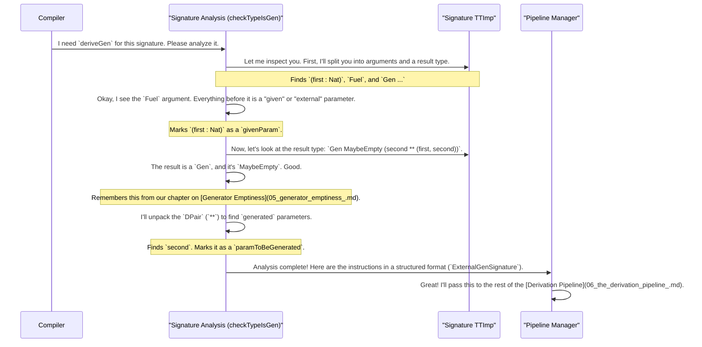

# Chapter 7: Generator Signature Analysis

In the [previous chapter](06_the_derivation_pipeline_.md), we took a tour of the `deriveGen` factory, an assembly line of specialists that work together to build a test data generator. We saw that the first specialist, the "Factory Manager," kicks off the whole process.

But how does the manager know what to build? Before any work can begin, someone has to read the customer's order and translate it into a clear set of instructions. This crucial first step is **Generator Signature Analysis**.

### The Order-Taking System

Think of our robot chef, `deriveGen`. You don't just tell it "make food." You give it a very specific order: "I'd like a two-course meal. For the main, I'll provide the steak (`given parameter`), you create a random side salad (`generated parameter`). Also, for the salad dressing, use this special recipe I brought (`auto` implicit generator)."

Generator Signature Analysis is the "order-taking system" that reads and understands this complex request. It meticulously analyzes the type signature of the generator function you want to derive. Its job is to figure out:

1.  **The Final Dish:** What is the overall data structure we are trying to create?
2.  **The Provided Ingredients:** Which parts are given to us as inputs by the user? (These are the *given parameters*).
3.  **The Chef's Creations:** Which parts need to be randomly generated from scratch? (These are the *generated parameters*).
4.  **Special Instructions:** Are there any custom sub-generators the user wants us to use instead of our defaults? (These are the *external generators* provided via `auto` implicits).

This analysis is essential for handling dependent types, where the shape of the "Chef's Creations" often depends on the "Provided Ingredients."

### Reading an Order

Let's look at a concrete order—a function signature—and see how the analysis system would interpret it. Imagine we want a generator that creates a vector (`Vect`) of a specific length provided by the user.

```idris
-- The signature of the generator we want to derive
genFixedLenVect : (len : Nat) -> Fuel -> Gen MaybeEmpty (Vect len String)
genFixedLenVect = deriveGen
```

When the compiler sees `deriveGen`, the signature analysis system gets to work. It breaks down the `genFixedLenVect` signature like this:

*   **Final Dish:** The target is a `Vect len String`. It's a vector of strings.
*   **Provided Ingredients:** The signature has a `(len : Nat)` argument *before* the `Fuel`. This is a **given parameter**. The user will provide the length.
*   **Chef's Creations:** There are no `(**)`-style dependent pairs in the result type, so there are no new top-level values to generate. The system's job is simply to fill the `Vect` with random `String`s.
*   **Special Instructions:** There are no `=>` arguments, so `deriveGen` will use its default recipe for generating `String`s.

The analysis concludes: "The user will give me a number `len`. I need to build a generator that creates a `Vect` of that exact length, filled with randomly generated strings using the standard string generator."

### A More Complex Order

Now let's see an order with both a given and a generated parameter. We want to generate a pair of numbers, where the first number is given by the user, and the second is randomly generated.

```idris
genPairWithGivenFirst : (first : Nat) -> Fuel -> Gen MaybeEmpty (second ** (first, second))
genPairWithGivenFirst = deriveGen
```

The order-taker analyzes this signature:

*   **Final Dish:** It's a pair `(first, second)`.
*   **Provided Ingredients:** The `(first : Nat)` argument is a **given parameter**.
*   **Chef's Creations:** The `(second ** ...)` part in the result type `Gen MaybeEmpty (second ** ...)` tells the system that `second` is a **generated parameter**. It must be created randomly. The type of `second` is implicitly `Nat` because it's used in a pair with `first : Nat`.
*   **Special Instructions:** None.

The final instructions are: "The user will provide a `Nat` called `first`. I need to generate a new random `Nat` called `second`, and then package them into the pair `(first, second)`."

Without this careful analysis, `deriveGen` wouldn't know that `first` comes from an input while `second` needs to be created.

### Under the Hood: The `checkTypeIsGen` Detective

The entire analysis process happens inside a single, powerful function called `checkTypeIsGen`, located in `src/Deriving/DepTyCheck/Gen.idr`. This function acts like a detective, examining the `TTImp` (the compiler's internal representation of a type) for clues.

Here’s a step-by-step of what it does when it receives an order:



The core logic of `checkTypeIsGen` uses helper functions provided by Idris's reflection capabilities to deconstruct the type:

*   `unPi sig`: Splits a function type like `A -> B -> C` into its arguments `[A, B]` and its final result `C`.
*   `unApp sigResult`: Splits an application like `Gen MaybeEmpty User` into the function `Gen` and its arguments `[MaybeEmpty, User]`.
*   `unDPairUnAlt targetType`: Splits a dependent pair type like `(x ** P x)` into the parameter to be generated `(x : Type)` and the final body `P x`.

A (very) simplified concept of the code looks like this:

```idris
-- In src/Deriving/DepTyCheck/Gen.idr (conceptual)
checkTypeIsGen : (signature : TTImp) -> Elab ...
checkTypeIsGen sig = do
  -- 1. Split the signature into arguments and result
  let (sigArgs, sigResult) = unPi sig

  -- 2. Find the Fuel argument and separate given/external params
  let (givenAndExternals, fuelAndRest) = span (isNotFuel) sigArgs

  -- 3. Unpack the Gen type from the result
  let [_, targetType] = unApp sigResult

  -- 4. Unpack the dependent pair to find generated params
  let (paramsToBeGenerated, finalStructure) = unDPairUnAlt targetType

  -- 5. Classify the `givenAndExternals` into given and auto-implicit
  ...

  -- 6. Package everything into a structured record and return it
  pure (MkExternalGenSignature ...)
```

The final output of this analysis is a value of type `ExternalGenSignature`. This record is the neat, formalized "order ticket" that contains all the information the rest of the `deriveGen` pipeline needs to do its job correctly.

### What's Next?

We've now seen the full picture of how `deriveGen` works, from the initial analysis of your request to the final assembly of the generator. With this deep understanding, you're now equipped to use `DepTyCheck` to its full potential.

In the final chapter, we'll step back from the concepts and look at the practical side of things. We'll cover the tools you'll use to work with the `DepTyCheck` project, how to run the examples, and how to configure its behavior. Let's move on to [Project Tooling & Configuration](08_project_tooling___configuration_.md).

---

Generated by [AI Codebase Knowledge Builder](https://github.com/The-Pocket/Tutorial-Codebase-Knowledge)