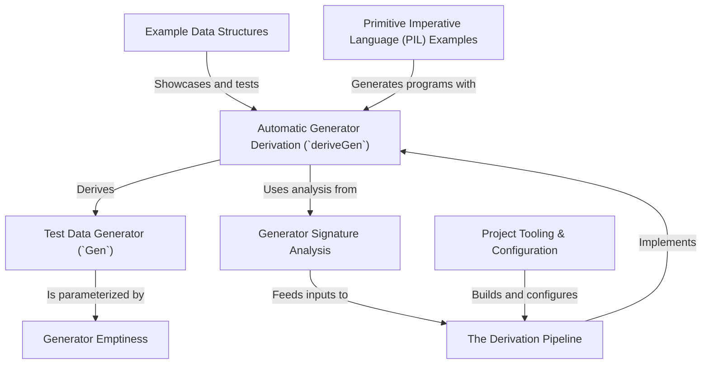

# Tutorial: DepTyCheck

`DepTyCheck` is a property-based testing library for the Idris 2 programming language, designed to work with advanced, dependently-typed data structures.

Its main feature is **automatic generator derivation**. Instead of manually writing code to create complex test data, you can use the `deriveGen` macro. This powerful tool acts like a "robot chef" that analyzes the type of data you need and *writes the test data generator for you* at compile-time. This is especially useful for testing applications like compilers or interpreters, where you can automatically generate a stream of valid, well-typed programs to test against. The core building block is the `Gen` type, which represents a recipe for generating random data.

**Source Repository:** [None](None)

## Chapters

1. [Test Data Generator (`Gen`)
](01_test_data_generator___gen___.md)
2. [Automatic Generator Derivation (`deriveGen`)
](02_automatic_generator_derivation___derivegen___.md)
3. [Example Data Structures
](03_example_data_structures_.md)
4. [Primitive Imperative Language (PIL) Examples
](04_primitive_imperative_language__pil__examples_.md)
5. [Generator Emptiness
](05_generator_emptiness_.md)
6. [The Derivation Pipeline
](06_the_derivation_pipeline_.md)
7. [Generator Signature Analysis
](07_generator_signature_analysis_.md)
8. [Project Tooling & Configuration
](08_project_tooling___configuration_.md)

---

Generated by [AI Codebase Knowledge Builder](https://github.com/The-Pocket/Tutorial-Codebase-Knowledge)