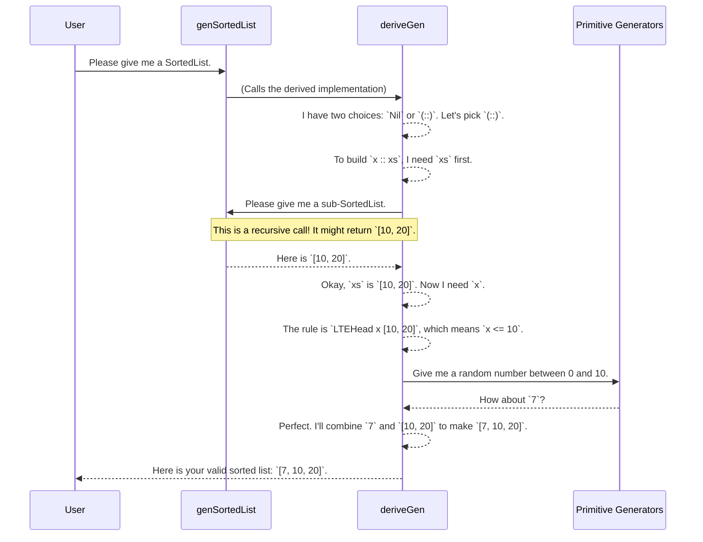

# Chapter 1: Dependently-Typed Data Structures & Generators

Welcome to the `DepTyCheck` tutorial! We're thrilled to have you here. This tutorial will guide you through the core ideas of `DepTyCheck`, a powerful tool for property-based testing in the dependently-typed programming language Idris.

Let's start with a common problem in software testing.

### The Challenge: Testing with "Smart" Data

Imagine you're building a function that only works on sorted lists of numbers. A classic example is a binary search algorithm. How would you test it?

You'd need to feed it many different *sorted lists* to make sure it works correctly.
- An empty list: `[]`
- A single-element list: `[42]`
- A longer list: `[1, 5, 19, 100, 204]`
- A list with duplicates: `[10, 10, 20, 30]`

Manually writing all these test cases is tedious and error-prone. What if you could just state the *rules* for a sorted list and have a machine automatically generate hundreds of valid examples for you?

This is exactly the problem `DepTyCheck` is designed to solve. It combines two powerful ideas:
1.  **Dependent Types** to define data structures with built-in rules.
2.  **Automatic Generators** to create random, valid instances of those structures.

It’s like designing a complex machine with very specific safety rules, and then having an AI that can automatically generate valid blueprints for building that machine.

### Our First Example: The `SortedList`

In Idris, we can define a `SortedList` where the sorting rule is part of its very definition. Let's look at how this is done.

```idr
-- A list where every element is less than or
-- equal to the one that follows it.
data SortedList : Type where
  Nil  : SortedList
  (::) : (x : Nat) -> (xs : SortedList) -> LTEHead x xs => SortedList
```

This might look a bit scary, so let's break it down.

*   `data SortedList : Type where` declares a new type of data called `SortedList`.
*   `Nil : SortedList` says that an empty list (called `Nil`) is a valid `SortedList`. Makes sense!
*   The `(::)` line is the interesting part. It says you can build a new `SortedList` by putting a number `x` in front of an existing `SortedList` `xs`, but *only if* a special condition is met: `LTEHead x xs`.

This `LTEHead x xs` is our "safety rule" expressed as a type. It's a proof that `x` is Less Than or Equal to the first element (the head) of `xs`. If you try to create a list like `5 :: [2, 10]` where `5` is *not* less than or equal to `2`, the Idris compiler will give you an error. The rule is enforced at compile-time!

> **What is `=>`?** In Idris, `constraint => Type` means that `Type` is only valid if the `constraint` can be satisfied. Think of it as an "if" condition for types.

### The Magic: Automatically Generating Sorted Lists

Okay, so we have this "smart" `SortedList` that can't be created incorrectly. Now, how do we make test data for it? We don't want to manually build hundreds of these lists and proofs.

This is where `DepTyCheck` shines. We can ask it to *derive* a generator for us.

Let's look at the entire file that defines a generator for `SortedList`.

```idr
-- File: examples/sorted-list-so-comp/src/Data/List/Sorted/Gen.idr

import public Data.List.Sorted
import public Test.DepTyCheck.Gen
import Deriving.DepTyCheck.Gen

export
genSortedList : Fuel -> Gen MaybeEmpty SortedList
genSortedList = deriveGen
```

That's it! That's all the code you need.

The one-liner `genSortedList = deriveGen` is incredibly powerful. `deriveGen` is the "AI blueprint generator" from our analogy. It inspects the definition of `SortedList`, understands its rules (including the tricky `LTEHead` constraint), and automatically creates a function that can generate random, valid `SortedList`s.

This is the central pattern of `DepTyCheck`: **define data with typed-invariants, then derive a generator.**

### What's Happening Under the Hood?

You don't need to understand the internals to use `DepTyCheck`, but a high-level overview can make things clearer. Let's imagine how `deriveGen` might think when asked to build a `SortedList`.



`deriveGen` intelligently breaks down the problem. It recursively generates the parts of the data structure and uses the type-level rules to guide the generation of random values, ensuring the final result is always valid.

### More Examples of the Pattern

This pattern isn't just for sorted lists. It works for a huge variety of data structures.

#### Unique-Element Lists

Want a list of strings where no string appears more than once? Define it with a dependent type!

```idr
-- A Vect (a list with its length in the type) of unique Strings.
data UniqStrVect : Nat -> Type where
  Nil  : UniqStrVect Z
  (::) : (s : String) -> (ss : UniqStrVect n) -> NotIn s n ss => UniqStrVect (S n)
```

Here, the rule is `NotIn s n ss`, a proof that the string `s` is not in the rest of the list `ss`. And how do we generate it? You guessed it:

```idr
-- File: examples/uniq-list/src/Data/Vect/Uniq/Gen.idr

Data.Vect.Uniq.genUniqStrVect = deriveGen
```

`deriveGen` is smart enough to generate a string, check if it's already in the sub-list it generated, and retry with a new string if it finds a duplicate.

#### Sorted Binary Trees

How about a binary tree where all values in a left child's branch are smaller than the node, and all values in the right child's branch are larger?

```idr
-- A binary tree where `lma` (left-max) must be less than `rmi` (right-min).
data SortedBinTree1 : (mi, ma : Nat) -> Type where
  Leaf : (x : Nat) -> SortedBinTree1 x x
  Node : (left : SortedBinTree1 lmi lma) -> (right : SortedBinTree1 rmi rma)
      -> lma `LT` rmi => SortedBinTree1 lmi rma
```

This type is quite complex! It tracks the minimum and maximum values in the tree at the type level. The rule `lma LT rmi` ensures the sorting property between the left and right sub-trees. But generating it is just as simple as before:

```idr
-- File: examples/sorted-tree-indexed/src/Data/SortedBinTree/Gen.idr

genSortedBinTree1 : Fuel -> Gen MaybeEmpty (mi ** ma ** SortedBinTree1 mi ma)
genSortedBinTree1 = deriveGen
```

`DepTyCheck` handles all the complexity of generating valid `left` and `right` sub-trees that satisfy the ordering constraint.

### Conclusion

In this chapter, we've introduced the most important pattern in `DepTyCheck`:
1.  **Define** a data structure using Idris's powerful dependent types to enforce complex rules and invariants at compile-time.
2.  **Derive** a test data generator for that structure automatically with a single line of code: `deriveGen`.

This lets you focus on correctly *specifying* your data, and `DepTyCheck` takes care of the tedious and error-prone task of creating valid test examples. You get correctness guarantees from the compiler and powerful testing capabilities, all at once.

We've seen the magic of `deriveGen` from the outside. In the next chapter, we'll take a closer look at what it is and how you can control its behavior.

Next up: [Automatic Generator Derivation (`deriveGen`)](02_automatic_generator_derivation___derivegen___.md)

---

Generated by [AI Codebase Knowledge Builder](https://github.com/The-Pocket/Tutorial-Codebase-Knowledge)