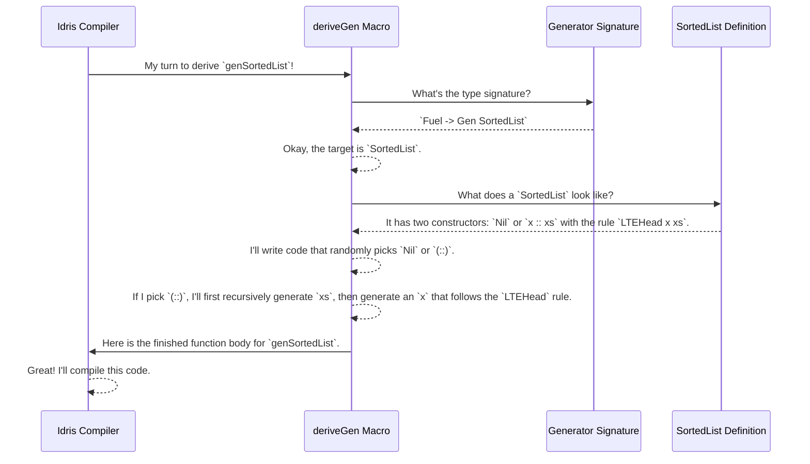

# Chapter 2: Automatic Generator Derivation (`deriveGen`)

In the [previous chapter](01_dependently_typed_data_structures___generators_.md), we saw `DepTyCheck` work its magic on `SortedList` with a mysterious one-liner: `genSortedList = deriveGen`. It felt like we waved a magic wand and a perfect generator appeared out of thin air.

In this chapter, we'll learn about that magic wand. `deriveGen` is the heart of `DepTyCheck`, and understanding how to use it is the key to unlocking the library's power.

### The Problem: Writing the Recipe is Hard

Imagine you're a chef. You have a picture of a complex, beautiful cake. Now, you have to write the recipe for it. You need to figure out the ingredients, the exact measurements, the baking temperatures, the assembly steps—it's a lot of work, and it's easy to get wrong.

Writing generators for dependently-typed data is similar. The type definition is like the picture of the cake; it tells you what the final result must look like. But writing the generator function—the recipe—is a complex, manual process full of potential mistakes.

`deriveGen` is like a master chef who can look at the picture (your type definition) and instantly write the perfect recipe for you. It automates the tedious work so you can focus on designing your data structures.

### What is `deriveGen`? A Code-Writing Robot

In Idris, `deriveGen` isn't a normal function. It's a special compile-time tool called a **macro**. Think of it as a small robot that runs while your program is compiling.

When the Idris compiler sees a line like `myGenerator = deriveGen`, it stops and says, "Hey, `deriveGen` robot, it's your turn!" The robot then does the following:

1.  **Looks at the type signature** of `myGenerator`. This is your "order" or "request".
2.  **Analyzes the data type** you want to generate (e.g., `SortedList`).
3.  **Writes the entire function body** for `myGenerator` based on its analysis.
4.  **Hands the code back** to the Idris compiler to be included in your final program.

You, the programmer, don't write the complex generator logic. You just write the *type signature* that describes what you want, and `deriveGen` handles the rest.

### How to "Talk" to `deriveGen`: The Generator Signature

The most important part of using `deriveGen` is writing the generator's type signature correctly. This signature is your set of instructions. Let's break down its components.

#### 1. The `Fuel` Argument

Every generator you derive must take `Fuel` as its first argument.

```idr
genSomething : Fuel -> Gen ...
genSomething = deriveGen
```

**Analogy:** `Fuel` is a safety mechanism. When generating complex, recursive data like lists or trees, it's possible for the generator to get stuck in an infinite loop. `Fuel` is like a limited amount of energy. Each time the generator makes a recursive step, it consumes one unit of fuel. If it runs out, generation stops. This prevents your tests from running forever.

#### 2. The Return Type: `Gen` and Dependent Pairs `(**)`

The return type tells `deriveGen` two things: what you're generating, and which parts of it should be randomly created.

Let's look at the `SortedBinTree1` example from the previous chapter.

```idr
-- Generates a tree, its min value `mi`, and its max value`ma`.
genSortedBinTree1 : Fuel -> Gen (mi ** ma ** SortedBinTree1 mi ma)
genSortedBinTree1 = deriveGen
```

Let's dissect that return type: `Gen (mi ** ma ** SortedBinTree1 mi ma)`.

*   `Gen ...`: This tells the compiler you're creating a generator. The `Gen` type is a wrapper that manages the randomness. We'll explore it more in the [Gen Monad](04__gen__monad_.md) chapter.
*   `(mi ** ma ** ...)`: This is a **dependent pair**. The `**` syntax is read as "and". This part tells `deriveGen`: "I want you to randomly **generate** a value for `mi`, then **generate** a value for `ma`, and finally **generate** a `SortedBinTree1 mi ma` that is valid for the `mi` and `ma` you just created."

The variables listed before the final type (`mi` and `ma` here) are the ones `DepTyCheck` will randomly generate for you.

#### 3. Given Parameters: Providing Your Own Inputs

What if you don't want everything to be random? What if you want to provide some of the values yourself? You can do this by adding them as arguments to the generator signature.

Let's imagine a generator for `Vect n a`, a list of length `n` containing elements of type `a`. What if we want to specify the length `n` ourselves?

We can write a signature like this:

```idr
-- A generator for a Vect of Nats, where the user provides the length `n`.
genVectOfNat : (n : Nat) -> Fuel -> Gen (Vect n Nat)
genVectOfNat = deriveGen
```

When `deriveGen` sees this, it understands:

*   The `n : Nat` is a **"given" parameter**. It's an input provided by the caller.
*   The `Fuel` is the standard fuel argument.
*   The target is `Vect n Nat`. `deriveGen` will use the *provided* `n` to create a vector of exactly that length.

So, when you call `genVectOfNat 5 myFuel`, it will always generate a `Vect` of length 5.

### An Inside Look: How the Robot Thinks

So what happens when the compiler runs the `deriveGen` macro? Let's trace the process with a simple mermaid diagram.

Imagine the compiler processing `genSortedList = deriveGen`.



The macro inspects both your *request* (the signature) and the *blueprint* (the data definition) to automatically construct the recipe (the function body).

### Diving Deeper: The Code Behind the Macro

You don't need to understand the source code to use `deriveGen`, but seeing a small piece of it can demystify the magic. The main entry point lives in `src/Deriving/DepTyCheck/Gen.idr`.

The `deriveGen` macro itself is surprisingly short:

```idr
-- File: src/Deriving/DepTyCheck/Gen.idr

export %macro
deriveGen : DeriveBodyForType => Elab a
deriveGen = do
  Just signature <- goal
     | Nothing => fail "..."
  tt <- deriveGenExpr signature
  check tt
```

Let's break this down:
*   `%macro`: This declares `deriveGen` as a compile-time macro.
*   `Just signature <- goal`: The macro asks the compiler for its "goal"—the type signature it's supposed to fill in (e.g., `Fuel -> Gen SortedList`).
*   `deriveGenExpr signature`: This is the helper function that does all the heavy lifting. It takes the signature, analyzes it, and returns the generated code.
*   `check tt`: The macro submits the generated code (`tt`) to the compiler for type-checking and insertion.

The real brainpower is inside `deriveGenExpr` and its own helpers, like `checkTypeIsGen`. These functions parse the signature you wrote, separating the given parameters, the generated parameters, and the final target type.

This internal machinery is complex, but its job is simple: to transform your declarative signature into a working imperative recipe. This recipe is written in an internal language called [PIL (Primitive Imperative Language)](05_primitive_imperative_language__pil__.md), which we will explore in a later chapter.

### Conclusion

In this chapter, we pulled back the curtain on `deriveGen`. We learned that it's not magic, but a powerful compile-time macro—a "code-writing robot."

The key takeaways are:
*   `deriveGen` automates the creation of complex generator functions.
*   You control `deriveGen` by writing a **generator signature**.
*   The signature specifies the **fuel**, **given parameters** (inputs you provide), and **generated parameters** (values `deriveGen` should create randomly).

By mastering the art of writing generator signatures, you tell `DepTyCheck` exactly what kind of test data you need, no matter how complex your data's rules are.

We've seen that `deriveGen` can intelligently figure out *how* to build data that satisfies rules like sorting. But what strategies does it use? How does it solve these puzzles?

Next up, we'll explore the clever thinking process behind the derivation: [Generator Derivation Internals](03_generator_derivation_internals_.md).

---

Generated by [AI Codebase Knowledge Builder](https://github.com/The-Pocket/Tutorial-Codebase-Knowledge)