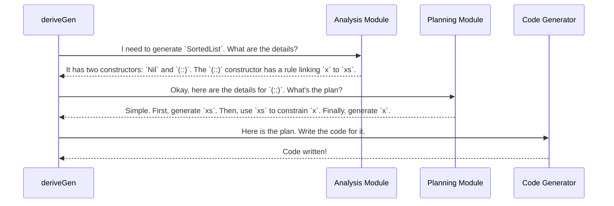

# Chapter 3: Generator Derivation Internals

In the [previous chapter](02_automatic_generator_derivation___derivegen__.md), we treated `deriveGen` as a powerful magic wand. We learned how to "talk" to it by writing type signatures, but the process of *how* it figures out the recipe for our data structures remained a mystery.

In this chapter, we're going to peek inside the "engine room." We'll explore the clever internal machinery that analyzes your data types and builds a step-by-step plan to generate them. Don't worry, you don't need to understand this to use `DepTyCheck`, but seeing how the magic works can make you a more confident user.

### A Detective and a Planner

Imagine being asked to build a complex Lego model just by looking at the finished picture. That's the challenge `deriveGen` faces. To solve it, `deriveGen` acts as both a detective and a planner.

1.  **The Detective (Analysis):** First, it investigates the data type. It looks for clues: what are its constructors? What arguments do they take? What are the special rules (dependent-type constraints) that must be followed?

2.  **The Planner (Strategy):** Once it has all the facts, it creates a bulletproof plan. It figures out the correct order to generate things. If one piece depends on another, it knows which one to build first.

Let's use our familiar `SortedList` example to see this process in action.

```idr
data SortedList : Type where
  Nil  : SortedList
  (::) : (x : Nat) -> (xs : SortedList) -> LTEHead x xs => SortedList
```

When `deriveGen` looks at this, its inner detective gets to work.

*   **Detective's Report for `SortedList`:**
    *   **Case File:** `SortedList`
    *   **Witness 1 (Constructor):** `Nil`. Simple, no arguments, no constraints. Easy case.
    *   **Witness 2 (Constructor):** `(::)`. More complex.
        *   **Argument `x`:** A `Nat`.
        *   **Argument `xs`:** A recursive `SortedList`.
        *   **Constraint (the "Motive"):** `LTEHead x xs`. This is the crucial clue! It means `x` must be Less Than or Equal to the head of `xs`.

The detective's report is clear: `x`'s value *depends on* `xs`'s value. A naive plan might be to generate `x` and then `xs`, but that would be like trying to guess the lock's combination before you know what the lock is!

The planner takes over and devises a strategy.

*   **Planner's Strategy for `(::)`:**
    1.  This is a recursive constructor. First, I need to generate the `SortedList` `xs`. I will make a recursive call to do this.
    2.  Let's say the recursive call returns a list, for example, `[10, 20, 30]`.
    3.  Now I consult the constraint: `LTEHead x [10, 20, 30]`. This simplifies to the rule `x <= 10`.
    4.  Finally, I can generate `x`. I'll generate a random `Nat` that is less than or equal to 10.
    5.  Combine them to get the final, valid `SortedList`.

This strategy of resolving dependencies before generating values is the core secret to `DepTyCheck`'s power. It systematically untangles the puzzle your dependent types create.

### A Look Under the Hood

So how does this detective and planner duo work in the code? The process is orchestrated by several modules that collaborate when you call `deriveGen`.

Here's a simplified diagram of the conversation that happens inside the compiler.



This internal machinery is what makes the magic wand work. Let's briefly look at the files where these roles are played out.

#### The Main Orchestrator: `ForOneType/Impl.idr`

This module is the high-level manager for deriving a generator for a single type. When it sees `SortedList`, it knows it has two options: `Nil` or `(::)`. It uses the `Fuel` argument we discussed in the last chapter to make a choice.

A very simplified view of its logic looks like this:

```idr
-- File: src/Deriving/DepTyCheck/Gen/ForOneType/Impl.idr

-- Simplified logic for canonicBody
canonicBody(sortedList) =
  -- Decide what to do based on fuel
  case fuel of
    Dry ->
      -- No fuel left, so we can only use non-recursive constructors.
      generate(Nil)
    More subFuel ->
      -- We have fuel! We can choose between Nil or (::).
      oneOf([ generate(Nil)
            , generate_Cons(subFuel) -- Pass the leftover fuel
            ])
```

It doesn't handle the details of `(::)` itself. Instead, it delegates that job to a specialist.

#### The Constructor Specialist: `ForOneTypeCon/Impl.idr`

This is where the real detective work happens. The function `canonicConsBody` is responsible for analyzing a *single constructor*, like `(::)`.

```idr
-- File: src/Deriving/DepTyCheck/Gen/ForOneTypeCon/Impl.idr

-- Simplified thinking process for canonicConsBody on the `(::)` constructor
canonicConsBody(...) = do
  -- 1. Analyze arguments (x, xs) and the constraint (LTEHead x xs)
  -- Discovers that `x` depends on `xs`.

  -- 2. Build the generation plan
  let plan =
        -- First, make a recursive call to get `xs`
        xs <- callGen `SortedList` -- ...
        -- Then, use `xs` to generate `x`
        x <- generateValueSatisfying `LTEHead x xs`
        -- Finally, return the constructed value
        pure (x :: xs)
  
  -- 3. Translate this plan into code
  return plan
```

This module figures out the dependency ordering for the arguments of a single constructor.

#### The Project Manager: `ForAllNeededTypes/Impl.idr`

What happens if generating `SortedList` requires generating another, different type? This module acts as a project manager, keeping track of all the generators that need to be built.

If `deriveGen` for `TypeA` realizes it needs a generator for `TypeB`, it doesn't stop. It adds `TypeB` to a "to-do" list and makes sure a generator for it is created too. This ensures that all dependencies, including generators for other types, are correctly resolved. It also manages a cache of already-derived generators to avoid doing the same work twice.

All of this analysis and planning results in step-by-step instructions. But these instructions are not immediately written in Idris. They are first translated into a special, simple internal language.

### A Glimpse of the Future: PIL

The "plan" created by the derivation engine is expressed in a tiny, focused language called the [Primitive Imperative Language (PIL)](05_primitive_imperative_language__pil__.md). It has basic commands like "generate a random number," "call this function," and "bind this value to a variable."

Translating to PIL first makes the derivation process much simpler. The engine can focus on the *logic* of generation ("what to do") without worrying about the complex syntax of full Idris code. A final, separate step then converts the simple PIL program into the final Idris code that gets compiled into your program.

### Conclusion

In this chapter, we opened the "engine room" of `deriveGen` and saw the machinery at work. We learned that `deriveGen` isn't just one thing, but a collaborative system that:

1.  **Analyzes (Detective Work):** It inspects data types to understand their constructors, arguments, and constraints.
2.  **Strategizes (Planning):** It creates a step-by-step plan, carefully ordering generation steps to satisfy all dependencies.
3.  **Delegates:** It uses specialized modules to handle the overall type, individual constructors, and dependencies on other types.
4.  **Generates Code:** It translates its final plan into a simple intermediate language ([PIL](05_primitive_imperative_language__pil__.md)) before outputting the final Idris function.

You don't need to remember the file names or internal functions. The key takeaway is that `deriveGen`'s "magic" is a well-defined process of analysis and planning that's powerful enough to solve the complex puzzles posed by dependent types.

So far, we've mentioned the `Gen` type many times—the wrapper around our generated values. But what is it, exactly? How does it manage the randomness that makes our generated data so useful?

Next up, we'll explore this fundamental building block: the [Gen Monad](04__gen__monad_.md).

---

Generated by [AI Codebase Knowledge Builder](https://github.com/The-Pocket/Tutorial-Codebase-Knowledge)