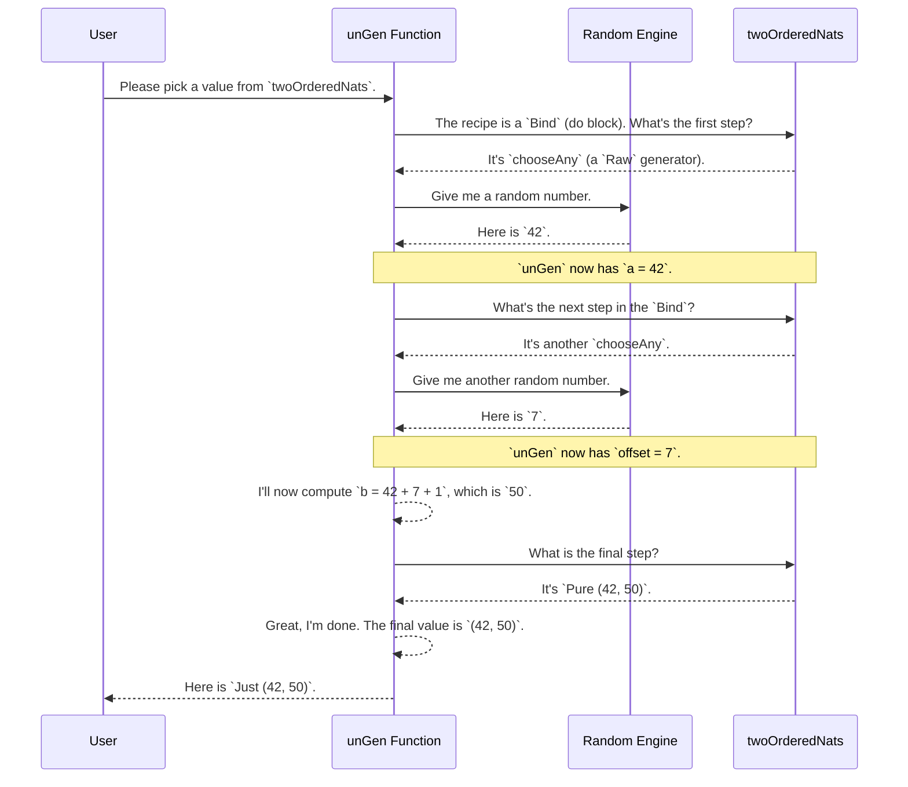

# Chapter 4: `Gen` Monad

In the [previous chapter](03_generator_derivation_internals_.md), we explored the "engine room" of `deriveGen`, seeing how it analyzes data types to create a plan for generating them. We learned that the final output of this process is a generator function.

But what *is* a generator, exactly? All the generators we've seen return a value of type `Gen a`. In this chapter, we'll dive into this fundamental type. `Gen` is the central tool in `DepTyCheck` for describing how to create random data.

### The Problem: We Need a Recipe for Randomness

Imagine you want to generate a random `Nat`. That's simple enough. Now, imagine you want to generate two `Nat`s, `a` and `b`, with the rule that `b` must always be greater than `a`.

How would you describe this process?

1.  First, generate a random number and call it `a`.
2.  Then, generate another random number, call it `offset`.
3.  Finally, calculate `b` as `a + offset + 1` to guarantee it's larger.

This is a sequence of steps, where one step depends on the result of the previous one. We need a way to represent not just a random value, but a *recipe* or a *computation* that produces a random value.

This is exactly what the `Gen` monad is for.

**Analogy:** A `Gen a` value is like a recipe for making a dish of type `a`.
*   A `Gen Nat` is a recipe for a random natural number.
*   A `Gen String` is a recipe for a random string.
*   A `Gen SortedList` is a recipe for a random, valid sorted list.

These recipes can be simple, or they can combine other recipes to create something complex, just like a master chef combines basic cooking steps to create a gourmet meal.

### The `Gen` Monad: A Language for Recipes

The term "monad" might sound intimidating, but for our purposes, you can think of it as a special container that lets you chain recipe steps together in a clean, readable way. In Idris, we do this using `do` notation.

Let's write the recipe for our `(a, b)` pair where `b > a`.

```idr
-- A generator for a pair of Nats (a, b) where b > a.
twoOrderedNats : Gen1 (Nat, Nat)
twoOrderedNats = do
  a <- chooseAny
  offset <- chooseAny
  let b = a + offset + 1
  pure (a, b)
```

This is incredibly expressive! Let's break down this `do` block:

*   `a <- chooseAny`: This is a recipe step. `chooseAny` is a basic generator that produces a random value of the required type (`Nat` in this case). The `<-` arrow means "run this generator, and give the result the name `a`."
*   `offset <- chooseAny`: We do it again to get a second random number.
*   `let b = ...`: This is a pure calculation, not a random step. We use the results of our previous steps.
*   `pure (a, b)`: This is the final step. `pure` takes a normal value (not a generator) and wraps it up as the final result of the recipe. It's like saying, "The dish is now complete. Here it is: `(a, b)`."

> **`Gen1` vs `Gen0`?**
> `Gen` tracks whether a generator might fail.
> *   `Gen1` (or `Gen NonEmpty`) is a recipe that is **guaranteed** to produce a value.
> *   `Gen0` (or `Gen MaybeEmpty`) is a recipe that **might fail**. We'll see why this is useful next.

### Basic Ingredients: Core Generators

`DepTyCheck` provides a handful of simple "ingredient" generators that you can combine.

*   `pure x`: The simplest recipe. It always produces the value `x`. No randomness involved.
*   `chooseAny`: Generates a completely random value of a basic type like `Nat`, `Integer`, or `String`.
*   `elements [a, b, c]`: A recipe that randomly picks one value from the given list.
*   `empty`: A special recipe that represents failure. It *never* produces a value.

### Filtering and Failure

What if we want to generate a random `Nat` that is less than 10? We could generate any `Nat` and then check if it meets our condition.

```idr
-- A generator for a Nat that must be less than 10.
smallNat : Gen0 Nat
smallNat = do
  n <- chooseAny
  suchThat (pure n) (\k => k < 10)
```

Here we introduce `suchThat`, a generator combinator that acts as a filter. `g `suchThat` p` runs the generator `g`, and if the result satisfies the predicate `p`, it returns it. If not, the generation **fails** for that attempt.

Because `suchThat` can cause a failure, the result type must be `Gen0` (`Gen MaybeEmpty`) to tell the compiler that this recipe isn't guaranteed to succeed. If `chooseAny` happens to produce `100`, `suchThat` will reject it, and this specific run of the `smallNat` generator will produce `nothing`.

### Running the Recipe: `pick`

So far, a `Gen a` is just a description, a blueprint. How do we execute the recipe to get an actual, concrete value? We use `Test.DepTyCheck.Gen.pick`.

```idr
-- Runs a generator once to get a possible value.
pick : Gen em a -> m (Maybe a)
```

The `pick` function takes a generator and returns a `Maybe a`. It's a `Maybe` because the generator could be "empty" (like our `smallNat` example if it picked a number >= 10).

*   `pick twoOrderedNats` might return `Just (42, 50)`.
*   `pick smallNat` might return `Just 7`, or it might return `Nothing`.
*   `pick empty` will always return `Nothing`.

### How It Works: A Look Inside

To understand `Gen`, it helps to see what it's made of. A `Gen` value is an instance of a data type with several constructors, each representing a different kind of recipe step.

Here is a simplified definition from `src/Test/DepTyCheck/Gen.idr`:

```idr
data Gen : Emptiness -> Type -> Type where
  Empty : Gen MaybeEmpty a             -- A recipe that fails.
  Pure  : a -> Gen em a                -- A recipe for a fixed value.
  Raw   : RawGen a -> Gen em a         -- A recipe for a basic random value.
  Bind  : RawGen c -> (c -> Gen biem a) -> Gen em a -- A "chaining" step.
  OneOf : ... -> Gen em a              -- A choice between recipes.
  -- ... and a few others
```

The `do` notation we used before is just convenient syntax for building up a nested structure of these `Bind` constructors.

When you call `pick`, it internally uses a function called `unGen` which walks through this structure.

Let's trace what `unGen` does when it runs our `twoOrderedNats` generator.



`unGen` acts as the "chef" that reads the `Gen` recipe. It follows each step, gets random ingredients from the `Random Engine` when needed, and assembles the final result.

### Conclusion

In this chapter, we've unpacked the core concept of the `Gen` monad.

*   `Gen a` is a **recipe** for generating a random value of type `a`.
*   We use `do` notation to **chain recipe steps**, where later steps can depend on the results of earlier ones.
*   Simple generators like `pure`, `chooseAny`, and `elements` are the basic **ingredients**.
*   The `Emptiness` parameter (`Gen0` vs `Gen1`) tracks whether a recipe is **guaranteed to succeed**.
*   The `pick` function **executes** a recipe to produce a single concrete value.

While you can write your own generators by hand using the `Gen` monad, the real power of `DepTyCheck` comes from the fact that `deriveGen` writes these complex recipes *for you*, automatically navigating the tricky rules of your dependent types.

The internal derivation engine doesn't write this `do`-notation code directly. Instead, it first creates a plan using a much simpler, internal language. This intermediate language makes the complex task of automatic derivation much more manageable.

Next up, we will explore this internal language: the [Primitive Imperative Language (PIL)](05_primitive_imperative_language__pil__.md).

---

Generated by [AI Codebase Knowledge Builder](https://github.com/The-Pocket/Tutorial-Codebase-Knowledge)