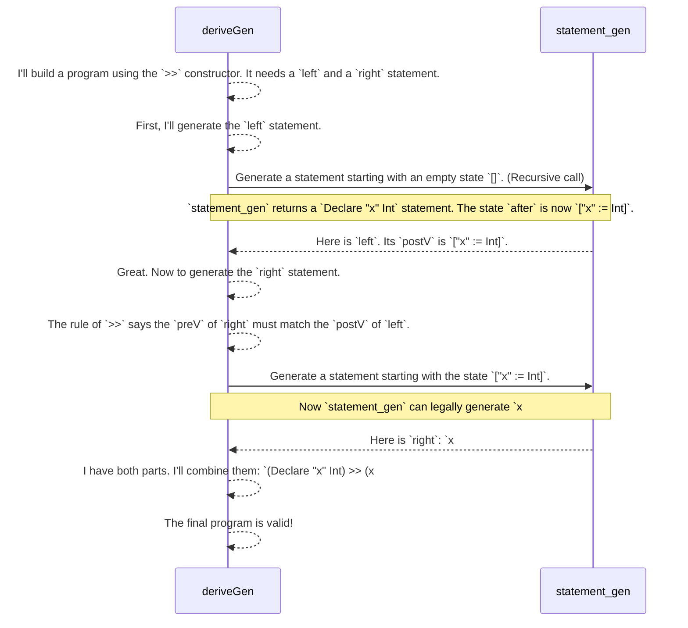

# Chapter 5: Primitive Imperative Language (PIL)

In the [previous chapter](04__gen__monad__.md), we learned how the `Gen` monad provides a "recipe language" for creating random data, and how `do` blocks let us chain generation steps together. We saw how to build simple recipes by hand.

Now, let's explore one of `DepTyCheck`'s most impressive feats: generating not just simple data, but entire, correct-by-construction computer programs.

We'll do this by looking at a case study: the **Primitive Imperative Language (PIL)**.

### The Ultimate Lego Set: A Language with Type-Safe Bricks

Imagine you're building a compiler or an interpreter. One of the hardest parts is testing. You need to feed it thousands of different programs to check if it behaves correctly. But what if some of those test programs have bugs in them?
- A program that tries to use a variable `x` before it's been declared.
- A program that assigns a string `"hello"` to a variable that's supposed to hold an integer.

If your test program is invalid, how can you trust the test result? Your compiler might crash, but not because of a bug in your compiler—it crashed because the input program was nonsense!

This is where PIL comes in. **PIL** is a family of small, simple programming languages defined inside Idris. Its superpower is that it uses dependent types to make invalid programs impossible to write.

It’s like a Lego set for building little programs, but each brick (a statement like `x = 5`) has specially shaped connectors (dependent types). These connectors only fit together in ways that form a valid program.
*   You physically *cannot* connect an "assign to `x`" brick if you haven't first connected a "declare `x`" brick.
*   You *cannot* connect an "assign a string" brick to a variable that was declared as an integer.

The `DepTyCheck` project uses PIL as a demonstration of how `deriveGen` can automatically build entire, complex, and provably correct programs for testing purposes.

### Building a Program, One Safe Step at a Time

So, how does PIL use dependent types to enforce these rules? It tracks the state of the program—like which variables exist and what their types are—at the type level.

Let's look at the heart of PIL, the `Statement` data type. A program is just a sequence of `Statement`s.

```idr
-- A Statement transforms the program's state.
-- It takes the variables `preV` and registers `preR` before it runs,
-- and produces new variables `postV` and registers `postR` after it runs.
data Statement : (preV  : Variables) -> (preR  : Registers rc) ->
                 (postV : Variables) -> (postR : Registers rc) ->
                 Type where
```

This might look complex, but the core idea is simple. A `Statement` is a type that is parameterized by the state *before* and *after* it executes.
*   `preV`: A type-level list of variables available *before* the statement.
*   `postV`: A type-level list of variables available *after* the statement.

Let's look at two "bricks" from this Lego set.

#### Brick 1: Declaring a New Variable

In PIL, declaring a variable is done with the `.` constructor.

```idr
-- Simplified for clarity
(.) : (ty : Type') -> (n : Name) ->
      Statement vars regs ((n, ty)::vars) regs
```

This says: declaring a new variable `n` of type `ty` is a statement that transforms the variable context from `vars` to `((n, ty)::vars)`. It literally adds the new variable and its type to the list of known variables in the type!

#### Brick 2: Assigning to an Existing Variable

Assigning a value is done with `#=`.

```idr
-- Simplified for clarity
(#=) : (n : Name) -> (0 lk : Lookup n vars) => (v : Expression ...) ->
       Statement vars regs vars regs
```

This brick has a special connector: `(0 lk : Lookup n vars) =>`. This is a proof constraint. It means "this statement is only valid if you can provide proof that the variable `n` already exists in the current context `vars`."

If you try to write `x #= 5` but `x` isn't in scope, the Idris compiler will give you an error because it can't find the `Lookup` proof. The "Lego bricks" simply won't connect.

### Asking `DepTyCheck` to Write a Program for Us

Okay, so we have this incredibly safe `Statement` type. Manually building a large program with all the necessary proofs would be exhausting. But we don't have to! We can just ask `deriveGen` to do it.

Let's write the signature for a generator that creates a complete, valid PIL program starting from an empty state.

```idr
-- File: examples/pil-reg/src/Example/Pil/Gens.idr

-- A generator for a Statement of any shape and size.
statement_gen : (fuel : Fuel) ->
                {vars : Variables} -> {regs : Registers rc} ->
                Gen (postV ** postR ** Statement vars regs postV postR)
statement_gen = deriveGen
```

This signature is a request to `deriveGen`:
>"Please write a function that, given some `fuel`, some initial `vars` and `regs`, generates a valid `Statement`. I don't care what the final variable and register states (`postV`, `postR`) are, so please generate them for me randomly (`**`) along with the `Statement` itself."

This single `deriveGen` call will create a generator that can produce millions of unique, syntactically correct, and type-safe programs.

### How `deriveGen` Thinks Like a Programmer

How does `deriveGen` manage to build a valid program? It follows the types, just like a careful programmer would. Let's trace its thought process when it decides to build a program out of two statements sequenced together with `>>`.

The type of `>>` is:
`Statement preV preR midV midR -> Statement midV midR postV postR -> Statement preV preR postV postR`

It connects two statements where the "after" state of the first matches the "before" state of the second.



`deriveGen` intelligently threads the state information (`preV`, `postV`, etc.) through its generation process. It uses the output type of one generated piece as the input requirement for the next, ensuring the Lego bricks always snap together correctly.

### Conclusion

In this chapter, we saw `DepTyCheck` tackle its most complex challenge yet: generating entire programs.

*   The **Primitive Imperative Language (PIL)** is an example of a data structure (a language) defined with dependent types to prevent common bugs at compile-time.
*   The types of statements like `Declare` and `Assign` track the program's state (e.g., available variables), making it impossible to construct an invalid program.
*   Using a single `deriveGen`, we can **automatically generate an endless supply of valid, type-safe PIL programs**.

This demonstrates the true power of `DepTyCheck`: it can handle incredibly complex rules and dependencies, making it an ideal tool for testing systems that process structured, rule-bound data like compilers, interpreters, and serializers.

We've generated a program, but it exists as an Idris data structure. How do we turn it into something a human can read, like a text file?

Next up, we'll explore the tools for turning generated data into readable text: the [Language Pretty-Printer Framework](06_language_pretty_printer_framework_.md).

---

Generated by [AI Codebase Knowledge Builder](https://github.com/The-Pocket/Tutorial-Codebase-Knowledge)