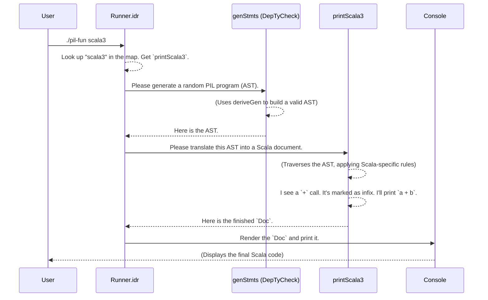

# Chapter 6: Language Pretty-Printer Framework

In the [previous chapter](05_primitive_imperative_language__pil__.md), we witnessed something remarkable: `DepTyCheck` automatically generated entire, valid computer programs using the [Primitive Imperative Language (PIL)](05_primitive_imperative_language__pil__.md). These programs exist as Idris data structures—abstract syntax trees (ASTs)—which are great for a compiler, but not so great for a human who wants to read them.

This brings us to our final challenge: we have a beautifully structured, correct-by-construction AST. How do we turn it back into readable source code? And what if we want to translate it into *multiple* programming languages, like Scala, Lua, or even Idris itself?

This is the problem the Language Pretty-Printer Framework solves. It's a "universal translator" for our generated ASTs.

### The Problem: From Abstract Ideas to Concrete Code

Imagine you've generated a PIL program that declares an integer variable `x`, assigns it the value `10`, and then prints it. In Idris, this AST might look something like this (conceptually):

```idris
-- This is just an abstract representation of the program's structure.
NewV Int' Immutable (C (I 10)) (
  Call "print" [V "x"] Nop
)
```

Now, how would you write this program in different languages?

**In Scala:**
```scala
val x: Int = 10
Console.println(x)
```

**In Lua:**
```lua
local x = 10
print(x)
```

Notice the differences:
*   Keywords (`val` vs. `local`).
*   Type annotations (`: Int` vs. none).
*   Function names (`Console.println` vs. `print`).

Manually writing converters for each language is tedious and error-prone. The pretty-printer framework provides a systematic way to define these translation rules once, allowing you to automatically convert your single AST into any target language you've described.

### How It Works: A Rulebook for Each Language

The core idea is simple:
1.  **You have one abstract structure:** Your PIL AST, which represents the pure logic of the program.
2.  **You create multiple "rulebooks":** For each target language (Scala, Lua, etc.), you write a pretty-printer function. This function is a rulebook that knows how to translate each piece of the AST into that specific language's syntax.

The `pil-fun` example demonstrates this perfectly. Let's look at `Runner.idr`, which orchestrates the whole process.

```idris
-- File: examples/pil-fun/src/Runner.idr

run : Config -> {0 language : SupportedLanguage} -> ... -> (pp : PP language) -> IO ()
run conf ctxt pp = do
  -- 1. Generate a random PIL program (AST)
  let ast = genStmts conf.modelFuel ...

  -- 2. Use the provided pretty-printer `pp` to convert the AST to a document
  let doc = pp ast

  -- 3. Print the final text
  putStrLn $ render doc
```

The `run` function first calls `genStmts` (which uses `deriveGen`!) to create a random PIL program. Then, it passes this AST to a mysterious `pp` function. This `pp` is our "rulebook" for the chosen language.

Where does this `pp` function come from? The runner looks it up in a map.

```idr
-- File: examples/pil-fun/src/Runner.idr

supportedLanguages : SortedMap String (l ** (NamedCtxt l, PP l))
supportedLanguages = fromList
  [ ("scala3", (Scala3 ** (..., printScala3)))
  , ("lua5.4", (Lua5_4 ** (..., printLua5_4)))
  , ("idris2", (Idris2 ** (..., printIdris2)))
  ]
```

This map connects a simple string like `"scala3"` to the specific rulebook function, `printScala3`, which knows how to produce Scala code.

### A Look Inside a Rulebook: `printScala3`

Let's peek inside the rulebook for Scala. A pretty-printer is just an Idris function that pattern-matches on the AST (`Stmts`) and builds up a printable document.

The "type" of a pretty-printer is defined as `PP`:

```idris
-- File: examples/pil-fun/src/Language/PilFun/Pretty.idr

public export
0 PP : SupportedLanguage -> Type
PP language = ... -> Stmts funs vars retTy -> Gen0 $ Doc opts
```

This says a `PP` takes a `Stmts` (our AST) and produces a `Doc`, which is a special type for building nicely-formatted text.

Here is a simplified piece of the Scala rulebook, showing how it handles a `NewV` (new variable) statement:

```idris
-- File: examples/pil-fun/src/Language/PilFun/Pretty/Scala3.idr

printStmts fl tl $ NewV ty mut initial cont = do
  -- Generate a fresh, unused name for our variable (e.g., "v1")
  (nm ** _) <- genNewName fl newNames ...

  let declPref = case mut of
                   Mutable   => "var"
                   Immutable => "val"
  let lhs = declPref <++> line nm <++> ":" <++> printTy ty <++> "="

  -- Recursively print the initial value and the rest of the program
  rhs <- printExpr Open initial
  rest <- printStmts ... cont

  -- Combine everything into a final document
  pure $ hangSep' 2 lhs rhs `vappend` rest
```

Let's break that down:
1.  It sees a `NewV` node in the AST.
2.  It checks if the variable is `Mutable` or `Immutable` to decide whether to print `var` or `val`.
3.  It prints the variable name, its type, and an equals sign.
4.  It calls `printExpr` to translate the variable's initial value.
5.  Crucially, it calls `printStmts` recursively on `cont` to print the *rest of the program*.
6.  Finally, it combines all these pieces into a single document.

Each pretty-printer (`printScala3`, `printLua5_4`) is a big function like this, with a case for every possible node in the PIL abstract syntax tree.

### The Secret Weapon: Language-Specific Metadata

Here's the really clever part. How does the pretty-printer know that in Scala, `+` is an *infix operator* (like `a + b`), but in some other language it might be a prefix function call (like `add a b`)?

This information is attached as **type-level metadata** when we define the functions available in our language.

Look at how the `+` function is defined for Scala in `Runner.idr`:

```idris
-- File: examples/pil-fun/src/Runner.idr

scala3StdFuns : NamedCtxt Scala3
scala3StdFuns = do
  -- The first `True` means "is infix". The second `True` means "is pure".
  AddFun True True "+" $ [< Int', Int'] ==> Just Int'
  ...
```

The `AddFun True ...` tells the framework that `+` should be treated as an infix operator *for the Scala target*.

The pretty-printer for Scala can then access this metadata and change its behavior.

```idris
-- File: examples/pil-fun/src/Language/PilFun/Pretty/Scala3.idr

printFunCall p n args = do
  case (isFunInfix names n, args, ...) of
    -- If it's infix and has two arguments, print it infix style.
    (True, [l, r], _) =>
      pure $ !(printExpr App l) <++> (line "+") <++> !(printExpr App r)

    -- Otherwise, print it as a normal function call.
    _ =>
      pure $ ...
```

The function `isFunInfix` simply looks up the metadata we attached earlier. This allows the same AST node for a function call to be printed in completely different ways, depending on the rules of the target language.

### How it All Fits Together

Let's walk through the entire process from start to finish.



The framework seamlessly connects the generation of an abstract program with the translation to concrete, human-readable code.

### Deeper Dive: The `UniqNames` Data Structure

The magic of attaching and retrieving language-specific metadata is handled by the `UniqNames` data type.

```idris
-- File: examples/pil-fun/src/Language/PilFun/Pretty.idr

data UniqNames : (l : SupportedLanguage) -> (funs : Funs) -> (vars : Vars) -> Type where
  ...
  NewFun  : (ss : UniqNames l funs vars) => (s : String) ->
            ... -> {default False isInfix : Bool} -> ... ->
            (languageCondition : LanguageToCondition l fun isInfix isPure) =>
            UniqNames l (funs:<fun) vars
```

This is adependently-typed list of all the function and variable names in our program's scope. The `NewFun` constructor is how we add a new function. Notice it takes `{isInfix : Bool}` and a `languageCondition` as arguments. This is where the metadata is stored, right inside the type!

Functions like `isFunInfix` are then simple recursive functions that walk this `UniqNames` list to find a function by its index and return the stored boolean flag. `DepTyCheck` uses the power of Idris's dependent types to make these complex interactions safe and verifiable by the compiler.

### Conclusion

Congratulations on completing this journey through `DepTyCheck`!

In this final chapter, we've seen how `DepTyCheck` not only helps you generate complex data but also provides tools to translate that data into other formats. The Language Pretty-Printer Framework is a powerful pattern that:

1.  **Decouples Structure from Presentation:** It separates the abstract logic of your data (the AST) from how it's displayed (the source code).
2.  **Enables Multi-Target Code Generation:** You can write one generator and produce code for many languages by simply adding new "rulebooks" (pretty-printers).
3.  **Encodes Language-Syntax in Types:** It uses dependent types to embed language-specific details, like whether an operator is infix, directly into the context, allowing for intelligent, context-aware pretty-printing.

---

### A Final Word

Over these six chapters, we have traveled from the core concepts of dependent types to the frontiers of automatic program generation and translation.

1.  We started with [Dependently-Typed Data Structures & Generators](01_dependently_typed_data_structures___generators_.md), defining data with built-in rules.
2.  We unlocked the "magic" of [Automatic Generator Derivation (`deriveGen`)](02_automatic_generator_derivation___derivegen__.md), turning type definitions into test data generators.
3.  We peeked at the [Generator Derivation Internals](03_generator_derivation_internals_.md) to see the clever analysis and planning that makes it all work.
4.  We mastered the [Gen Monad](04__gen__monad__.md), the recipe language for randomness.
5.  We built entire, correct-by-construction programs with the [Primitive Imperative Language (PIL)](05_primitive_imperative_language__pil__.md).
6.  And finally, we learned how to translate these abstract programs into readable source code with the **Language Pretty-Printer Framework**.

`DepTyCheck` is more than just a testing library; it's a new way of thinking about the relationship between types, data, and programs. We hope this tutorial has inspired you to explore how dependent types and automatic derivation can bring more power and confidence to your own projects. Happy coding

---

Generated by [AI Codebase Knowledge Builder](https://github.com/The-Pocket/Tutorial-Codebase-Knowledge)