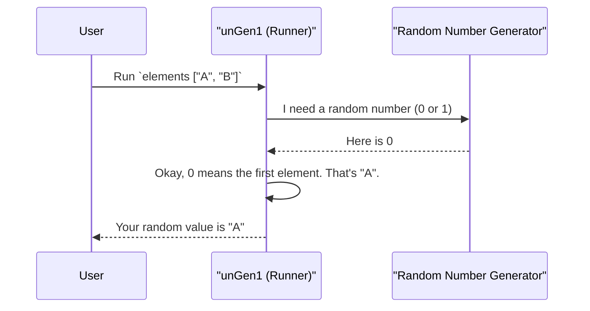

# Chapter 1: Random Value Generator (Gen)

Welcome to `DepTyCheck`! If you've ever wanted to automatically test your programs with random data, you're in the right place. In this first chapter, we'll explore the most fundamental concept in the library: the **Random Value Generator**, or `Gen` for short.

## What's a `Gen` and Why Do We Need It?

Imagine you're a chef who needs to create a wide variety of dishes for a big party. You wouldn't start from scratch every single time. Instead, you'd have a recipe book. Some recipes might be simple ("how to boil an egg"), while others are complex combinations of simpler ones ("how to make a soufflé").

In `DepTyCheck`, a `Gen` is exactly like that recipe book. A `Gen a` is a "recipe" that knows how to produce a random value of type `a`.

This is especially important when dealing with "dependently-typed" data structures, where the shape of your data is constrained by its values. For example, you might have a list that *knows* its own length. A simple random generator would struggle with such rules, but `Gen` is designed specifically to handle these complex, interwoven constraints.

Let's start cooking and see how to create our first recipes!

## Our First Generators: The Basics

`DepTyCheck` provides a few simple "base recipes" to get us started.

### `pure`: The Simplest Recipe

The simplest recipe is one that does nothing random at all. It always gives you back the same value. This is called `pure`.

```idris
-- A recipe that always produces the number 42
genFortyTwo : Gen1 Nat
genFortyTwo = pure 42
```

Think of this as a recipe that just says, "Take this pre-made cake out of the box." It's not very exciting, but it's a useful building block.

> **A Note on `Gen1`**: You'll see `Gen1` and `Gen0` used.
> *   `Gen1 a`: A generator that is **guaranteed** to produce a value of type `a`.
> *   `Gen0 a`: A generator that **might** produce a value, or it might fail (e.g., if you're trying to generate a value with impossible constraints).
>
> For now, we'll mostly use `Gen1`.

### `elements`: Picking from a List

A more interesting recipe is `elements`, which randomly picks one item from a list you provide.

```idris
-- A recipe to pick a random traffic light color
genColor : Gen1 String
genColor = elements ["Red", "Yellow", "Green"]
```

This is like a recipe saying, "Randomly pick one fruit from this basket." Every time you use this generator, you'll get one of the three colors.

## Combining Recipes

The real power of `Gen` comes from combining simple recipes to build more elaborate ones. Let's say we have a simple data type for a user profile:

```idris
data User = MkUser String Nat

-- A recipe for a username
genName : Gen1 String
genName = elements ["Alice", "Bob", "Charlie"]

-- A recipe for an age, between 18 and 65
genAge : Gen1 Nat
genAge = choose (18, 65)
```

Now, how do we combine `genName` and `genAge` to get a `Gen User`? We can use special "applicative" syntax `[| ... |]` which lets us build a larger structure from smaller generator parts.

```idris
genUser : Gen1 User
genUser = [| MkUser genName genAge |]
```

That's it! `DepTyCheck` understands that to build a `User`, it needs to run `genName` to get a `String` and `genAge` to get a `Nat`, and then it puts them together with `MkUser`. We've just composed two simple recipes to create a more complex one!

## The Magic: Generators for Dependent Types

Now for the main event. `Gen` truly shines when working with dependent types, where the structure of data depends on its values. Let's look at a classic example: a tree whose structure depends on its depth.

```idris
-- From examples/deep-wide-tree/src/Data/Tree/DeepWide.idr
data DW : Nat -> Type where
  B : (a, b, c, d, e, f : Nat) -> DW Z
  R : (a, b, c, d, e, f : DW n) -> DW (S n)
```

This defines a `DW` (Deep-Wide) tree.
*   `DW Z`: A tree of depth zero (a leaf), which contains six numbers (`Nat`).
*   `DW (S n)`: A tree of depth `S n`, which is a branch containing six smaller trees of depth `n`.

Writing a generator for this by hand seems tricky, but `Gen` makes it elegant. Here's a generator for `DW` from one of the examples.

```idris
-- A generator for a Nat, used inside the DW leaves
n : Gen1 Nat
n = elements [1..99]

-- A generator for a DW tree of a given depth 'n'
b : {n : Nat} -> Gen1 (DW n)
b {n=Z}   = pure $ B !n !n !n !n !n !n
b {n=S _} = pure $ R !b !b !b !b !b !b
```

Let's break this down—it's the secret sauce of `DepTyCheck`!

1.  **`b : {n : Nat} -> Gen1 (DW n)`**: This says `b` is a function. You give it a depth `n`, and it returns a recipe for a `DW` tree of exactly that depth.
2.  **`b {n=Z} = ...`**: This is the base case. If we want a tree of depth zero, we create a leaf (`B`). The `!n` syntax is special sugar that says, "Run the `n` generator and plug the result in here." So it runs our `elements [1..99]` generator six times to get six random numbers.
3.  **`b {n=S _} = ...`**: This is the recursive step. If we want a tree of depth `S k` (e.g., depth 5), we create a branch (`R`). The `!b` syntax is the magic. It means, "Recursively call the `b` generator for the *next smallest* depth (`k`)". So to build a `DW 5`, it calls `b` six times to get six random `DW 4` trees. To build those, it calls `b` to get `DW 3` trees, and so on, until it hits the base case.

This shows how `Gen` can easily handle the "dependency" between the type (`DW n`) and the value (`n`).

## Running a Generator to Get Values

We have all these fantastic recipes, but how do we actually "cook" with them to get our random data? You use functions like `runN` and `unGenAll`.

Let's look at the `main` function from the example:

```idris
-- From examples/deep-wide-tree/tests/gens/bindful/Main.idr
main : IO ()
main = runN 20 5 b
```

The `runN` function (provided in the example) does the following:
1.  It takes a count (20), a depth (5), and our generator (`b`).
2.  It calls `unGenAll`, which takes a generator and a random seed, and produces an infinite stream of random values.
3.  It then takes the first 20 values from that stream and prints the count.

When you run this program, it will use your `b` recipe to generate 20 different, valid random trees of depth 5. The output will simply be `20`, but behind the scenes, a lot of complex, rule-abiding data was just created!

## What's Happening Under the Hood?

You don't need to know the internals to use `Gen`, but a quick peek can make things clearer.

When you ask `DepTyCheck` to run a generator, it follows a step-by-step process. Let's trace a simple call like `elements ["A", "B"]`.



The `Gen` type itself is a data structure that represents these recipes.

```idris
-- A simplified view of src/Test/DepTyCheck/Gen.idr
data Gen : Emptiness -> Type -> Type where
  Pure  : a -> Gen em a
  OneOf : (alternatives : List (Gen em a)) -> Gen em a
  Bind  : Gen em c -> (c -> Gen em a) -> Gen em a
  -- ... and a few others
```

*   `Pure x`: Represents the simplest recipe: "just use `x`".
*   `OneOf gs`: Represents `elements` or `oneOf`. It holds a list of other generators and the runner picks one at random.
*   `Bind g f`: This is the powerhouse for dependent generation. It tells the runner: "First, run generator `g` to get a value `c`. Then, pass `c` to the function `f`, which will decide what generator to run *next*." This is how our `DW` generator could change its behavior based on the depth `n`.

You've already mastered the core ideas just by understanding how to use `pure`, `elements`, `choose`, and the `[| ... |]` and `!g` syntax!

## Conclusion

In this chapter, you've learned the most important concept in `DepTyCheck`:

*   A **`Gen a`** is a "recipe" for creating random values of type `a`.
*   You can create simple generators with `pure`, `elements`, and `choose`.
*   You can **combine** generators to build recipes for complex data.
*   `Gen` is powerful enough to handle **dependently-typed** data structures, where the shape of data depends on its values.

Writing these generators by hand is powerful. But for very large or complex data types, it can become tedious. What if `DepTyCheck` could do most of this work for you?

In the next chapter, we'll explore just that. Get ready to see how the library can automatically analyze your types and write these generators for you!

Next: [Chapter 2: Automatic Generator Derivation (deriveGen)](02_automatic_generator_derivation__derivegen__.md)

---

Generated by [AI Codebase Knowledge Builder](https://github.com/The-Pocket/Tutorial-Codebase-Knowledge)