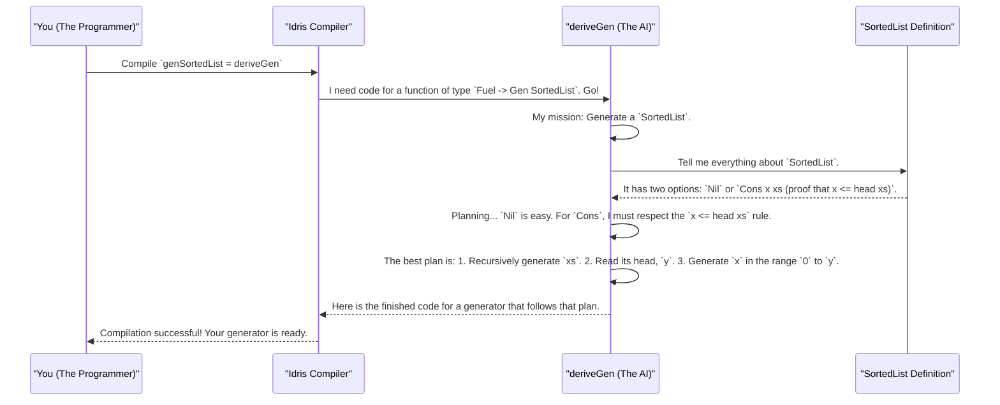

# Chapter 2: Automatic Generator Derivation (deriveGen)

In the [previous chapter](01_random_value_generator__gen__.md), we became chefs, learning how to write our own "recipes" for random data using [Random Value Generator (Gen)](01_random_value_generator__gen__.md). We saw how to combine simple generators to build up complex ones, even for dependently-typed data.

But let's be honest: writing those recipes by hand can be a lot of work, especially when the rules get complicated. What if you had a master chef AI that could look at your final dish and instantly write the recipe for you?

Welcome to `deriveGen`, the magic of `DepTyCheck`.

## The Problem: Tedious, Constrained Generators

Imagine we have a `SortedList`, which is a list of numbers that must always be in ascending order.

```idris
-- A list where each element is less than or equal to the next one
data SortedList : Type where
  Nil  : SortedList
  Cons : (x : Nat) -> (xs : SortedList) ->
         (case xs of
               Nil      => True
               Cons y _ => x <= y) ->
         SortedList
```

The third argument to `Cons` is a proof that `x` is less than or equal to the head of the rest of the list, `y`. This is what guarantees the list stays sorted.

How would we write a [Random Value Generator (Gen)](01_random_value_generator__gen__.md) for this? We can't just pick a random number for `x` and a random `SortedList` for `xs`. We have to be clever. We'd have to generate `xs` first, inspect its first element `y`, and *then* generate an `x` that is smaller than or equal to `y`. That's a lot of manual logic!

For complex data structures with many rules, this becomes a major headache.

## The Solution: `deriveGen` to the Rescue!

`deriveGen` is a tool that does all this hard work for you. It's like telling the compiler, "Here's the data structure I want. **You** figure out how to generate it."

Using it is a simple, two-step process:

1.  **Declare the generator's signature:** You write the *type* of the generator function you want. This tells `deriveGen` what your goal is.
2.  **Set its implementation to `deriveGen`:** You literally just write `= deriveGen`.

That's it! Let's see it in action with our `SortedList`.

### Step 1: Declare the Signature

We need a function that can produce a `Gen SortedList`. We also add a `Fuel` argument, which is like a "gas tank" for the generator to prevent it from running forever.

```idris
-- From: examples/sorted-list-so-comp/src/Data/List/Sorted/Gen.idr

genSortedList : Fuel -> Gen MaybeEmpty SortedList
```

*   `Fuel`: A budget to control how deep or large the generated data can be.
*   `Gen MaybeEmpty SortedList`: A recipe that *might* produce a `SortedList`. We use `MaybeEmpty` because sometimes constraints can be impossible to satisfy, and the generator needs a way to "give up". This is similar to the `Gen0` we touched on in [Chapter 1](01_random_value_generator__gen__.md).

### Step 2: Use `deriveGen`

Now for the magic. We just set the function's body to `deriveGen`.

```idris
genSortedList : Fuel -> Gen MaybeEmpty SortedList
genSortedList = deriveGen
```

And we're done! At compile time, `DepTyCheck` will:
1.  Look at the type `SortedList`.
2.  See the `Nil` and `Cons` constructors.
3.  Analyze the `x <= y` constraint in the `Cons` case.
4.  **Automatically write the entire generator function for you**, complete with the logic to generate `xs` first and then a valid `x`.

You just defined what you wanted, and `deriveGen` handled the how.

## Another Example: Generating Unique Lists

Let's try another one. How about a vector (a list with a known length) where every element must be unique?

Here's a simplified definition for a proof of uniqueness, `Uniq`:

```idris
-- A proof that a Vect has no duplicate elements
data Uniq : Vect n a -> Type where
  UNil  : Uniq []
  UCons : Uniq xs -> {auto prf : Not (x `Elem` xs)} -> Uniq (x :: xs)
```
The constraint here is `{auto prf : Not (x `Elem` xs)}`, which means `x` cannot already be in the list `xs`. This is even trickier to generate by hand than a sorted list!

But with `deriveGen`, it's just as easy. We want a generator that, given a length `n`, produces both a `Vect n String` and the `Uniq` proof for it.

```idris
-- Simplified from: examples/uniq-list/src/Data/Vect/Uniq/Gen.idr

-- Goal: A generator for a vector of unique strings of length `n`
genUniqStrVect : (n : Nat) -> Fuel -> Gen MaybeEmpty (Vect n String ** Uniq _)
genUniqStrVect = deriveGen
```

Look at the return type: `Gen MaybeEmpty (Vect n String ** Uniq _)`. This `**` syntax creates a **dependent pair**. It means `deriveGen` will create a generator that produces two things bundled together:
1.  A `Vect n String`.
2.  A `Uniq` proof that is *dependent on* the vector from step 1.

Without `deriveGen`, we'd have to write code that keeps track of the elements it has already generated to avoid duplicates. But here, we just state our goal, and `DepTyCheck` takes care of the rest.

## Under the Hood: The Master Chef AI

So how does this magic actually work? You don't need to know the internals to use `deriveGen`, but it helps to have a mental model. Think of `deriveGen` as an AI that `DepTyCheck` runs during compilation.

Here's a simplified step-by-step of what happens when the compiler sees `genSortedList = deriveGen`:



The key is that `deriveGen` is a **macro**. It's a special piece of code that runs *at compile time* to write *more code* on your behalf. It does this by using Idris's powerful reflection capabilities, which allow code to inspect and analyze types.

The internal logic lives in `src/Deriving/DepTyCheck/Gen.idr`. The main entry point is `deriveGenExpr`, which kicks off the process.

1.  `checkTypeIsGen` first parses your function signature to understand the goal (e.g., "generate a `SortedList`"). It's smart enough to give you helpful errors if your signature is malformed.
2.  Then, it analyzes the target data type's constructors (`Nil`, `Cons`).
3.  For each constructor, it figures out a "least effort" plan to satisfy all the constraints. For our `SortedList`, it determines that generating the tail `xs` before the new head `x` is the path of least resistance.
4.  Finally, it assembles all these plans into a complete [Random Value Generator (Gen)](01_random_value_generator__gen__.md) recipe and hands it back to the compiler.

This process is incredibly sophisticated, but from your perspective, it just works. We'll explore the nitty-gritty details of this process later in [Chapter 9: Generator Derivation Internals](09_generator_derivation_internals_.md).

## Conclusion

In this chapter, we've unlocked the true "magic" of `DepTyCheck`:

*   **`deriveGen`** is a powerful tool that **automates the creation of test data generators**.
*   It saves you from writing complex, tedious, and error-prone generator logic by hand.
*   You simply **define your data type** with all its rules and constraints, declare the **generator's signature**, and let `deriveGen` do the rest.
*   It works by analyzing your types at compile time and intelligently building a generator that satisfies all their dependencies.

Now that you know how to automatically generate data for even the most rule-heavy types, you're ready to see this technique applied to a wider variety of real-world problems.

Next: [Chapter 3: Constrained Data Structure Examples](03_constrained_data_structure_examples_.md)

---

Generated by [AI Codebase Knowledge Builder](https://github.com/The-Pocket/Tutorial-Codebase-Knowledge)