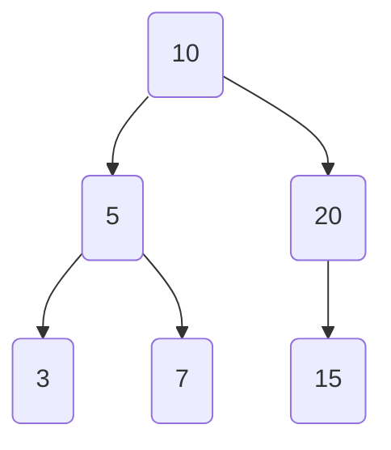

# Chapter 3: Constrained Data Structure Examples

In the [previous chapter](02_automatic_generator_derivation__derivegen__.md), we discovered the magic of `deriveGen`, our "master chef AI" that can automatically write recipes for generating random data. We saw how it can save us from the tedious work of hand-crafting generators for types with simple rules.

Now, it's time to put `deriveGen` to the test with some truly complex dishes. These are the "molecular gastronomy" of data structures—types with intricate, built-in rules that are enforced by the compiler. These examples will show you just how powerful and intelligent `deriveGen` really is.

## The Challenge: Data with Built-in Rules

Imagine trying to generate test data for a function that only accepts sorted lists. If you just generate random lists, most of them will be unsorted and useless for your tests. You need a way to generate lists that are *guaranteed* to be sorted.

This is where dependently-typed data structures shine. They allow us to bake the rules (like "this list must be sorted") directly into the type itself. Let's look at a few examples and see how `deriveGen` handles them with ease.

## Example 1: `SortedList` - The Ordered List

First up is a classic: a list of numbers that is guaranteed to be in ascending order. Here is how we can define it in Idris.

```idris
-- From: examples/sorted-list-so-comp/src/Data/List/Sorted.idr
data SortedList : Type where
  Nil  : SortedList
  (::) : (x : Nat) -> (xs : SortedList) ->
         LTEHead x xs => SortedList
```

This looks like a normal list definition, but with a twist! The `(::)` constructor (often called "cons") takes a third argument: `LTEHead x xs`. This is a **proof** that the new element `x` is "Less Than or Equal to the Head" of the rest of the list `xs`. The Idris compiler will not let you build a `SortedList` that breaks this rule.

Writing a generator for this by hand would be tricky. But for `deriveGen`, it's a piece of cake.

```idris
-- A generator for a SortedList
genSortedList : Fuel -> Gen MaybeEmpty SortedList
genSortedList = deriveGen
```

That's it! When you ask `deriveGen` to build this generator, it analyzes the `LTEHead` constraint and understands its meaning. It figures out that it must:
1.  First, generate the tail of the list, `xs`.
2.  Then, look at the head of `xs` (let's call it `y`).
3.  Finally, generate a new head `x` that is less than or equal to `y`.

This automatically produces valid lists like `[2, 5, 5, 10, 21]` but will never produce an invalid list like `[2, 8, 5, 10]`.

## Example 2: `UniqStrList` - The List with No Duplicates

Let's try something even harder. What about a list of strings where every single element must be unique?

```idris
-- From: examples/uniq-list/src/Data/List/Uniq.idr
data UniqStrList : Type where
  Nil  : UniqStrList
  (::) : (s : String) -> (ss : UniqStrList) ->
         s `NotIn` ss => UniqStrList
```

This definition is very similar to our sorted list. The `(::)` constructor requires a proof `s `NotIn` ss`, which proves that the new string `s` is not already present in the rest of the list `ss`.

Manually writing a generator for this would be a real pain. You'd have to keep track of all the strings you've already used. But with `deriveGen`, the solution is beautifully simple:

```idris
-- A generator for a list of unique strings
genUniqStrList : Fuel -> Gen MaybeEmpty UniqStrList
genUniqStrList = deriveGen
```

Again, `deriveGen` inspects the `NotIn` constraint and devises a plan. It will generate a new string `s` and then check if it's already in the list it's building. If it is, it will throw it away and try generating a *different* string until it finds one that is unique. All of this complex logic is generated for you automatically!

## Example 3: `SortedBinTree` - The Balanced and Ordered Tree

Now for the grand finale. Let's consider a binary search tree. These trees have two important rules for any given node with value `x`:
1.  All values in the `left` subtree must be less than `x`.
2.  All values in the `right` subtree must be greater than `x`.

This structure makes searching for values very fast. Here's a diagram of a valid tree:



Here's a simplified version of how you might define this in Idris:

```idris
-- From: examples/sorted-tree-naive/src/Data/SortedBinTree.idr
data SortedBinTree : Type where
  Empty : SortedBinTree
  Node  : (x : Nat) -> (left, right : SortedBinTree) ->
          AllLT x left => AllGT x right => SortedBinTree
```

The `Node` constructor requires two proofs: `AllLT x left` (all values in the `left` tree are less than `x`) and `AllGT x right` (all values in the `right` tree are greater than `x`).

This is by far the most complex structure we've seen. Generating a valid tree of any significant size by hand would be a nightmare. You have to thread constraints down through every branch of the tree. Yet, for `deriveGen`, the process is the same as always:

```idris
-- A generator for a valid SortedBinTree
genSortedTree : Fuel -> Gen MaybeEmpty SortedBinTree
genSortedTree = deriveGen
```

`DepTyCheck` is smart enough to unravel these nested dependencies. It understands that to generate a `Node` with value `x`, it needs to recursively call the generator for the `left` subtree, but with an added constraint: "all values must be less than `x`". Similarly, it calls the generator for the `right` subtree with the constraint "all values must be greater than `x`".

This ability to correctly generate data for such intricate, rule-driven structures is what makes `DepTyCheck` so powerful for testing dependently-typed programs.

## Conclusion

In this chapter, we've seen how `DepTyCheck` can automatically generate valid instances of highly constrained data structures:

*   **`SortedList`**: Where elements must be in ascending order.
*   **`UniqStrList`**: Where every element must be unique.
*   **`SortedBinTree`**: Where nodes must obey complex ordering rules.

These examples are not just academic curiosities. They represent real-world problems where your data must follow strict invariants. With `deriveGen`, you get to define your data with all its rules, and `DepTyCheck` gives you a powerful test data generator for free.

But once we have a generator, how do we know it's a *good* one? A generator that only ever produces empty lists is valid, but not very useful for testing. How can we be sure our generator is exploring all the interesting shapes and sizes of our data? We'll tackle that question in the next chapter.

Next: [Chapter 4: Generator Coverage Analysis](04_generator_coverage_analysis_.md)

---

Generated by [AI Codebase Knowledge Builder](https://github.com/The-Pocket/Tutorial-Codebase-Knowledge)