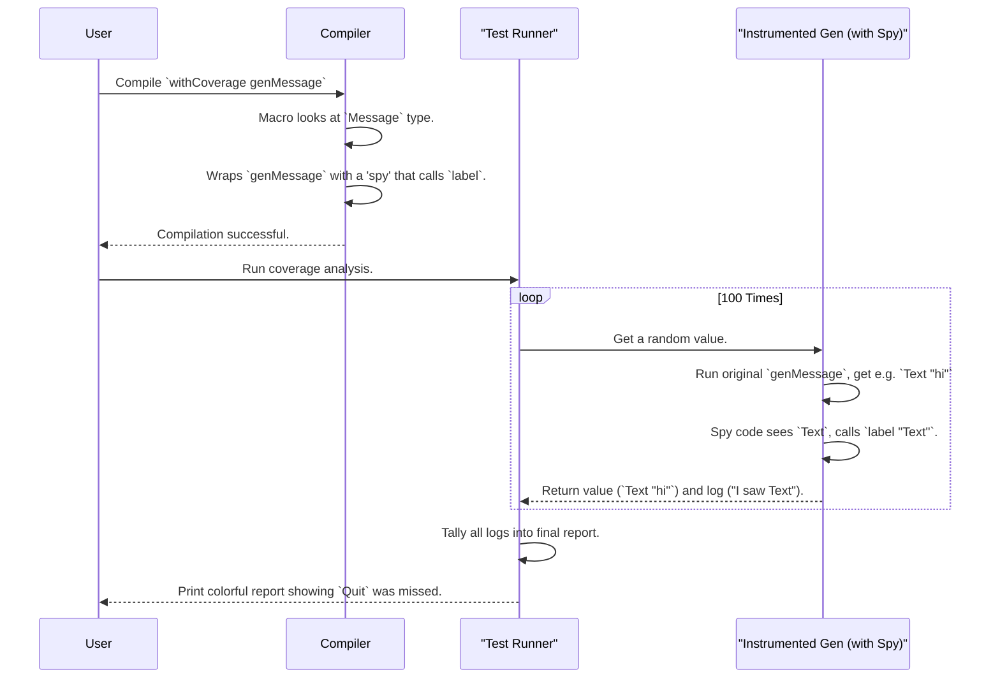

# Chapter 4: Generator Coverage Analysis

In the [previous chapter](03_constrained_data_structure_examples_.md), we saw how `deriveGen` can masterfully create generators for even the most complex, rule-filled data structures like sorted trees. We now have a powerful way to generate valid test data automatically.

But this raises a new question: Just because a generator produces *valid* data, does that mean it's a *good* generator for testing?

Imagine you have a generator for a `TrafficLight` type. If it only ever creates the value `Red`, it's technically correct, but it's a terrible test generator because it will never test the `Green` or `Yellow` cases. How can we get a report card on our generator's performance?

Welcome to Generator Coverage Analysis, a tool that tells you exactly which parts of your data type your generator is actually creating.

## The Problem: The "Always Empty List" Generator

Let's say we have a simple data type for a list of numbers:

```idris
data MyList = MyNil | MyCons Nat MyList
```

And we write a generator for it. But maybe, due to a bug or a tricky constraint, our generator *only ever produces `MyNil`* and never `MyCons`.

```idris
-- A (bad) generator that only produces empty lists
genBadList : Gen1 MyList
genBadList = pure MyNil
```

If we run our tests with this generator, we'll never test any code that deals with non-empty lists! We need a way to automatically detect this blind spot.

## The Solution: A Test Report Card

Generator Coverage Analysis acts like a "test report card" for your generator. It works in a few simple steps:

1.  **Instrument:** You tell `DepTyCheck` which generator you want to watch.
2.  **Run:** You run the generator many times to produce a sample set of values.
3.  **Analyze:** The tool analyzes this set and counts how many times each constructor (`MyNil`, `MyCons`) was used.
4.  **Report:** It gives you a beautiful, color-coded report showing what was covered and, more importantly, what was missed.

Let's see this in action.

### Step 1: Instrument the Generator with `withCoverage`

First, we need to tell `DepTyCheck` to keep an eye on our generator. We do this by wrapping our generator with the `withCoverage` macro. It doesn't change what the generator does, it just adds "tracking" to it.

Let's use a slightly more interesting example, a `Message` type.

```idris
data Message = Text String | Picture String | Quit
```

Now, let's create a (potentially biased) generator and wrap it with `withCoverage`.

```idris
-- A generator for Messages. Is it fair?
genMessage : Gen1 Message
genMessage = oneOf [ pure (Text "hello")
                   , pure (Picture "cat.jpg")
                   ]
-- Notice this generator can't produce 'Quit'!

-- The same generator, but now with coverage tracking enabled.
genMessageWithCoverage : Gen1 Message
genMessageWithCoverage = withCoverage genMessage
```

### Step 2: Initialize an Empty Report Card

Next, we need a blank "report card" to fill in. The `initCoverageInfo` macro creates one for us by inspecting our `Message` type.

```idris
-- Create an empty coverage report for our 'Message' generator
initialReport : CoverageGenInfo genMessage
initialReport = initCoverageInfo genMessage
```

This `initialReport` now knows that the `Message` type has three constructors it needs to look for: `Text`, `Picture`, and `Quit`.

### Step 3: Run and Collect the Data

Now we run our instrumented generator, say 100 times, and collect all the coverage information. The function `unGenTryND` is perfect for this.

```idris
-- Run the generator 100 times and collect the coverage results
runAndCollect : RandomGen g => g -> LazyList (ModelCoverage, Message)
runAndCollect seed = unGenTryND 100 seed genMessageWithCoverage
```

This gives us a list where each item contains the generated `Message` and a little piece of coverage data (like a note saying "I saw a `Text` constructor").

### Step 4: Generate and Print the Final Report

Finally, we take all the collected coverage notes and tally them up on our report card using `registerCoverage`.

```idris
-- Imagine 'allCoverageData' is the list of coverage notes from the previous step
finalReport : CoverageGenInfo _
finalReport = foldl registerCoverage initialReport allCoverageData

-- Now, just print it!
main : IO ()
main = print finalReport
```

When you run this, you'll get a beautifully formatted report right in your terminal. Because our generator never created a `Quit` message, the output will look something like this (colors added for clarity):

```
Message covered partially (100 times)
  - Text:    🟢 covered (50 times)
  - Picture: 🟢 covered (50 times)
  - Quit:    🔴 not covered
```

Instantly, we can see the problem! Our generator is systematically missing the `Quit` case. This report gives us a clear signal that we need to fix our `genMessage` to be more comprehensive.

## How Does It Work Under the Hood?

The magic behind this report is a combination of compile-time macros and a clever use of monads.

1.  **`withCoverage` (The Spy):** When you use the `%macro withCoverage`, it runs at compile-time. It looks at the type your generator produces (e.g., `Message`) and finds all its constructors (`Text`, `Picture`, `Quit`). It then transparently wraps your generator in code that says, "After you produce a value, check which constructor it used, and `label` it."

2.  **`label` (The Note Taker):** The `label` function uses a `Writer` monad. Think of a `Writer` as a computation that, in addition to producing a result, also writes notes in a logbook. Every time our generator creates a `Message`, the spy code adds a note like "Used `Text`" or "Used `Picture`" to this log.

3.  **`unGenTryND` (The Collector):** This function runs the generator many times. On each run, it gets back not only the value (the `Message`) but also the logbook (`ModelCoverage`) containing the note about which constructor was used.

4.  **`CoverageGenInfo` and `registerCoverage` (The Accountant):** The `initCoverageInfo` macro also runs at compile-time, creating a data structure (`CoverageGenInfo`) that is basically an empty ledger with an entry for every possible constructor. `registerCoverage` is the simple function that takes a note from the logbook and adds a tally mark to the correct entry in the ledger.

Here is a simplified diagram of the process:



The core of this logic is in `src/Test/DepTyCheck/Gen/Coverage.idr`. The `withCoverage` macro is particularly clever, as it uses Idris's reflection capabilities to automatically inject the necessary tracking code without you ever having to see it.

## Conclusion

In this chapter, you've learned how to get a "report card" on your generators to ensure they are thorough.

*   **Generator Coverage Analysis** checks which constructors of your data type are actually being generated.
*   You use **`withCoverage`** to "instrument" a generator for tracking.
*   The process involves **initializing a report**, **running the generator** to collect data, and **registering the results**.
*   The final **color-coded report** gives you an at-a-glance summary of covered and, crucially, **uncovered** cases.

This tool helps you gain confidence that your test data is diverse and that you're not systematically missing important edge cases. It turns "I hope my generator is good" into "I can see that my generator is good."

Now that we can check the *structural* coverage of our generators, what about the *statistical properties* of the values they produce? Are the random numbers we generate truly random-looking, or are they clumped together in a biased way? We'll explore this in the next chapter.

Next: [Chapter 5: Statistical Distribution Checking](05_statistical_distribution_checking_.md)

---

Generated by [AI Codebase Knowledge Builder](https://github.com/The-Pocket/Tutorial-Codebase-Knowledge)